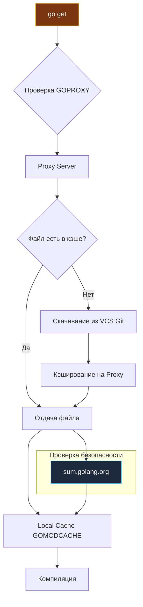

В экосистемах npm или Maven центральный репозиторий представляет собой сложную динамическую базу данных, хранящую метаданные, зависимости и бинарные файлы. В Go пошли принципиально иным, классическим путем Bell Labs: максимальная простота и надежность. Go Proxy — это не сложная база данных, а простое **хранилище статических файлов**, доступное по стандартному протоколу HTTP GET.

Эта архитектурная простота — залог абсолютной надежности и феноменальной скорости. Понимание того, как устроен сетевой протокол прокси, база контрольных сумм и локальное кэширование, критически важно для настройки быстрого, стабильного и безопасного CI/CD.

---

## Протокол Go Proxy

Когда вы выполняете `go get`, клиент не всегда клонирует Git-репозиторий. Если настроен прокси (по умолчанию `https://proxy.golang.org`), Go взаимодействует с ним по предельно простому HTTP протоколу.

Прокси предоставляет три типа файлов для каждой версии модуля:

1.  **`.info`**: JSON-файл с метаданными (имя версии, время создания коммита).
2.  **`.mod`**: Текстовое содержимое файла `go.mod` этой версии.
3.  **`.zip`**: Архив с исходным кодом модуля.

Запросы выглядят предсказуемо и единообразно:
```bash
GET https://proxy.golang.org/github.com/gin-gonic/gin/@v/v1.9.1.info
GET https://proxy.golang.org/github.com/gin-gonic/gin/@v/v1.9.1.mod
GET https://proxy.golang.org/github.com/gin-gonic/gin/@v/v1.9.1.zip
```

> [!info] Под капотом
> Прокси-серверу не нужно знать внутреннее устройство Git, Mercurial или SVN. Он просто отдает неизменяемые статические файлы. Это позволяет легко кэшировать ответы через глобальные CDN (Content Delivery Network) вроде Fastly или Cloudflare, что делает скачивание зависимостей молниеносным в любой точке мира с минимальной задержкой.

---

## Архитектура скачивания



### 1. Immutability (Неизменяемость)
Самое важное свойство прокси: **однажды опубликованная версия никогда не меняется**. Если архив `v1.0.0` попал на `proxy.golang.org`, он остается там навсегда. В мире Node.js удаление 11 строк кода библиотеки `left-pad` сломало сборки тысяч проектов по всему миру. В Go такой инцидент невозможен в принципе: даже если автор удалит свой репозиторий на GitHub или перезапишет тег в Git, `proxy.golang.org` продолжит отдавать исходный zip-архив. Это фундаментальная гарантия воспроизводимости сборки (Build Reproducibility).

### 2. Lazy Fetching (Ленивое получение)
Публичный прокси Go не индексирует весь интернет вслепую. Он скачивает модуль из внешней системы контроля версий (VCS) только тогда, когда в прокси приходит первый в истории запрос на скачивание данной версии от какого-либо клиента.

---

## Локальный кэш (`GOMODCACHE`)

После того как файл `.zip` скачан с прокси, он распаковывается и сохраняется в локальном кэше на вашей машине (`go env GOMODCACHE`).

Структура директории: `$GOMODCACHE/<path>/<module>@<version>/`.

*   **Read-only файлы**: Go устанавливает файловые права "только для чтения" (`0555`) на все файлы в кэше. Это строгая защита от случайного изменения кода зависимости разработчиком или IDE в процессе отладки.
*   **Глобальность**: Кэш глобален для всей операционной системы. Если у вас на машине есть десять независимых микросервисов, использующих `gin@v1.9.1`, они делят один и тот же набор файлов на диске.

> [!warning] Ловушка / Gotcha
> Иногда кэш может "загрязниться" или повредиться при некорректном завершении процессов:
> *   `go clean -modcache`: Полностью удаляет кэш модулей. Это безопасный способ "начать с чистого листа".
> *   В Docker-сборках критически важно монтировать `GOMODCACHE` через BuildKit кэш-маунт (`RUN --mount=type=cache,target=/go/pkg/mod`). Если вы скачиваете зависимости внутри контейнера и не сохраняете слой кэша, каждый билд будет тянуть их из интернета заново, замедляя CI в десятки раз.

---

## Переменная `GOPROXY`

Вы можете управлять цепочкой прокси через переменную `GOPROXY`. Значения перечисляются через запятую:

*   `https://proxy.golang.org,direct`: Сначала попробуй публичный прокси. Если не найдено (404/410), иди напрямую в VCS (Git).
*   `https://proxy.golang.org,https://proxy.golang.cn,direct`: Цепочка резервных прокси (полезно для обхода географических блокировок).
*   `direct`: Не использовать прокси вообще, всегда обращаться напрямую к репозиториям VCS.
*   `off`: Запретить любое сетевое скачивание модулей. Используется для проверки герметичности сборки в закрытых (air-gapped) контурах: проект соберется только если все нужные версии уже лежат в локальном кэше или вендоре.

---

## Checksum Database (`sum.golang.org`)

Прокси отдает файлы, но как мы можем быть математически уверены, что их не подменили злоумышленники методом "человек посередине" (MITM) или скомпрометировав сам прокси-сервер?

Параллельно с прокси работает **Checksum Database** (`sum.golang.org`).
*   Это публичный криптографический реестр прозрачности (Transparency Log) на базе дерева Меркла (Merkle Tree), аналогичный системе Certificate Transparency для TLS-сертификатов.
*   После скачивания архива `.zip` с любого прокси, клиент Go запрашивает у `sum.golang.org` доказательство включения хэша: "Какая контрольная сумма зафиксирована для этого модуля?".
*   Если локальный хэш архива не совпадает с записью в дереве Меркла, сборка прерывается с ошибкой безопасности.

Это гарантирует, что даже скомпрометированный или поддельный прокси не сможет незаметно внедрить бэкдор в ваш проект.

> [!tip] Собеседование
> **Вопрос:** Почему Go скачивает `.zip` архивы вместо клонирования Git-репозиториев?
> **Ответ:**
> 1. **Скорость и трафик:** Клонирование репозитория через Git выкачивает всю тяжелую историю коммитов (папку `.git`), которая может весить сотни мегабайт. Zip-архив содержит только файлы конкретной версии.
> 2. **Автономия от инструментов:** Клиентской машине не требуется установленный `git`, `hg` или `svn`. Достаточно стандартного HTTP-клиента.
> 3. **Безопасность:** Прокси-сервер валидирует структуру архива и отсекает потенциально вредоносные элементы (например, циклические симлинки или ссылки, ведущие за пределы архива).

---

## Итог

1.  **Go Proxy** — это простое HTTP-хранилище статических файлов (`.info`, `.mod`, `.zip`), идеально подходящее для кэширования через CDN.
2.  Прокси обеспечивает **неизменяемость** версий (защита от "Left-Pad" катастрофы, даже если автор удалил репозиторий).
3.  Локальный кэш (`GOMODCACHE`) глобален и переиспользуется между всеми проектами системы.
4.  Служба **Checksum Database** (`sum.golang.org`) обеспечивает криптографическую защиту от подмены кода на стороне прокси.
5.  Всегда используйте кэширование слоев с `GOMODCACHE` в Docker для ускорения CI.

Мы разобрались, как управлять зависимостями для одного модуля. Но что если мы разрабатываем несколько модулей одновременно в одном репозитории (Monorepo)? В следующей статье мы изучим механизм Workspaces: [[17. Workspaces. go work.md]].