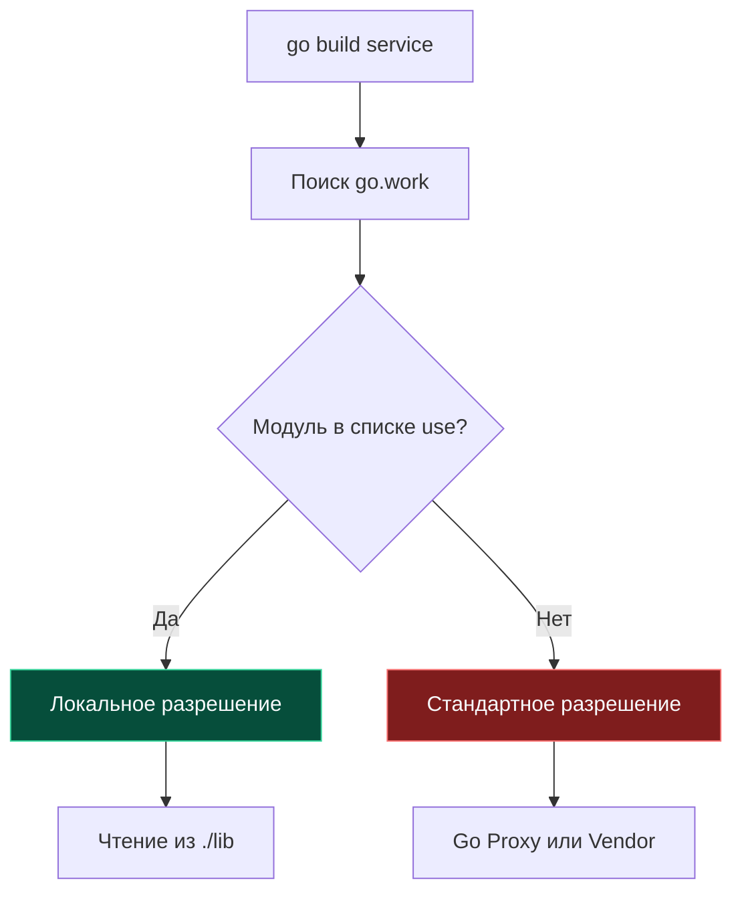

До появления Go 1.18 работа с несколькими модулями одновременно (например, когда вы параллельно разрабатываете внутреннюю библиотеку и сервис, который её использует) была настоящей головной болью инженеров. Единственным способом связать их локально была директива `replace` в `go.mod`, указывающая путь к соседней директории на диске. Это приводило к тому, что файл `go.mod` засорялся временными локальными путями, которые разработчики регулярно забывали удалить перед `git commit` и ломали CI/CD пайплайны всей команде.

Механизм **Workspaces** (рабочие области) и файл `go.work` навсегда решили эту проблему, предоставив чистый, элегантный и изолированный способ работы с монорепозиториями и мульти-модульными проектами.

---

## Проблема: Мульти-модульная разработка

Представьте типичную структуру современного проекта:
```text
my-project/
├── service/      # Основной микросервис (модуль)
│   └── go.mod
└── lib/          # Внутренняя shared-библиотека (модуль)
    └── go.mod
```

Сервис `service` импортирует `github.com/myorg/lib`. Если вы хотите внести правку в `lib` и тут же протестировать её в `service` без публикации промежуточных релизов на GitHub, раньше приходилось писать в `service/go.mod`:
```go
replace github.com/myorg/lib => ../lib
```

Если вы забывали убрать эту строку перед `git push`, удаленный сборщик падал с ошибкой: директории `../lib` по этому пути в изолированном контейнере сборки попросту не существовало.

---

## Решение: `go.work`

Workspaces позволяют определить внешний контекст для локальной разработки, вообще не трогая файлы `go.mod` внутри модулей.

Файл `go.work` создается на один уровень выше — в корневой директории репозитория. Он сообщает компилятору: "Все перечисленные модули образуют единую рабочую область и должны разрешаться локально друг в друга".

```go
go 1.22

use (
    ./service
    ./lib
)
```

Теперь, когда код внутри `service` импортирует `github.com/myorg/lib`, Go проверяет файл `go.work`, видит, что этот модуль включен в блок `use`, и прозрачно читает исходный код прямо из соседней папки `./lib`, полностью игнорируя сетевой прокси и версии в `go.mod`.



> [!info] Под капотом
> При наличии `go.work` в текущей директории или любом родительском каталоге, Go автоматически активирует "Workspace mode".
> Команда `go list -m` покажет ваши локальные модули со специальным суффиксом `(workspace)`. Это также позволяет унифицировать версию компилятора через директиву `toolchain` в `go.work` для всех подмодулей сразу.

---

## Команды управления

Управление рабочей областью происходит через штатные CLI-команды тулчейна:

*   **Инициализация:**
    ```bash
    go work init ./service ./lib
    ```
    Создает файл `go.work` и добавляет в него указанные пути модулей.

*   **Добавление модуля:**
    ```bash
    go work use ./newmodule
    ```
    Добавляет новую строку `use` в файл. Если директории нет на диске, строка будет закомментирована.

*   **Синхронизация:**
    ```bash
    go work sync
    ```
    Сверяет зависимости всех модулей workspace и проталкивает необходимые обновления в файлы `go.mod`, гарантируя консистентность версий.

---

## Связь с Vendor и CI/CD

Workspaces прекрасно интегрируются с вендорингом. Команда `go work vendor` создаст единую директорию `vendor/` в корне проекта, собрав туда транзитивные зависимости всех модулей, перечисленных в `use`.

Это критически важно для CI/CD в монорепозиториях. Вы можете настроить пайплайн так, чтобы он запускал сборку с флагом `-workfile=off` (принудительно игнорировать workspace) для проверки независимости модулей, или использовать `go.work` для сборки всего монорепозитория целиком.

> [!warning] Ловушка / Gotcha
> **Коммитить или нет `go.work` в Git?**
> Это зависит от вашей архитектурной стратегии:
> *   **Для Monorepo:** Да, коммитьте `go.work`. Это неотъемлемая часть монорепозитория, позволяющая инженерам после клонирования сразу работать со всеми сервисами без локальных манипуляций.
> *   **Для ad-hoc разработки (отладка сторонних библиотек):** Если вы просто локально форкнули чужую библиотеку для отладки бага в своем сервисе, добавьте `go.work` в `.gitignore`, чтобы ваши локальные пути не утекли в общий репозиторий.

---

## Переменная `GOWORK`

Вы можете управлять файлом рабочей области через переменную окружения `GOWORK`:
```bash
# Принудительно использовать конкретный файл
export GOWORK=/path/to/custom.work

# Отключить workspace mode (вернуться к стандартному поведению)
export GOWORK=off
```
Это незаменимо в сложных сборочных скриптах, где на одном раннере нужно изолировать этапы сборки разных сервисов.

> [!tip] Собеседование
> **Вопрос:** В чем разница между `replace` в `go.mod` и `use` в `go.work`?
> **Ответ:**
> *   `replace` мутирует декларацию зависимостей конкретного модуля. Это жесткое вмешательство в файл `go.mod`, которое рискует утечь в продакшн и сломать сборку зависимых проектов.
> *   `use` в `go.work` — это локальная оверлейная инструкция для тулчейна разработчика. Она объединяет несколько модулей в общую рабочую среду "поверх" их независимых манифестов, оставляя файлы `go.mod` абсолютно чистыми и готовыми к публикации в Open Source.

---

## Итог

1.  **Workspaces** (`go.work`) — стандартный инструмент для локальной разработки мульти-модульных проектов и монорепозиториев.
2.  Они навсегда устранили необходимость во временных хаках с директивами `replace` внутри `go.mod`.
3.  Управляются через команды `go work init/use/sync`.
4.  Безопасны для коммита в монорепозиториях, но должны быть добавлены в `.gitignore` при ad-hoc отладке внешних библиотек.

Мы настроили структуру проекта и управление зависимостями. Теперь перейдем к обеспечению качества кода. В следующей статье мы разберем главный инструмент статического анализа в индустрии: [[18. Линтеры. golangci lint.md]].