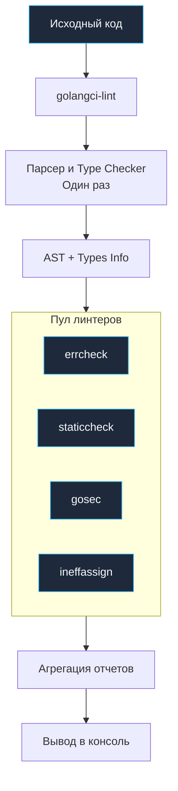

## Стандарт индустрии: Почему не просто go vet

В классическую эпоху Bell Labs Стив Джонсон создал утилиту `lint`, чтобы компенсировать снисходительность компилятора C к типам данных и логике. В Go компилятор строг, а встроенный `go vet` эффективно ловит гарантированные дефекты. Однако `go vet` намеренно консервативен: он молчит о плохом стиле, проигнорированных ошибках, потенциальных уязвимостях в безопасности, неэффективных аллокациях или неиспользуемых присваиваниях.

Для построения надежного барьера качества (Quality Gate) сообщество создало десятки специализированных инструментов: `staticcheck`, `errcheck`, `golint`, `gosec`. Но запускать их в проекте по отдельности — это инженерный кошмар: каждому анализатору требуется свой бинарник, свои флаги, собственная конфигурация и разный формат вывода ошибок в CI/CD.

Решением стал **`golangci-lint`**. Это не просто отдельный линтер, а высокопроизводительный **мета-раннер** (агрегатор), объединяющий десятки независимых анализаторов под единым капотом. Сегодня это неоспоримый стандарт качества в мировой Go-индустрии.

---

## Как это работает: Скорость через оптимизацию

Главное препятствие при запуске десятков линтеров — колоссальное дублирование работы по парсингу кода. Самая дорогая операция статического анализа — построение Абстрактного Синтаксического Дерева (AST) и вычисление информации о типах (`go/types`). Если запустить 10 линтеров по отдельности, код вашего проекта будет распарсен и типизирован 10 раз подряд, сжигая гигабайты оперативной памяти и минуты времени сборки.

`golangci-lint` решает эту проблему благодаря архитектуре **shared parsing** (совместный парсинг):

1.  **Единственный проход**: `golangci-lint` парсит исходные файлы и строит типизированное AST ровно один раз для всего пакета.
2.  **Параллельная доставка**: Готовое синтаксическое дерево в памяти передается всем активным анализаторам одновременно в параллельных горутинах.
3.  **Инкрементальное кэширование**: Результаты анализа кэшируются на основе хэшей содержимого файлов, поэтому повторный запуск на неизмененном коде занимает доли секунды.



> [!info] Под капотом
> `golangci-lint` написан на Go и использует те же внутренние пакеты, что и сам Go тулчейн (`go/parser`, `go/types`). Он умеет запускать линтеры конкурентно (в горутинах), что на многоядерных машинах дает огромный прирост скорости по сравнению с последовательным запуском. Также он перехватывает паники (`recover`) внутри сторонних чекеров: если один экзотический линтер упадет с паникой на сложном коде, это не сорвет работу остальных анализаторов.

---

## Основные линтеры в составе

Из коробки `golangci-lint` включает свыше 50 анализаторов, но по умолчанию активны только самые стабильные. Ключевые линтеры любого продакшн-проекта:

1.  **`errcheck`**: Самый критичный линтер для Go. Он гарантирует, что вы не забыли обработать возвращенное значение `error`. В Go игнорирование ошибки (пропуск второго return-значения) — главная причина скрытых падений в продакшене.
2.  **`staticcheck`**: Фундаментальный инструмент Доминика Хоннефа. Ловит скрытые баги, недостижимый код и неэффективные паттерны (например, вызов `fmt.Sprintf` без плейсхолдеров форматирования).
3.  **`ineffassign`**: Находит бесполезные присваивания переменным, значение которых перезаписывается до того, как будет прочитано.
4.  **`gosec`**: Сканирует код на предмет уязвимостей безопасности: жестко зашитые пароли, небезопасные параметры TLS, слабые генераторы псевдослучайных чисел, SQL-инъекции.
5.  **`govet`**: Официальный `go vet` встроен прямо в конвейер `golangci-lint`.
6.  **`revive`**: Быстрая, современная и расширяемая замена устаревшему `golint`, проверяющая идиоматичность стиля кода и соглашения об именовании.

> [!warning] Ловушка / Gotcha
> Никогда не включайте опцию `enable-all: true`! Это распространенная ошибка новичков. Она активирует десятки экспериментальных и противоречащих друг другу линтеров, завалит вас сотнями ложных срабатываний (false positives) и замедлит прогон в разы. Всегда настраивайте список проверок осознанно через белый список `enable: [...]`.

---

## Использование

Установка утилиты производится через стандартную команду `go install`:

```bash
go install github.com/golangci/golangci-lint/cmd/golangci-lint@latest
```

Запуск проверки в корне проекта:
```bash
golangci-lint run
```

Команда автоматически:
1.  Обнаружит файл настроек (`.golangci.yml`, `.golangci.yaml` или `golangci.yml`).
2.  Скомпилирует и подготовит анализаторы.
3.  Выполнит быструю проверку всех файлов проекта и выведет отчет с номерами строк и пояснениями.

Интеграция с редакторами кода (VSCode, GoLand) работает через языковой сервер `gopls` или нативные плагины: ошибки линтинга подчеркиваются прямо в процессе набора текста.

---

## `golangci-lint` vs `go vet`

| Характеристика | `go vet` | `golangci-lint` |
| :--- | :--- | :--- |
| **Тип** | Официальный минималистичный чекер. | Мета-раннер десятков линтеров сообщества. |
| **Цель** | Найти очевидные ошибки и несовпадения типов. | Найти скрытые баги, уязвимости и архитектурный долг. |
| **Расширяемость** | Ограничена стандартными чекерами. | Поддерживает более 50 встроенных и внешние плагины. |
| **Конфигурация** | Флаги командной строки. | Декларативный файл `.golangci.yml`. |
| **Использование** | Автоматически запускается перед `go test`. | Обязательный этап CI/CD Quality Gate и хуков. |

> [!tip] Собеседование
> **Вопрос:** Зачем нам `golangci-lint`, если есть `go vet` и встроенные инспекции IDE?
> **Ответ:** `go vet` ловит лишь минимальное подмножество проблем. Инспекции IDE привязаны к локальным настройкам конкретной среды разработки (у одного разработчика включены одни правила, у другого — другие). `golangci-lint` фиксирует **единый строгий стандарт качества в виде конфигурационного файла внутри репозитория**. Это исключает человеческий фактор: код проверяется одинаково на ноутбуке разработчика, на код-ревью и в изолированном CI-пайплайне.

---

## Итог

1.  **`golangci-lint`** — признанный золотой стандарт статического анализа в мире Go.
2.  Его главная сила — **высочайшая скорость** за счет shared-парсинга AST и интеллектуального кэширования.
3.  Включает в себя критически важные анализаторы: `errcheck`, `staticcheck`, `gosec`.
4.  Конфигурируется декларативно через YAML, устраняя споры о стандартах в команде.

Мы познакомились с архитектурой агрегатора. Теперь нужно научиться гибко настраивать его под требования конкретного проекта, подавлять ложные срабатывания и задавать исключения. В следующей статье разбираем: [[19. Конфигурация линтеров.md]].