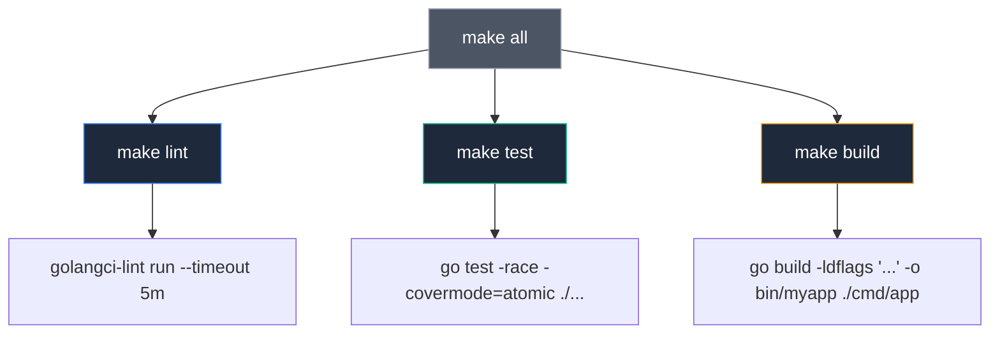

## Пульт управления проектом: Классика автоматизации из Bell Labs

В 1976 году в исследовательском центре Bell Labs мой коллега Стюарт Фельдман (Stuart Feldman) написал первую версию утилиты `make`. Поводом для этого послужила типичная драма программистских будней: один из наших инженеров потратил целый день на бесплодную отладку странного бага, пока не выяснилось, что он просто забыл перекомпилировать один-единственный файл исходного кода, где изменилась структура данных. Фельдман задумал инструмент, который избавит человека от рутинного отслеживания зависимостей и временных меток файлов.

Хотя современный язык Go обладает превосходным встроенным инструментарием (`go build`, `go test`), в реальной промышленной разработке команды неизбежно сталкиваются с проблемой человеческого фактора и воспроизводимости. Один разработчик запускает тесты без детектора гонок `-race`, другой забывает передать флаги линковщика `-ldflags` с версией при выпуске релиза, а третий не может локально запустить статический анализ, потому что забыл установить `golangci-lint`.

**Makefile** — это проверенный временем стандарт де-факто в Unix-среде. В экосистеме Go он используется не столько для пофайловой компиляции (с этим сам компилятор `go` справляется фантастически быстро благодаря внутреннему кэшу), сколько для **оркестрации инженерных задач**. Это единая точка входа (Single Source of Truth) и «пульт управления» проектом: от линтинга и тестов до кодогенерации и подготовки релизного контейнера.



---

## Философия: Почему не просто скрипты?

Соблазн написать для проекта незамысловатый командный файл `build.sh` возникает у каждого инженера. Однако утилита Make предоставляет два фундаментальных преимущества, делающих ее незаменимой:

1. **Разрешение графа зависимостей:** Make умеет анализировать временные метки файлов (timestamps). Если результирующий бинарник новее исходных файлов, Make мгновенно пропустит сборку, сэкономив ресурсы процессора.
2. **Декларативность:** Вы описываете желаемые *цели* (targets), условия их готовности и взаимные зависимости, а Make автоматически выстраивает ациклический направленный граф (DAG) выполнения.

---

## Ключевое понятие: `.PHONY`

В классических проектах на C/C++ правила Make оперируют файлами: цель `main.o` зависит от `main.c` и порождает файл на диске. В экосистеме Go мы почти всегда используем цели как абстрактные *действия* (actions): прогнать линтеры, очистить временные файлы или запустить бенчмарки.

Если в корневом каталоге вашего проекта случайно появится каталог с именем `build` или тестовый файл `test`, Make посмотрит на файловую систему, обнаружит существующий файл, решит, что цель уже достигнута, и откажется выполнять команды!

Чтобы исключить подобное поведение, цели-действия объявляются как «фиктивные» с помощью специальной директивы **`.PHONY`**:

```makefile
.PHONY: build test clean lint

build:
	go build -o bin/app cmd/main.go
```

Директива `.PHONY` категорично указывает Make: «Не ищи файл с именем `build` на диске и не проверяй его временную метку, просто выполняй команды рецепта при каждом явном вызове».

---

## Практический Makefile для Go

Ниже приведен эталонный, проверенный годами шаблон `Makefile`, готовый к интеграции в любой промышленный Go-микросервис:

```makefile
# Переменные
APP_NAME := myapp
VERSION := $(shell git describe --tags --always --dirty)
BUILD_TIME := $(shell date -u +"%Y-%m-%dT%H:%M:%SZ")
LDFLAGS := -ldflags "-X main.Version=$(VERSION) -X main.BuildTime=$(BUILD_TIME) -s -w"

# Основные цели
.PHONY: all build test lint clean run

all: lint test build

## build: Сборка бинарника
build:
	@echo "Building $(APP_NAME)..."
	@mkdir -p bin
	go build $(LDFLAGS) -o bin/$(APP_NAME) ./cmd/app

## test: Запуск тестов с покрытием
test:
	@echo "Running tests..."
	go test -race -coverprofile=coverage.out -covermode=atomic ./...

## lint: Запуск статического анализа
lint:
	@echo "Running linters..."
	golangci-lint run --timeout 5m

## clean: Очистка артефактов
clean:
	@echo "Cleaning..."
	rm -rf bin/
	rm -f coverage.out

## run: Локальный запуск
run:
	go run ./cmd/app
```

> [!info] Под капотом
> Обратите внимание на переменную `LDFLAGS`. Мы используем возможности Go Linker, чтобы внедрить версию из Git-тега и время сборки прямо в бинарник. Это классический паттерн для микросервисов. При запуске `./myapp --version` вы увидите реальную версию коммита, а не `dev`.
> 
> Флаги `-s -w` отсекают отладочную информацию DWARF и таблицу символов, уменьшая физический размер результирующего бинарного файла на 25–35%.

---

## Самодокументируемый Makefile (Self-Documenting)

Хороший инженер заботится о коллегах, которые впервые клонируют проект. Добавление двойного комментария `##` перед каждой целью превращает ваш `Makefile` в живую интерактивную справку, генерируемую по вызову `make help`:

```makefile
.PHONY: help

## help: Показать эту справку
help:
	@echo "Usage:"
	@sed -n 's/^##//p' $(MAKEFILE_LIST) | column -t -s ':' | sed -e 's/^/ /'
```

Когда новый разработчик вводит команду `make help`, связка утилит `sed` и `column` парсит переменную `$(MAKEFILE_LIST)` и выводит аккуратную табличную справку:

```text
 build   Сборка бинарника
 test    Запуск тестов с покрытием
 lint    Запуск статического анализа
 clean   Очистка артефактов
```

---

## Параллельное выполнение задач (`-j`)

По умолчанию Make исполняет рецепты строго последовательно. Однако, если цели независимы друг от друга (например, запуск статического анализа кода, прогон тестов и генерация документации), их можно запустить одновременно на всех ядрах процессора с помощью флага `-j` (jobs):

```bash
make -j4 lint test docs
```

Этот подход превосходно раскрывает потенциал современных многоядерных рабочих станций и CI-серверов сборки, сокращая общее время обратной связи в разы.

> [!warning] Ловушка / Gotcha
> Makefile критически чувствителен к символам отступа. **Всегда используйте TAB** для отступов перед командами внутри цели, не пробелы. Это историческая особенность формата, которая ломает мозг новичкам. Если вы скопируете код с пробелами, Make выдаст ошибку `missing separator`.
> 
> Как вспоминал Стюарт Фельдман, использование жесткого символа табуляции вместо пробелов было синтаксическим решением, принятым за первые выходные разработки `make`. Когда через пару недель он осознал проблему, утилитой уже пользовались около десятка ведущих инженеров Unix, и Фельдман не захотел ломать обратную совместимость с их первыми сценариями. Это классический урок того, как временные компромиссы становятся стандартом на полвека.

---

## Make vs Shell Scripts

Почему зрелые инженерные команды выбирают `Makefile`, а не набор bash-скриптов:

| Характеристика | Shell Script (`build.sh`) | Makefile |
| :--- | :--- | :--- |
| **Зависимости** | Надо писать `if [ -f ... ]`. | Нативная поддержка по timestamp. |
| **Параллелизм** | Надо писать `&` и `wait`. | Флаг `-j` из коробки. |
| **Интерфейс** | Один монолитный файл. | Разбит на цели (`make test`). |
| **Повторяемость** | Выполняет все команды всегда. | Пропускает уже сделанное. |

> [!tip] Собеседование
> **Вопрос:** Зачем нам Makefile, если у нас есть CI/CD (GitHub Actions)?
> **Ответ:** Принцип "Works on my machine" должен работать в обе стороны. CI/CD должен запускать ровно те же команды, что и разработчик локально. Makefile выступает абстрактным слоем, скрывающим сложность вызовов `go test -race -coverprofile...` за простым `make test`. CI-конфиг в этом случае становится тривиальным: `script: make test`.
> 
> Если тест или линтер падает на CI, инженер должен иметь возможность воспроизвести ровно ту же команду на своем ноутбуке одним движением руки, без чтения длинных YAML-манифестов.

---

## Итог

1. **Makefile** — универсальный и нестареющий стандартный "пульт управления" проектом, понятный любому инженеру от новичка до системного администратора.
2. Все служебные задачи, не порождающие файлы с одноименным названием на диске, обязательно объявляйте через `.PHONY`.
3. Внедряйте Git-версию и метку времени через флаги компоновщика `LDFLAGS` на этапе сборки.
4. Документируйте цели с помощью `##` и делайте справку доступной через цель `help`.

Makefile — это классика, прошедшая полувековую проверку временем. Однако архаичный синтаксис (табуляции, особый язык макросов) периодически подталкивает сообщество к созданию альтернатив.

В следующей статье мы познакомимся с современным инструментом, написанным на Go и использующим знакомый формат YAML: [[21. Taskfile как альтернатива Makefile]].