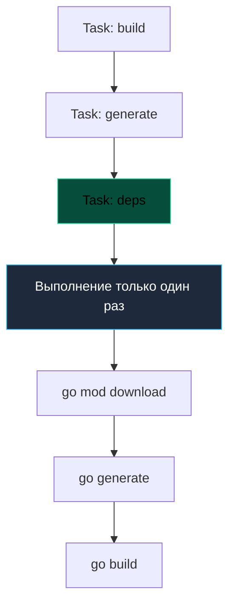

## Современная альтернатива: Когда ветерану пора на покой

Утилита `make` сослужила вычислительной индустрии полувековую верную службу. Ее минимализм и элегантный принцип разрешения зависимостей по временным меткам заложили фундамент для десятков поколений систем сборки. Однако мир программной инженерии существенно изменился со времен исследовательских лабораторий Bell Labs. 

В современной корпоративной разработке классический `Makefile` регулярно сталкивается с двумя болезненными барьерами:

1. **Архаичный синтаксис и хрупкость:** Табуляции против пробелов, причудливые правила экранирования макросов и отсутствие нативной поддержки структурированных данных (JSON/YAML) вызывают раздражение у инженеров, привыкших к экосистеме Docker Compose и манифестам Kubernetes.
2. **Проблема кроссплатформенности:** Утилита `make` и ее рецепты опираются на классическое Unix-окружение (`sh`, `rm -rf`, `cp`, `find`). На платформе Windows сборка превращается в мучительный квест с установкой WSL, MSYS2, MinGW или Cygwin, что отнимает драгоценные часы при онбординге новых разработчиков.

**Taskfile** (проект `go-task/task`) — это современная, легковесная альтернатива Make, написанная на языке Go. Она сохраняет проверенную временем концепцию декларативного графа задач, но полностью избавляет команду от системных причуд POSIX-оболочек. Для инженера на Go это идеальный выбор: `task` распространяется в виде единого автономного бинарника без зависимостей и устанавливается штатной командой `go install`.

---

## YAML вместо архаичного DSL

Вместо невидимых управляющих символов табуляции Taskfile использует привычный и прозрачный формат YAML. Конфигурационный файл называется **`Taskfile.yml`** и размещается в корневой директории проекта.

Рассмотрим практический сценарий сборки:

```yaml
version: '3'

vars:
  APP_NAME: myapp
  VERSION:
    sh: git describe --tags --always --dirty

tasks:
  build:
    desc: "Сборка бинарника"
    cmds:
      - go build -ldflags "-X main.Version={{.VERSION}}" -o bin/{{.APP_NAME}} ./cmd/app
    sources:
      - ./**/*.go
    generates:
      - bin/{{.APP_NAME}}

  test:
    desc: "Запуск тестов"
    cmds:
      - go test -race -coverprofile=coverage.out ./...

  lint:
    desc: "Запуск линтеров"
    cmds:
      - golangci-lint run
```

> [!info] Под капотом
> Taskfile использует движок шаблонов Go (template engine). Вы можете использовать переменные `{{.VAR}}`, функции (например, `now | date "2006-01-02"`), условные операторы и циклы прямо внутри YAML. Это дает мощь скриптового языка без необходимости писать сложные bash-one-liners.
> 
> Кроме того, обратите внимание на секции `sources` и `generates`. В отличие от Make, который сравнивает лишь время модификации файлов (mtime), Taskfile вычисляет криптографические контрольные суммы (хеши) исходных файлов. Если содержимое файлов `.go` не изменилось, сборка пропускается, даже если вы переключали ветки в Git!

---

## Умное управление зависимостями (DAG)

Как и положено качественной системе автоматизации сборки, Taskfile строит ациклический направленный граф зависимостей (DAG — Directed Acyclic Graph). Если несколько высокоуровневых задач опираются на одну общую предварительную фазу, Taskfile гарантирует, что она будет вызвана строго единожды:

```yaml
tasks:
  deps:
    desc: "Установка зависимостей"
    cmds:
      - go mod download

  generate:
    desc: "Генерация кода"
    deps: [deps] # Зависимость
    cmds:
      - go generate ./...

  build:
    desc: "Сборка"
    deps: [generate] # Зависимость
    cmds:
      - go build -o bin/app .
```



---

## Кроссплатформенность: Решение проблемы Windows

В традиционном `Makefile` разработчикам приходится либо навязывать коллегам утилиты Unix (`rm -rf bin/`, `cp`, `find`), либо громоздить ветвления шелла, которые с грохотом ломаются в PowerShell или CMD.

Taskfile решает эту фундаментальную проблему двумя путями:
1. Имеет встроенный интерпретатор команд (на базе форка `mvdan/sh`), реализующий базовую POSIX-семантику прямо внутри бинарника на Go.
2. Позволяет явно разграничивать команды под конкретные операционные системы через директиву `platforms`:

```yaml
cmds:
  - task: clean # Встроенная задача или команда

# Или использование спец. синтаксиса для удаления файлов
cmds:
  - cmd: rm -rf bin/
    platforms: [linux, darwin] # Только для Unix
  - cmd: cmd /c rmdir /s /q bin
    platforms: [windows] # Для Windows
```

Но чаще всего Taskfile позволяет использовать Go-стиль для путей и встроенные модули для работы с файловой системой, что абстрагирует ОС и избавляет от необходимости писать системно-зависимые команды вручную.

---

## Переменные окружения и `.env`

В микросервисной архитектуре двенадцати факторов (Twelve-Factor App) конфигурация приложений хранится в переменных окружения и локальных `.env`-файлах. Чтобы прочитать `.env` в `Makefile`, приходится использовать ухищрения с `export $(cat .env | xargs)`.

Taskfile решает эту задачу элегантно и нативно прямо из коробки:

```yaml
version: '3'

env:
  # Загрузить переменные из файла
  .env:

tasks:
  run:
    cmds:
      - go run ./cmd/app
```

Taskfile автоматически считывает файл `.env`, валидирует его и пробрасывает переменные в дочерние процессы всех вызываемых задач. Это превращает его в идеальный инструмент для локального оркестрирования микросервисов, запуска миграций баз данных и взаимодействия с Docker Compose.

---

## Сравнение: Make vs Task

| Характеристика | Makefile | Taskfile |
| :--- | :--- | :--- |
| **Синтаксис** | Свой DSL (табы, зависимости). | YAML (читаемый, привычный). |
| **Windows** | Требует WSL/Cygwin. | Нативная поддержка (один бинарник). |
| **Шаблоны** | Слабые, через shell. | Мощные Go Templates. |
| **Документация** | `make help` надо писать руками. | `task --list` выводит `desc` автоматически. |
| **Переменные** | Строки, shell-вызов. | YAML vars + dynamic vars (`sh`). |

> [!warning] Ловушка / Gotcha
> YAML чувствителен к отступам. Неправильный пробел в Taskfile сломает парсинг так же легко, как таб в Makefile. Используйте .editorconfig или настройку IDE, чтобы принудительно ставить 2 или 4 пробела для YAML.
> 
> Также не забывайте экранировать фигурные скобки `{{` при вызове команд, если они предназначены не для шаблонизатора Task, а для утилит вроде `awk` или `sed`.

---

## Интеграция и установка

Установить Taskfile в систему можно за несколько секунд через штатный компилятор Go:

```bash
go install github.com/go-task/task/v3/cmd/task@latest
```

После установки вы получаете полноценную самодокументированную среду. Команда `task --list` собирает метаданные из всех полей `desc` и форматирует их в аккуратный список:

```bash
task --list
* build:    Сборка бинарника
* test:     Запуск тестов
* lint:     Запуск линтеров
```

Запуск задачи `task build` исполнит необходимые зависимости, проверит хеши и соберет проект в целевой каталог.

> [!tip] Собеседование
> **Вопрос:** Когда стоит выбрать Taskfile вместо Makefile?
> **Ответ:** Если ваша команда работает на смешанных ОС (macOS + Windows) или если сложность скриптов сборки выросла настолько, что Makefile стал нечитаемым набором bash-команд. Taskfile лучше структурирует задачи и нативно поддерживает современные практики (`.env`, YAML).
> 
> Если же проект разрабатывается строго под POSIX, входит в состав базового системного дистрибутива Linux или требует минималистичного тулчейна без установки сторонних CLI-утилит — классический `Makefile` остается непревзойденным стандартом.

---

## Итог

1. **Taskfile** — современная, кроссплатформенная альтернатива Make на Go, избавленная от проблем с несовместимостью терминальных оболочек.
2. Использование **YAML** и **Go Templates** делает конфигурацию сборки наглядной и удобной для всей команды.
3. Хеширование исходных файлов (`sources` и `generates`) обеспечивает надежное отслеживание изменений без риска ложных пропусков сборки.
4. Нативная поддержка `.env` файлов и встроенная справка (`task --list`) превращают утилиту в полноценный центр локального управления инфраструктурой.

Мы построили надежный фундамент автоматизации локальной сборки и тестирования. Однако компиляция бинарного файла — лишь половина пути. В современном облачном окружении артефактом развертывания является контейнер.

В следующей статье мы исследуем основы технологии контейнеризации с точки зрения языка Go: [[22. Docker. Основы для Go]].