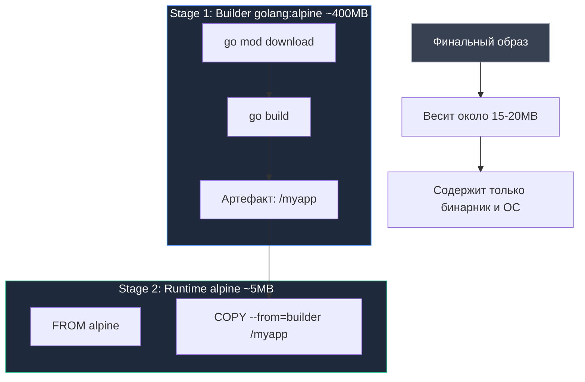

## Концепция: Разделяй и властвуй

В традиционном ремесленном производстве мастер никогда не отправляет заказчику кузнечный горн, наковальню и груду шлака вместе с готовым мечом. Покупателю нужно лишь само отточенное лезвие. Долгое время в мире Docker эта очевидная истина нарушалась: разработчикам приходилось либо паковать в финальный образ весь сборочный цех (тяжеловесный тулчейн компилятора, исходные коды и менеджеры пакетов), либо прибегать к неуклюжему паттерну "Builder Container", извлекая бинарник на хост-машину с помощью внешних shell-скриптов и временных томов.

С появлением механизма **многоэтапных сборок (Multi-stage builds)** в Docker и тулчейне Go разработчики получили элегантный инструмент разделения обязанностей прямо внутри единого декларативного `Dockerfile`.

Идея предельно проста:
1. **Этап 1 (Builder):** Полнофункциональное сборочное окружение с компилятором Go, заголовочными файлами, утилитой Git и кэшем модулей. Здесь происходит выкачивание зависимостей и компиляция.
2. **Этап 2 (Runtime):** Сверхлегковесный или абсолютно чистый образ (Alpine, Scratch или Distroless), куда переносится исключительно скомпилированный бинарный файл и необходимые системные метаданные.

Все промежуточные гигабайты сборочного цеха мгновенно выбрасываются сборщиком, оставляя для развертывания компактный и безопасный артефакт.

---

## Архитектура Multi-Stage сборки

Многоэтапный `Dockerfile` строится с использованием нескольких независимых директив `FROM`. Каждому этапу можно присвоить символическое имя через конструкцию `AS <name>`:

```dockerfile
# --- Stage 1: Builder ---
FROM golang:1.22-alpine AS builder

# Устанавливаем git (нужен для go get в частных случаях) и ca-certificates
RUN apk add --no-cache git ca-certificates tzdata

WORKDIR /app

# Кэшируем зависимости
COPY go.mod go.sum ./
RUN go mod download

# Копируем исходники и собираем
COPY . .
# Важная часть: отключаем CGO для статической линковки
RUN CGO_ENABLED=0 GOOS=linux go build -ldflags="-s -w" -o /myapp ./cmd/app

# --- Stage 2: Runtime ---
FROM alpine:latest

# Устанавливаем сертификаты и timezone данные (для работы с HTTPS и временем)
RUN apk --no-cache add ca-certificates tzdata

WORKDIR /root/

# Копируем бинарник из первого этапа
COPY --from=builder /myapp .

# Копируем статику или конфиги при необходимости
# COPY --from=builder /app/static ./static

CMD ["./myapp"]
```

> [!info] Под капотом
> Когда Docker видит `COPY --from=builder`, он не монтирует файловую систему предыдущего этапа. Он обращается к внутреннему кэшу слоев, где хранится результат работы этапа `builder`. Это гарантирует, что в финальный образ не попадут временные файлы, кэш модулей или исходный код, если вы явно их не скопировали.
> 
> Более того, современный сборочный движок BuildKit строит граф выполнения задач и компилирует независимые этапы параллельно. Если финальный этап не ссылается на определенные сборочные ветки, они даже не будут выполняться.

---

## Визуализация процесса



---

## Сравнение базовых образов для Runtime

Выбор основы для релизного слоя — это классический инженерный компромисс между удобством сопровождения, функциональностью и информационной безопасностью:

| Образ | Размер | Shell | glibc | Безопасность | Комментарий |
| :--- | :--- | :--- | :--- | :--- | :--- |
| **golang:1.22** | ~1.2 GB | Да | Да | Низкая | Никогда не используйте в runtime. |
| **alpine:latest** | ~5 MB | Да `sh` | musl | Средняя | Требует `CGO_ENABLED=0`. Ошибки DNS/Timezone решаются установкой пакетов. |
| **scratch** | 0 MB | Нет | - | Максимальная | Самый безопасный. Нет shell, нельзя сделать `exec -it`. |
| **distroless** | ~2 MB | Нет | glibc | Очень высокая | От Google. Есть варианты с `debug` тегом (busybox). |

> [!warning] Ловушка / Gotcha
> **Alpine и DNS.**
> Alpine Linux использует `musl libc` вместо стандартной `glibc`. Это может вызывать проблемы с DNS-резолвингом в Kubernetes (особенно с `ndots:5`). Go бинарник, скомпилированный с `CGO_ENABLED=0`, статически слинкован и использует чистые syscall'ы, поэтому он работает на Alpine без проблем. Но если вы используете CGO (например, для SQLite), вы **обязаны** собирать бинарник внутри Alpine-контейнера на этапе builder, иначе бинарник не запустится.

---

## Distroless: Золотой стандарт продакшена

Проект **Distroless**, разработанный инженерами Google, предлагает золотую середину между абсолютной пустотой `scratch` и самодостаточностью стандартных дистрибутивов.

Образы `gcr.io/distroless/static` или `gcr.io/distroless/base` созданы специально для безопасного запуска сервисов в облаке. 

Они содержат минимально необходимый фундамент:
* Доверенные корневые SSL/TLS CA-сертификаты (`/etc/ssl/certs/ca-certificates.crt`).
* Базовые системные файлы `/etc/passwd` и `/etc/group` для запуска от непривилегированного пользователя.
* Информацию о часовых поясах (`tzdata`).

И принципиально **не содержат**:
* Никаких командных оболочек (`sh`, `bash`).
* Пакетных менеджеров (`apk`, `apt`, `yum`).
* Системных утилит ядра (`curl`, `wget`, `nc`, `rm`, `ls`).

```dockerfile
# Runtime stage with Distroless
FROM gcr.io/distroless/static-debian12:latest

COPY --from=builder /myapp /

CMD ["/myapp"]
```

Если злоумышленник сумеет внедрить эксплойт через прикладной протокол, он окажется в глухом капкане: в файловой системе контейнера нет ни единого бинарника или шелла для закрепления в системе или загрузки вредоносного кода.

> [!tip] Собеседование
> **Вопрос:** Как вы будете дебажить контейнер на базе `scratch` или `distroless`, если там нет shell?
> **Ответ:**
> 1. **Ephemeral container (K8s):** Использовать `kubectl debug -it <pod> --image=busybox --target=<container>`. Это присоединит контейнер с инструментами к тому же namespace процесса.
> 2. **Debug build:** Использовать debug-версию образа `distroless:debug`, которая содержит `busybox` shell, для staging окружений.
> 
> В современных версиях Kubernetes механизм Ephemeral Containers позволяет подключить отладочный образ к пространству имен процессов работающего пода на лету, не нарушая неизменяемости рабочего контейнера.

---

## Итог

1. **Multi-stage builds** — бескомпромиссный стандарт сборки контейнеров для компилируемых языков, избавляющий финальный образ от сборочного тулчейна.
2. Именуйте промежуточные этапы осмысленно (`AS builder`), чтобы директивы `COPY --from=builder` сохраняли выразительность.
3. Соблюдайте порядок кэширования: сначала копируйте `go.mod` и выполняйте `go mod download`, а затем переносите исходный код.
4. Выбирайте базовый образ рантайма осознанно: `distroless` или `scratch` для боевых кластеров, `alpine` — если локально требуется базовый `sh` для регламентных работ.

Мы научились собирать лаконичные и защищенные контейнеры. Теперь стоит глубже исследовать тонкости работы с минимальными окружениями: почему отсутствие `/etc/passwd` может удивить рантайм Go, как устроены корневые сертификаты и когда стоит предпочесть `distroless` образу `scratch`.

В следующей статье мы погрузимся в детали экстремального сжатия: [[24. Минимизация образов. scratch, distroless]].