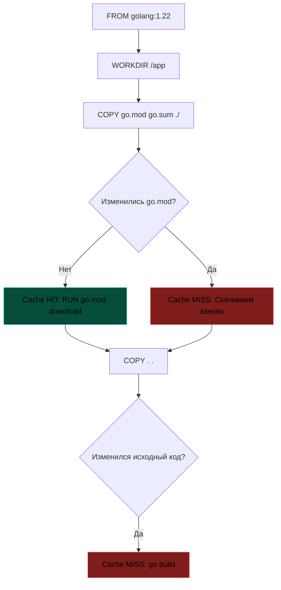

## Физика кэширования: Самая быстрая компиляция — та, которой не было

Каким бы стремительным ни был компилятор Go, самая быстрая компиляция в мире — это та, которую процессору вовсе не пришлось выполнять, потому что результат уже был вычислен ранее. В мире непрерывной интеграции (CI/CD) скорость сборки контейнерных образов перестает быть просто вопросом субъективного комфорта инженера. Это прямой экономический показатель. Когда пайплайн сборки микросервиса длится 10 минут вместо 25 секунд, компания платит реальные деньги за аренду процессорного времени облачных CI-раннеров, а разработчики теряют концентрацию в мучительном ожидании результатов каждого коммита.

Файловая система Docker построена на каскаде неизменяемых слоев (OverlayFS). Каждая инструкция в `Dockerfile` (`RUN`, `COPY`, `ADD`) создает новый слой файловой системы. Истинное мастерство управления сборкой заключается в понимании законов **инвалидации кэша слоев**: как именно сборочный демон принимает решение о том, устарели ли данные на диске.

---

## Правила и цепочки инвалидации кэша

Docker и современный движок сборки BuildKit вычисляют валидность кэша по строгим детерминированным правилам:

1. **Текст инструкции:** Если изменилась сама команда (например, замена `go build` на `go build -v`), кэш этого слоя немедленно признается недействительным.
2. **Контрольные суммы файлов:** Если файлы, переносимые инструкцией `COPY`, изменились хотя бы на один байт (изменилась их криптографическая чексумма), кэш слоя сбрасывается.
3. **Принцип каскадной инвалидации:** Если кэш оказался инвалидирован на текущем шаге, он **автоматически инвалидируется для всех последующих шагов**, независимо от того, менялись ли их команды.



> [!warning] Ловушка / Gotcha
> Самая частая ошибка новичков — поставить `COPY . .` в самое начало Dockerfile.
> ```dockerfile
> # ОШИБКА
> COPY . .
> RUN go mod download
> ```
> В этом случае `go mod download` будет запускаться каждый раз, когда вы поменяете хоть одну букву в `main.go`, так как кэш сломается на шаге `COPY`. Зависимости будут скачиваться постоянно, превращая сборку в пытку.

---

## Правильный Dockerfile для Go

Идиоматичный подход к проектированию `Dockerfile` для Go-приложений опирается на принцип частоты изменений: редко изменяемые слои должны предшествовать часто изменяемым.

Манифесты зависимостей (`go.mod`, `go.sum`) меняются значительно реже, чем строки прикладного кода в обработчиках HTTP. Поэтому выгрузка внешних модулей должна быть вынесена в самостоятельный предварительный слой:

```dockerfile
# 1. Базовый слой (кэшируется почти всегда)
FROM golang:1.22-alpine AS builder

# 2. Рабочая директория
WORKDIR /app

# 3. Сначала копируем ТОЛЬКО манифест зависимостей
COPY go.mod go.sum ./

# 4. Скачиваем зависимости
# Этот слой будет кэшироваться, пока не поменяется go.mod
RUN go mod download

# 5. Только ПОСЛЕ этого копируем исходный код
COPY . .

# 6. Сборка
RUN CGO_ENABLED=0 go build -o /myapp ./cmd/app
```

При изменении бизнес-логики в файлах `.go` сборочный демон выполнит следующую оптимизацию:
1. Пропустит `go mod download` (Cache HIT), так как контрольная сумма `go.sum` не менялась.
2. Исполнит только шаги `COPY . .` и `go build`.

В результате сборка займет считанные секунды вместо повторного скачивания сотен модулей по сети.

---

## Продвинутый уровень: BuildKit и Cache Mounts

Даже идеальное послойное разделение имеет физический изъян. Внутри сборочного контейнера компилятор Go сохраняет промежуточные результаты своей работы в двух специальных каталогах:
* `$GOMODCACHE` (`/go/pkg/mod`) — распакованные архивы сторонних модулей.
* `GOCACHE` (`/root/.cache/go-build`) — скомпилированные объектные файлы пакетов стандартной библиотеки и проекта.

В стандартном Docker эти каталоги стираются при инвалидации слоя сборки, заставляя `go build` компилировать всю стандартную библиотеку с нуля!

Современный механизм BuildKit позволяет использовать **монтирование постоянных томов кэша (cache mounts)** прямо в момент выполнения директивы `RUN`. Это работает как разделяемый системный кэш между последовательными сборками на хост-машине.

Для активации этой возможности сборщик переводится в режим BuildKit (`DOCKER_BUILDKIT=1`):

```dockerfile
# syntax=docker/dockerfile:1.4
FROM golang:1.22-alpine AS builder

WORKDIR /app

# Монтируем кэш Go Modules в специальный том
# Он не попадет в финальный образ, но сохранится между сборками на машине
RUN --mount=type=cache,target=/go/pkg/mod \
    --mount=type=cache,target=/root/.cache/go-build \
    go mod download

COPY . .

# Используем тот же кэш для сборки
RUN --mount=type=cache,target=/go/pkg/mod \
    --mount=type=cache,target=/root/.cache/go-build \
    CGO_ENABLED=0 go build -o /myapp ./cmd/app
```

> [!info] Под капотом
> Флаг `--mount=type=cache` говорит Docker-демону: "Не создавай новую папку внутри этого слоя, а примонтируй существующую именованную директорию с хоста (или volume)".
> Это позволяет переиспользовать скачанные модули даже при полном изменении `Dockerfile` или пересоздании контейнеров сборки. Это "Mechanical Sympathy" к дисковой подсистеме и сети.
> 
> Компилятор Go проверяет инкрементальные кэши в `GOCACHE`, сопоставляя хеши входных AST и флагов компиляции. Если функции сторонних пакетов не изменились, компоновщик сразу подставляет готовые машинные блоки.

---

## Кэширование в CI/CD: Эфемерные раннеры

На локальном рабочем компьютере кэш слоев сохраняется локально в директории `/var/lib/docker`. Однако в промышленных CI-системах (GitHub Actions, GitLab CI, AWS CodeBuild) виртуальные агенты сборки эфемерны: виртуальная машина создается с нуля для каждой задачи и уничтожается сразу после завершения пайплайна.

Без специальной настройки кэш слоев Docker будет безвозвратно теряться после каждого коммита.

Для сохранения скорости сборки применяются два проверенных архитектурных подхода:

### 1. Файловый кэш действий (GitHub Actions)
Слои кэша BuildKit сериализуются в локальный каталог и сохраняются через штатный механизм экшена:

```yaml
- uses: actions/cache@v3
  with:
    path: /tmp/.buildx-cache
    key: ${{ runner.os }}-go-build-${{ hashFiles('**/go.sum') }}
```

### 2. Кэширование в удаленный Docker Registry
Сборочный плагин `buildx` умеет сохранять промежуточные метаданные и слои сборки прямо в удаленный реестр образов:

```bash
docker buildx build \
  --cache-from type=registry,ref=myrepo/cache:builder \
  --cache-to type=registry,ref=myrepo/cache:builder,mode=max .
```

Режим `mode=max` указывает BuildKit выгружать в реестр кэш абсолютно всех этапов, включая промежуточные слои билдера. При последующих сборках агент скачивает только изменившиеся слои.

> [!tip] Собеседование
> **Вопрос:** Вы изменили одну строчку в README.md, и CI начал пересобирать весь образ. В чем проблема и как исправить?
> **Ответ:** В `COPY . .`. Команда копирует все файлы, включая README. Изменение любого файла меняет чексумму слоя, ломая кэш для всех последующих шагов.
> **Решение:** Добавить README в `.dockerignore`. Этот файл исключает ненужные файлы из контекста сборки, предотвращая инвалидацию кэша при их изменении.

---

## `.dockerignore`: Забытый страж производительности

Файл **`.dockerignore`** в корне репозитория выполняет для Docker ту же роль, что и `.gitignore` для Git. Когда клиент Docker инициирует сборку, он сначала упаковывает весь текущий рабочий каталог в архив и передает его демону сборки как *контекст сборки (build context)*.

Если не исключить временные каталоги и тяжеловесные артефакты, контекст сборки может раздуться до нескольких гигабайт.

Обязательный минимум для файла `.dockerignore` в любом Go-проекте:

```text
.git
.env
bin/
README.md
docker-compose*.yml
Dockerfile
```

Исключение директории `.git` не только экономит дисковый трафик, но и защищает от случайного запекания приватной истории коммитов в контейнер, а исключение документации предохраняет кэш слоев от случайных инвалидаций при обновлении описания проекта.

---

## Итог

1. **Закон последовательности:** Никогда не копируйте все файлы проекта перед вызовом сетевых команд. Сначала перенесите `go.mod` и `go.sum`, скачайте модули и только затем копируйте исходный код.
2. **BuildKit Cache Mounts:** Используйте флаги `--mount=type=cache` для каталогов `$GOMODCACHE` и `GOCACHE`, превращая пересборку контейнеров в инкрементальный процесс.
3. **Чистота контекста:** Всегда ведите аккуратный файл `.dockerignore`, отсекая `.git`, бинарники и документацию от контекста сборки.
4. **Удаленный кэш в CI:** На эфемерных раннерах настраивайте флаги `--cache-from` и `--cache-to` для экспорта кэша сборки в Registry.

Мы овладели инструментами сборки, линтинга и упаковки Go-сервисов в компактные контейнеры. Теперь пришло время связать эти изолированные кирпичики в единый, непрерывный и надежный конвейер поставки программного обеспечения.

В следующей статье мы приступаем к исследованию фундаментальных принципов автоматизации поставки кода: [[26. CI_CD. Общие принципы]].