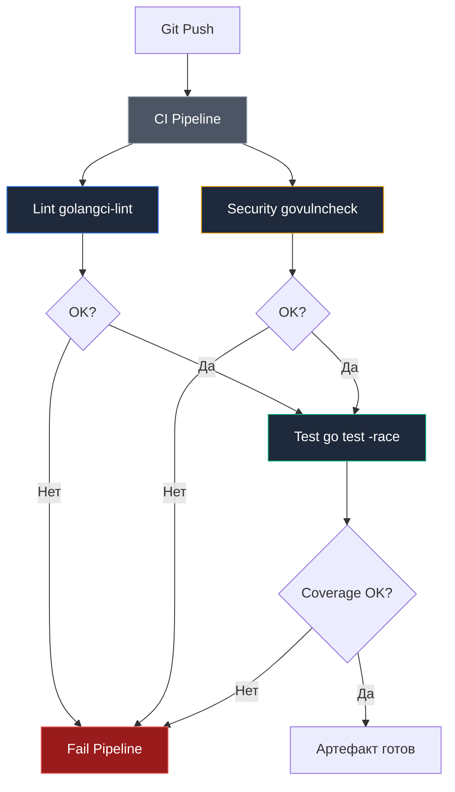

## CI/CD. Общие принципы

В раннюю эпоху вычислительной техники в Bell Labs цикл поставки программного обеспечения был физически мучительным. Инженер набивал перфокарты, сдавал колоду оператору мейнфрейма и ждал утра, чтобы увидеть распечатку компилятора: `SYNTAX ERROR ON CARD 42`. Этот цикл обратной связи длился 12–24 часа. С появлением интерактивных терминалов Unix мы научились компилировать код локально за секунды, но с ростом распределенных систем и команд возникла новая дилемма: *«На моем компьютере всё работает, почему оно упало на боевом сервере?»*.

В современной разработке ценность написанного кода определяется не тем, насколько элегантно он исполняется на ноутбуке автора, а тем, насколько предсказуемо, надежно и быстро он трансформируется в работающий сетевой сервис.

**CI/CD (Continuous Integration / Continuous Delivery)** — это автоматизированный инженерный конвейер, превращающий коммиты в репозитории в готовые к эксплуатации бинарные артефакты. Для инженера на Go понимание архитектуры этого конвейера критически важно: язык Go проектировался авторами внутри Google именно для того, чтобы устранить многочасовые задержки сборки гигантских систем и сделать интеграцию почти мгновенной.

---

## Непрерывная интеграция (CI): Защитный барьер кодовой базы

Главная задача **непрерывной интеграции (Continuous Integration)** — гарантировать, что любое изменение, вливаемое в основную ветку (`main`), абсолютно безопасно, соответствует инженерным стандартам команды и не нарушает целостность существующей функциональности.

В экосистеме Go конвейер CI выполняется на порядок быстрее, чем в проектах на C++, Java или Rust, благодаря феноменальной скорости компилятора и строгому запрету циклических зависимостей.

### Основные этапы CI
Инженерный конвейер должен следовать принципу **«Ошибайся быстро» (Fail Fast)**: дешевые и быстрые проверки запускаются первыми, а дорогие и тяжеловесные операции откладываются:

1. **Lint (Статический анализ):** Самый быстрый и дешевый этап. Анализатор `golangci-lint` инспектирует AST за считанные секунды. Если в коде есть неиспользованные переменные, затенение ошибок или опечатки в комментариях, нет никакого смысла запускать тяжелую компиляцию и разворачивать базы данных.
2. **Build (Компиляция проекта):** Проверка синтаксиса и совместимости типов. Компилятор проверяет корректность связывания всех пакетов и директив сборки.
3. **Test (Тестирование):** Запуск юнит- и интеграционных тестов. Для сетевого бэкенда на Go категорически обязателен запуск с флагом детектора гонок данных **`-race`** (`go test -race`). Без него конкурентные ошибки потоков неизбежно просочатся в релиз.
4. **Security Scan (Аудит безопасности):** Автоматическая проверка уязвимостей в дереве зависимостей с помощью официального инструмента **`govulncheck`**, сверяющего хэши модулей с национальной базой уязвимостей Go Vulnerability Database.



> [!info] Под капотом
> CI-система — это, по сути, автоматизированный исполнитель скриптов. Она запускает ровно те команды, которые вы прописали в `Makefile` или конфиге, но в стерильной среде (эфемерный контейнер). Если ваш проект работает локально, но падает в CI, в 99% случаев это проблема окружения: разница в версиях Go, отсутствие переменных окружения или hardcoded-пути.
> 
> Изолированный контейнер раннера не имеет доступа к вашим локальным файлам кэша или настроенным утилитам, поэтому он обнажает любые скрытые неявные зависимости проекта.

---

## Непрерывная доставка (CD): Путь в промышленную эксплуатацию

Если конвейер CI удостоверяет математическую и логическую корректность исходного кода, то **CD** решает инженерную задачу упаковки и доставки полученного результата до конечных пользователей.

В индустрии четко разграничивают две градации:
* **Continuous Delivery (Непрерывная доставка):** Каждый успешно прошедший CI коммит автоматически упаковывается в готовый к развертыванию релизный артефакт, но решение о его выкатке на боевые серверы принимает человек (нажатием кнопки в интерфейсе).
* **Continuous Deployment (Непрерывное развертывание):** Полная автоматизация без участия человека. Если коммит прошел все тесты в ветке `main`, он автоматически и непрерывно развертывается в боевой кластер.

Для Go-бэкенда универсальным артефактом доставки сегодня выступает **минималистичный Docker-образ** (на базе `scratch` или `distroless`).

### Фундаментальные принципы надежного CD

1. **Иммутабельность артефактов (Build Once):**
   Один и тот же скомпилированный Docker-образ обязан проходить по цепочке всех сред: `Dev -> Staging -> Production`. Категорически запрещено пересобирать бинарник отдельно для продакшена! Исходный код, заново скомпилированный через 3 часа, может подтянуть обновленную зависимость или собраться с другими флагами. То, что тестировалось на стейджинге, и только оно, должно уйти в прод.
2. **Строгое версионирование и трассируемость:**
   Каждому артефакту должен быть присвоен уникальный, неизменяемый идентификатор (Git Commit SHA или тег SemVer, например `v1.4.2`). Использование плавающего тега `latest` в продакшене — это гарантированный путь к катастрофе при отладке и расследовании инцидентов.
3. **Детерминированный откат (Rollback):**
   Процесс отката к предыдущей стабильной версии должен быть тривиальным и занимать секунды. В Kubernetes откат сводится к атомарной замене тега контейнера в спецификации Deployment.

> [!warning] Ловушка / Gotcha
> **Secrets Management.**
> Никогда не храните секреты (API ключи, пароли от БД) в коде или Docker-образе. В CI/CD секреты должны пробрасываться через защищенные переменные окружения системы (GitHub Secrets, GitLab Variables) и монтироваться в контейнер при запуске, а не при сборке.
> 
> Секрет, попавший в слой Docker-образа при выполнении инструкции `RUN`, остается в истории слоев навсегда, даже если вы удалите его следующей командой `rm`.

---

## Концепция «Shift Left»: Смещение контроля влево

В классических водопадных моделях разработки тестирование и аудит безопасности производились на финальной стадии — перед релизом. Месяцы работы могли пойти прахом из-за фундаментальной ошибки в архитектуре.

Принцип **Shift Left (Сдвиг влево)** постулирует: перенесите все возможные проверки как можно ближе к моменту написания первой строчки кода разработчиком:

```
[ IDE / Pre-commit ]  --->  [ CI: PR Checks ]  --->  [ Staging ]  --->  [ Production ]
  Линтинг и синтаксис       Юнит-тесты и гонки       E2E и нагрузка       Мониторинг метрик
```

1. **Pre-commit hooks:** Линтеры и форматирование кода запускаются локально на машине разработчика еще до фиксации коммита в Git.
2. **CI Pipeline:** Компиляция, тесты на гонки данных (`-race`) и сканирование зависимостей блокируют слияние Pull Request.
3. **Staging:** Интеграционные и сквозные (E2E) тесты проверяют сетевое взаимодействие сервисов.

Согласно эмпирическому закону Барри Боэма (Barry Boehm), стоимость исправления ошибки растет экспоненциально по мере продвижения по циклу разработки. Опечатка, пойманная линтером в IDE, стоит несколько секунд времени инженера. Та же ошибка, просочившаяся в продакшен, может стоить компании миллионов долларов прямых убытков и потери репутации.

---

## Go и CI/CD: Естественное преимущество

Почему язык Go считается признанным фундаментом экосистемы Cloud Native (Kubernetes, Docker, Terraform, Prometheus)? Ответ кроется в архитектурных решениях его создателей:

1. **Молниеносная скорость компиляции:** Время прогона полного пайплайна Go обычно укладывается в 1–3 минуты, тогда как эквивалентный проект на C++ или Java требует 15–30 минут прогрева. Это сохраняет фокус разработчика и обеспечивает непрерывный поток мыслей.
2. **Автономный статический бинарник:** Отсутствие рантайм-зависимостей (`virtualenv`, `node_modules`, тяжеловесные JVM) избавляет от проблем с несоответствием версий системных библиотек. Один бинарник — одна точка контроля.
3. **Встроенная кросс-компиляция:** Чтобы собрать бинарник под архитектуру `linux/arm64` или `linux/amd64`, не требуется настраивать сложнейшие тулчейны кросс-компиляции C++. Достаточно передать переменные окружения `GOOS=linux GOARCH=arm64`.

---

## Итог

1. **CI (Continuous Integration)** — автоматизированная верификация каждого коммита, предотвращающая деградацию кодовой базы.
2. **CD (Continuous Delivery / Deployment)** — автоматическая упаковка и предсказуемая доставка проверенных неизменяемых артефактов в эксплуатацию.
3. Два главных правила конвейера: **Fail Fast** (прерывать пайплайн на самых дешевых проверках) и **Build Once** (один скомпилированный бинарник проходит сквозь все среды).
4. Архитектурная простота и скорость Go делают его идеальным языком для построения сверхбыстрых и надежных конвейеров поставки.

Мы усвоили общую теорию и фундаментальные принципы автоматизации. Теперь настало время перенести эти абстракции в конкретную практическую плоскость.

В следующей статье мы построим полноценный производственный конвейер на базе самой распространенной облачной платформы: [[27. GitHub Actions для Go]].