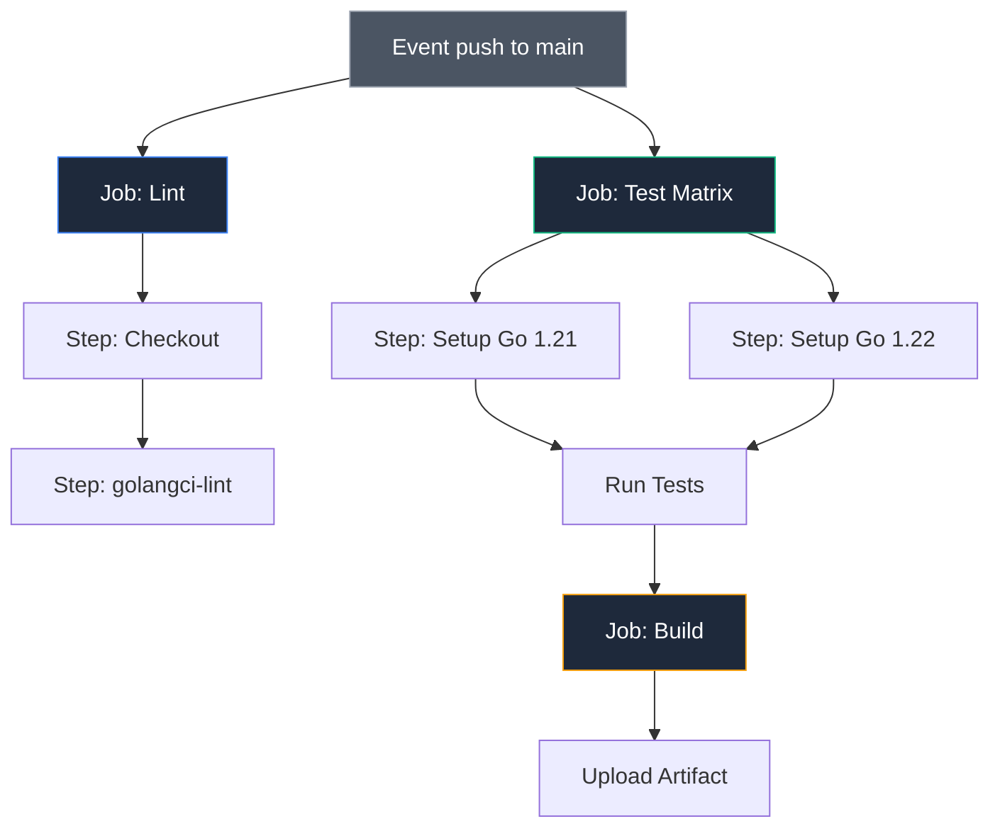

## Облачный конвейер: Автоматизация в GitHub Actions

Платформа GitHub Actions (GHA) за последние годы превратилась в стандарт де-факто для автоматизации открытых проектов и коммерческих облачных сервисов. Ее главное архитектурное преимущество — бесшовная интеграция с кодовой базой и богатая экосистема готовых переиспользуемых модулей (Actions). Инженеру больше не требуется администрировать выделенные физические серверы автоматизации: GitHub по требованию выделяет чистые виртуальные машины (Runners) под управлением Linux, macOS или Windows с предустановленным системным окружением.

Для разработчика на Go среда GitHub Actions исключительно дружелюбна: минималистичный синтаксис YAML и официальные экшены позволяют настроить комплексный конвейер верификации всего за несколько минут.

---

## Архитектура Workflow: События, Задания и Шаги

Логика автоматизации описывается в декларативных YAML-манифестах, размещенных в каталоге `.github/workflows/` (например, `.github/workflows/ci.yml`). 

Архитектура пайплайна базируется на трех основополагающих сущностях:

1. **Events (События-триггеры):** Условия, пробуждающие конвейер к жизни (поступление нового коммита `push`, открытие запроса на слияние `pull_request`, публикация релизного тега `tag` или срабатывание таймера cron).
2. **Jobs (Задания):** Изолированные единицы выполнения, исполняемые на независимых виртуальных машинах. По умолчанию разные Jobs выполняются параллельно на отдельных ядрах облака, но между ними можно задавать зависимости (`needs`).
3. **Steps (Шаги):** Последовательные команды шелла или вызовы готовых экшенов, исполняемые строго друг за другом внутри одной и той же виртуальной машины.



---

## Ключевой Action: `setup-go` и умное кэширование

Центральным звеном любого Go-пайплайна в GitHub Actions выступает официальный экшен `actions/setup-go`. Он не просто скачивает и распаковывает целевую версию тулчейна Go в системный `PATH`, но и берет на себя интеллектуальное управление кэшированием зависимостей.

```yaml
- uses: actions/setup-go@v5
  with:
    go-version: '1.22'
    cache: true # Включает умное кэширование go mod
```

> [!info] Под капотом
> При включении `cache: true`, экшен использует `actions/cache` под капотом. Он кэширует директории, возвращаемые командой `go env GOMODCACHE` и `go env GOCACHE`. Ключом кэша выступает хеш файла `go.sum`. Это означает, что при добавлении новой зависимости кэш инвалидируется, но для того же набора библиотек `go test` отработает мгновенно, так как всё уже скачано.
> 
> На физическом уровне GitHub сохраняет сжатый архив каталогов кэша в свое распределенное облачное хранилище и распаковывает его в начале шага за пару секунд.

---

## Production-Ready Pipeline

Ниже представлен эталонный манифест `.github/workflows/ci.yml`, реализующий разделение фаз (Lint -> Matrix Test -> Build) в соответствии с лучшими инженерными практиками:

```yaml
name: Go CI

on:
  push:
    branches: [ "main" ]
  pull_request:
    branches: [ "main" ]

jobs:
  lint:
    runs-on: ubuntu-latest
    steps:
      - uses: actions/checkout@v4
      
      - uses: actions/setup-go@v5
        with:
          go-version: '1.22'
          
      - name: Run golangci-lint
        uses: golangci/golangci-lint-action@v6
        # Этот action сам скачает и запустит линтер
        # Он также кэширует сам бинарник линтера

  test:
    strategy:
      matrix:
        go-version: ['1.21', '1.22'] # Матричное тестирование
        os: ['ubuntu-latest', 'macos-latest']
    runs-on: ${{ matrix.os }}
    
    steps:
      - uses: actions/checkout@v4
      
      - uses: actions/setup-go@v5
        with:
          go-version: ${{ matrix.go-version }}
          
      - name: Run Tests
        run: go test -race -coverprofile=coverage.out -v ./...

      - name: Upload Coverage
        uses: codecov/codecov-action@v4
        with:
          file: ./coverage.out

  build:
    needs: [lint, test] # Запустить только после успешного lint и test
    runs-on: ubuntu-latest
    steps:
      - uses: actions/checkout@v4
      
      - uses: actions/setup-go@v5
        with:
          go-version: '1.22'
          
      - name: Build
        run: go build -v -o bin/app ./cmd/app
        
      - name: Upload Artifact
        uses: actions/upload-artifact@v4
        with:
          name: app-binary
          path: bin/app
```

> [!warning] Ловушка / Gotcha
> **Checkout Depth.**
> `actions/checkout` по умолчанию клонирует репозиторий с глубиной 1 (`--depth 1`). Это быстрее, но ломает некоторые команды, которые пытаются прочитать историю Git (например, `git describe --tags` для версии).
> Решение: добавьте `fetch-depth: 0`.
> ```yaml
> - uses: actions/checkout@v4
>   with:
>     fetch-depth: 0 # Полная история для версионирования
> ```
> Без этого вызова генерация версии с помощью тегов SemVer завершится ошибкой или запишет в бинарник некорректный идентификатор коммита.

---

## Матричное тестирование (Matrix Strategy)

Экосистема Go развивается динамично: новые мажорные релизы выходят каждые 6 месяцев. Создатели открытых библиотек и переиспользуемых SDK обязаны гарантировать работоспособность своего кода на двух последних стабильных версиях компилятора.

Конструкция `strategy.matrix` позволяет одной декларативной строкой породить параллельный запуск набора виртуальных машин с разными комбинациями операционных систем и версий компилятора:

```yaml
strategy:
  matrix:
    go: ['1.21', '1.22']
```

GitHub Actions развернет задачи независимо и запустит тесты параллельно для обеих версий. Если изменение нарушит обратную совместимость или вызовет панику в компиляторе предыдущего выпуска, матрица подсветит проблему мгновенно.

---

## Автоматизация обновления зависимостей: Dependabot

Ручной контроль версий внешних библиотек утомляет и неизбежно ведет к накоплению технического долга и уязвимостей безопасности. Сервис Dependabot нативно интегрирован в GitHub и умеет самостоятельно мониторить выпуск обновлений для экосистемы Go.

Для включения создается файл конфигурации `.github/dependabot.yml`:

```yaml
version: 2
updates:
  - package-ecosystem: "gomod"
    directory: "/"
    schedule:
      interval: "weekly"
```

Раз в неделю Dependabot просканирует манифест `go.mod`, проверит наличие свежих версий зависимостей в Go Proxy и автоматически откроет аккуратный Pull Request с описанием изменений и ссылками на коммиты. Настроенный нами CI-пайплайн автоматически соберет проект и прогонит тесты на гонки, подтверждая безопасность обновления.

---

## Итог

1. **GitHub Actions** — мощная и глубоко интегрированная платформа автоматизации, ставшая стандартом индустрии.
2. Применяйте `actions/setup-go` с директивой `cache: true` для интеллектуального повторного использования `$GOMODCACHE` и `$GOCACHE`.
3. Для статического анализа используйте проверенный экшен `golangci/golangci-lint-action`, экономящий время на установке бинарников.
4. Применяйте **Matrix Strategy** для гарантированного сохранения обратной совместимости на разных версиях Go и операционных системах.
5. Не забывайте передавать `fetch-depth: 0` в `actions/checkout`, если этап сборки вычисляет версию бинарника из тегов Git.

Мы настроили автоматизацию в облачной инфраструктуре GitHub. Однако в корпоративном сегменте и крупных закрытых контурах стандартом является GitLab с собственными раннерами.

В следующей статье мы исследуем построение конвейера на базе GitLab CI: [[28. GitLab CI для Go]].