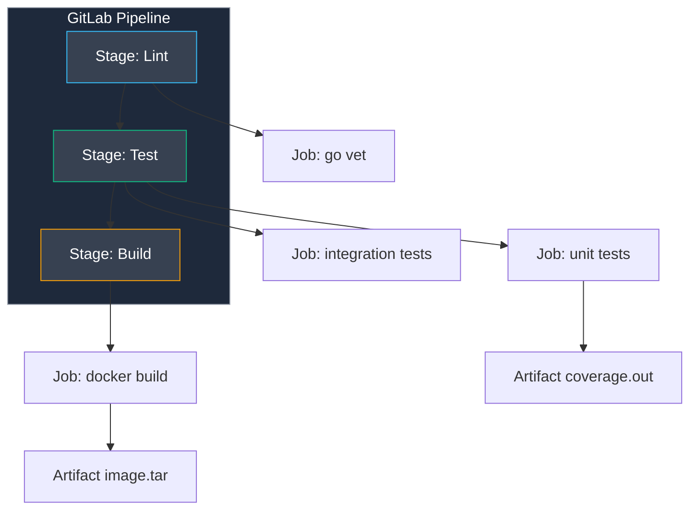

## Энтерпрайз-конвейер: Архитектура GitLab CI/CD

В то время как публичные проекты и стартапы традиционно выбирают открытое облако GitHub, в корпоративном секторе, банковских системах и закрытых контурах стандартом де-факто выступает **GitLab CI/CD**. 

Главное архитектурное отличие GitLab CI кроется в модели доставки задач. Если многие облачные платформы используют push-модель (сервер инициирует соединение с исполнителем), то GitLab CI спроектирован по **Pull-based** модели:
1. Агент (**GitLab Runner**) устанавливается на целевой машине и сам с заданной периодичностью опрашивает центральный сервер GitLab по защищенному HTTPS-каналу: *«Есть ли работа для меня?»*.
2. Получив задачу, Runner скачивает репозиторий, исполняет шаги в изолированной среде и отправляет результаты обратно.

Такая топология идеальна для строгой корпоративной безопасности: раннеры могут находиться за корпоративными файрволами, в демилитаризованных зонах (DMZ), на мощных физических bare-metal серверах или внутри изолированных Kubernetes-кластеров. Серверу GitLab не требуется знать внутренние IP-адреса машин сборки и пробивать входящие сетевые порты.

---

## Концепция `.gitlab-ci.yml`: Этапы и Задания

Поведение конвейера описывается в едином манифесте **`.gitlab-ci.yml`**, расположенном в корне репозитория. Вся структура опирается на две базовые концепции:
* **Stages (Этапы):** Логические фазы конвейера (например, `lint`, `test`, `build`, `deploy`). Все задания внутри одного этапа выполняются параллельно. Переход к следующему этапу происходит только тогда, когда все задачи текущего этапа завершились успехом.
* **Jobs (Задания):** Конкретные вычислительные сценарии, выполняемые конкретным раннером.



> [!info] Под капотом
> GitLab Runner может использовать разные исполнители (Executors). Самые популярные:
> *   **Shell**: Команды выполняются прямо на хосте. Быстро, но "грязно" (загрязнение среды).
> *   **Docker**: Каждая джоба запускается в чистом контейнере (например, `golang:1.22`). Стандарт де-факто.
> *   **Kubernetes**: Каждая джоба — это Pod в кластере. Идеально для автомасштабирования (Autoscaling).
> 
> Исполнитель `docker` гарантирует, что каждый запуск начинается с чистого листа, предотвращая взаимовлияние параллельных сборок.

---

## Кэширование и Артефакты: Не путать теплое с мягким

Одна из самых распространенных ошибок начинающих инженеров в GitLab CI — смешение понятий **`cache`** и **`artifacts`**. Это принципиально разные механизмы с разной физической природой и назначением:

1. **Cache (Кэш):**
   * **Назначение:** Ускорение **последующих** прогонов пайплайна (переиспользование скачанных Go-модулей).
   * **Надежность:** *Best effort* (без гарантий). Если кэш поврежден, очищен администратором или раннер запущен на новой машине, пайплайн обязан успешно собраться с нуля.
   * **Хранение:** Локальный каталог на машине раннера или объектное S3-хранилище (MinIO).
2. **Artifacts (Артефакты):**
   * **Назначение:** Гарантированная передача результатов работы текущего задания **следующим этапам** того же конвейера (бинарный файл, отчет покрытия тестами, файл лога).
   * **Надежность:** Абсолютная гарантия. GitLab сохраняет артефакты на координаторе и передает их в зависимые джобы.
   * **Хранение:** Централизованное хранилище GitLab с настраиваемым временем жизни (`expire_in`).

Пример правильной конфигурации кэширования модулей Go и выгрузки артефактов:

```yaml
variables:
  GOPATH: $CI_PROJECT_DIR/.go

cache:
  key:
    files:
      - go.sum
  paths:
    - .go/pkg/mod/

stages:
  - test

unit_tests:
  stage: test
  image: golang:1.22
  script:
    - go test -race -coverprofile=coverage.out ./...
  artifacts: # Сохраняем отчет для следующей джобы или просмотра в UI
    paths:
      - coverage.out
    expire_in: 1 week
```

Переопределение переменной `GOPATH` на поддиректорию внутри проекта `$CI_PROJECT_DIR/.go` критически важно: GitLab Runner по умолчанию умеет архивировать в кэш только те пути, которые находятся внутри клонированного репозитория.

---

## Сборка контейнеров: Docker-in-Docker (DinD) vs Kaniko

Когда пайплайн доходит до этапа упаковки сервиса в образ, возникает вопрос: как собрать Docker-образ внутри раннера, который сам работает в контейнере?

### Вариант 1: Docker-in-Docker (DinD)
Исторический метод, при котором контейнер сборки обращается к соседнему контейнеру-демону `docker:dind`:

```yaml
services:
  - docker:dind
build:
  image: docker:latest
  script:
    - docker login -u $CI_REGISTRY_USER -p $CI_REGISTRY_PASSWORD $CI_REGISTRY
    - docker build -t $CI_REGISTRY_IMAGE:$CI_COMMIT_SHA .
    - docker push $CI_REGISTRY_IMAGE:$CI_COMMIT_SHA
```

**Фундаментальная угроза безопасности:** Для запуска `docker:dind` раннер обязан работать в привилегированном режиме (`privileged: true`). Это открывает процессу прямой доступ к хостовому ядру Linux, системным устройствам (`/dev`) и таблицам маршрутизации. Любая брешь в зависимостях приложения позволяет злоумышленнику совершить побег из контейнера (container escape) и захватить родительский сервер.

### Вариант 2: Kaniko (Рекомендуемый стандарт безопасности)
Утилита **Kaniko** от Google создана специально для компиляции и сборки Docker-образов внутри контейнеров **без** демона Docker и без root-привилегий.

Kaniko разбирает `Dockerfile`, выполняет системные команды в своем собственном пространстве пользователя (userspace) и формирует слои файловой системы в виде tar-архивов, после чего отправляет их напрямую в реестр по протоколу Docker Registry v2:

```yaml
build:
  stage: build
  image:
    name: gcr.io/kaniko-project/executor:debug
    entrypoint: [""]
  script:
    - /kaniko/executor
      --context "${CI_PROJECT_DIR}"
      --dockerfile "${CI_PROJECT_DIR}/Dockerfile"
      --destination "${CI_REGISTRY_IMAGE}:${CI_COMMIT_TAG}"
```

> [!warning] Ловушка / Gotcha
> При использовании Kaniko вы не можете использовать инструкции `COPY --from=builder`, если базовый образ недоступен или требует аутентификации, без предварительного конфигурирования `.docker/config.json` для Kaniko. Однако Kaniko поддерживает кэширование слоев в удаленном репозитории (remote cache), что часто работает стабильнее локального кэша Docker.

---

## Развертывание (Environments)

GitLab CI предоставляет развитую подсистему **Environments**, визуализирующую состояние развертывания на стендах (`development`, `staging`, `production`) и позволяющую встроить человеческий контроль через ручные триггеры (`when: manual`):

```yaml
deploy_prod:
  stage: deploy
  script:
    - ./deploy.sh production
  environment:
    name: production
    url: https://prod.myapp.com
  when: manual # Требует ручного нажатия кнопки
  only:
    - main
```

Директива `when: manual` превращает этап выкатки в продакшен в контролируемый релизный шлюз. Ответственный релиз-инженер или тимлид нажимает кнопку «Play» в веб-интерфейсе GitLab только после того, как функционал проверен на стейджинге. В случае сбоя интерфейс GitLab позволяет выполнить мгновенный откат (Rollback) к предыдущему успешному развертыванию в 1 клик.

---

## Итог

1. **GitLab CI** опирается на безопасную архитектуру **Pull-based**: агенты сами опрашивают сервер, что позволяет развертывать раннеры в любых изолированных сетях.
2. Четко разделяйте **`cache`** (необязательное ускорение сборки модулей `go mod`) и **`artifacts`** (строго гарантированная передача бинарников и отчетов между стадиями).
3. Избегайте привилегированного режима `docker:dind` — для безопасной сборки контейнеров в изолированных кластерах используйте **Kaniko**.
4. Используйте секцию `environment` и директиву `when: manual` для обеспечения контролируемых и воспроизводимых релизов в продакшен.

Мы научились конфигурировать пайплайны на ведущих CI-платформах. Теперь обратимся к самому ценному содержанию этих конвейеров — автоматизированному тестированию.

В следующей статье мы разберем, как выжать максимум из встроенных тестов Go в распределенном конвейере: [[29. Тестирование в CI]].