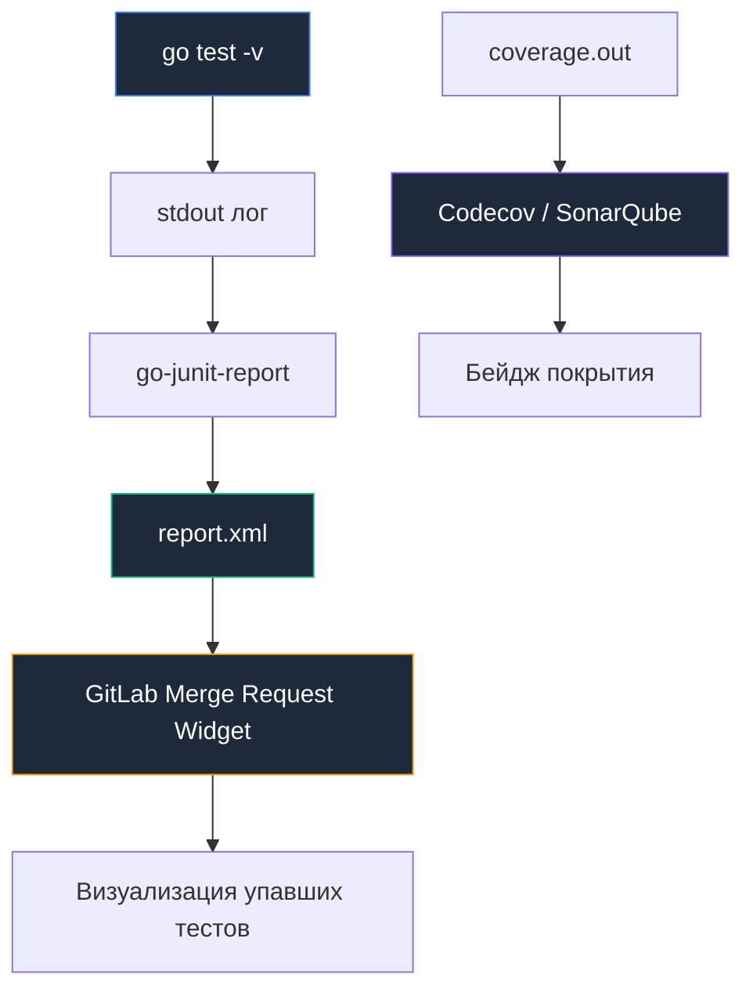

## Стерильный полигон: Автоматизированное тестирование в CI

Как однажды заметил Эдсгер Дейкстра, тестирование программы может показать наличие ошибок, но никогда не докажет их отсутствие. Тем не менее, запуск тестов на локальной машине разработчика — это лишь поверхностная проверка того, что автор не допустил грубой опечатки в своем привычном окружении. Настоящей проверкой на прочность выступает запуск тестов в конвейере CI: в стерильной, воспроизводимой среде, лишенной локальных артефактов и неявных глобальных переменных.

Для проектов на Go тестирование в CI обладает уникальной спецификой. Благодаря встроенному детектору гонок данных, возможностям профилирования покрытия и интеграции с сервисными контейнерами, компилятор `go test` превращается в бескомпромиссного аудитора качества.

---

## Базовая команда: Все флаги важны

Обычный вызов `go test ./...` допустим для быстрой локальной проверки, но в производственном CI-конвейере команда должна быть предельно строгой:

```bash
go test -race -coverprofile=coverage.out -covermode=atomic -v ./...
```

Каждый флаг в этой комбинации решает фундаментальную инженерную задачу:

* **`-race`**: Абсолютно обязательный флаг для CI-пайплайна. Он включает динамический анализатор гонок данных (ThreadSanitizer). Детектор выделяет теневую память (shadow memory) и перехватывает все операции чтения и записи в память, отслеживая отношения синхронизации *happens-before*. Да, это замедляет тесты в 2–5 раз и увеличивает потребление памяти, но пропущенная гонка данных в продакшене способна вызвать повреждение памяти и аварийное падение сервиса в самый неподходящий момент. Локально разработчики часто забывают этот флаг из-за спешки, поэтому CI — последний эшелон обороны.
* **`-coverprofile=coverage.out`**: Сохраняет подробную статистику покрытия строк кода тестами в файл, который затем передается внешним системам аналитики (Codecov, SonarQube).
* **`-covermode=atomic`**: Категорически обязателен при совместном использовании с `-race`. По умолчанию компилятор внедряет в базовые блоки кода обычный инкремент счетчика `count++`. Если несколько конкурентных горутин одновременно исполнят этот код, счетчик вызовет гонку данных внутри самого механизма подсчета покрытия! Режим `atomic` компилирует эти операции через атомарные процессорные инструкции (`sync/atomic`), гарантируя точность и безопасность.
* **`-v`**: Подробный вывод (verbose). В эфемерном раннере CI терминальный лог — единственный источник истины. Если тест падает, флаг `-v` выведет весь контекст вызовов `t.Logf`, стек паники и аргументы функций, избавив от необходимости гадать над сухим сообщением `FAIL`.

> [!warning] Ловушка / Gotcha
> **Кэширование тестов.**
> Go кэширует результаты тестов. Если вы запускаете `go test` дважды без изменений кода, он может выдать `ok  github.com/user/pkg  (cached)`.
> В CI это обычно не является проблемой, так как раннеры эфемерны. Однако, если вы используете самохостинг (self-hosted runners) с персистентным кэшем, и ваши тесты зависят от внешнего состояния (БД, файловая система), кэш может "соврать". Принудительно отключить кэш можно флагом `-count=1`.
> 
> Флаг `-count=1` заставляет тестовый драйвер проигнорировать сохраненный хэш пакета и честно выполнить все тестовые функции заново.

---

## Формат отчетов: JUnit XML

Штатный вывод утилиты `go test` оптимизирован для чтения человеком в терминале. Однако современные корпоративные CI-системы (GitLab, GitHub Actions, Jenkins) и агрегаторы отчетов требуют машиночитаемый структурированный формат **JUnit XML**.

Поскольку сам тулчейн Go намеренно следует принципу минимализма и не включает сторонние форматы, для трансформации потока вывода применяется проверенная временем утилита **`go-junit-report`**:

```bash
# Установка конвертера
go install github.com/jstemmer/go-junit-report/v2@latest

# Запуск тестов, парсинг вывода и сохранение в XML
go test -v -race ./... 2>&1 | go-junit-report -set-exit-code -out report.xml
```

Сгенерированный файл `report.xml` регистрируется как артефакт тестирования. После этого интерфейс Pull/Merge Request начинает наглядно отображать список упавших тестов, время их выполнения и трассировку ошибок прямо в карточке задачи.



---

## Интеграционные тесты и Service Containers

Юнит-тесты выполняются за миллисекунды, изолированно проверяя алгоритмы. Однако в архитектуре бэкенда критически важно проверять реальное взаимодействие с реляционными базами данных (PostgreSQL, MySQL), брокерами очередей (Kafka, RabbitMQ) и кэшами (Redis).

В конвейере CI нельзя надеяться на то, что СУБД уже установлена на агенте. Для изоляции применяются **Service Containers (Сервисные контейнеры)** — фоновые Docker-контейнеры, запускаемые в общей виртуальной сети рядом с контейнером сборки:

```yaml
jobs:
  integration-test:
    runs-on: ubuntu-latest
    
    services:
      postgres:
        image: postgres:15
        env:
          POSTGRES_PASSWORD: secret
        ports:
          - 5432:5432
        options: >-
          --health-cmd pg_isready
          --health-interval 10s
          
    steps:
      - uses: actions/checkout@v4
      - uses: actions/setup-go@v5
        with: { go-version: '1.22' }
        
      - name: Run Integration Tests
        env:
          DB_HOST: localhost
          DB_PORT: 5432
        run: go test -race -tags=integration ./...
```

> [!info] Под капотом
> Платформа создает общую Docker-сеть для контейнера раннера и сервис-контейнера. Это позволяет обращаться к базе по имени хоста (`postgres` или `localhost`, в зависимости от конфигурации). Опция `--health-cmd` критична: CI дождется, пока база станет "healthy", прежде чем запускать тесты, избавляя вас от `connection refused` ошибок при старте.
> 
> Без проверки готовности сетевого сокета через `pg_isready` тесты могут стартовать раньше, чем PostgreSQL завершит инициализацию системных каталогов на диске.

---

## Разделение Юнит и Интеграционных тестов

В развитых проектах комплексные интеграционные тесты могут занимать 10–20 минут. Запускать их на каждый промежуточный коммит — непозволительная трата времени и ресурсов.

Идиоматичный подход Go — разделение тестов с помощью директив условной компиляции (**Build Tags**).

В начале файла интеграционного теста указывается тег сборки:

```go
//go:build integration

package db_test
// ...
```

Стратегия запуска в CI делится на два потока:
1. **Быстрый конвейер (Fast Feedback для каждого Push и PR):** 
   ```bash
   go test -race ./...
   ```
   Файлы с тегом `integration` игнорируются компилятором, и разработчик получает мгновенный вердикт по юнит-тестам за 30 секунд.
2. **Ночной запуск или слияние в основную ветку (Nightly Build / Main Branch):** 
   ```bash
   go test -race -tags=integration ./...
   ```
   Компилятор включает интеграционные наборы тестов, проверяя всю сквозную цепочку взаимодействия.

---

## Flaky Tests (Тесты-хлопушки): Борьба с нестабильностью

Особое бедствие распределенных конвейеров — **flaky-тесты**, которые спорадически падают без видимой причины, а при повторном запуске волшебным образом проходят. 

В Go-программах главные источники флакающих тестов:
* Использование `time.Sleep` вместо синхронизации через каналы или `sync.WaitGroup`. Если на виртуальной машине CI возникнет всплеск загрузки CPU (CPU Steal), таймаут истечет раньше, чем фоновая горутина успеет завершить работу.
* Отсутствие явных таймаутов в сетевых сокетах и HTTP-клиентах.
* Недетерминированный порядок чтения из мап или каналов в тестах.

В конфигурации CI можно настроить автоматический перезапуск упавших задач:

```yaml
# GitLab CI example
test:
  script:
    - go test -race ./...
  retry:
    max: 2
    when:
      - script_failure # Повторить, если упал скрипт (тест)
```

Однако автоматический перезапуск маскирует архитектурный дефект. Зрелый инженерный подход требует локализации первопричины: тест должен фиксировать состояние через дампы, а гонки и скрытые дедлоки должны устраняться перепроектированием логики синхронизации.

---

## Итог

1. Всегда запускайте тесты в CI с комбинацией флагов `-race`, `-coverprofile` и `-covermode=atomic`.
2. Конвертируйте тестовые отчеты в **JUnit XML** с помощью утилиты `go-junit-report` для наглядного отображения в интерфейсе репозитория.
3. Используйте **Service Containers** с обязательным флагом `--health-cmd` для воспроизводимого запуска реальных баз данных и очередей.
4. Разделяйте быстрые юнит-тесты и тяжелые интеграционные сценарии с помощью сборочных тегов (`//go:build integration`).
5. Не миритесь с тестами-хлопушками (flaky tests): перезапуски (`retry`) спасают сборку временно, но только рефакторинг синхронизации гарантирует надежность.

Тесты подтвердили корректность бизнес-логики. Однако работоспособный код все еще может содержать скрытые дефекты архитектуры или проблемы стиля.

В следующей статье мы установим жесткие автоматические фильтры качества: [[30. Линтинг и quality gates]].