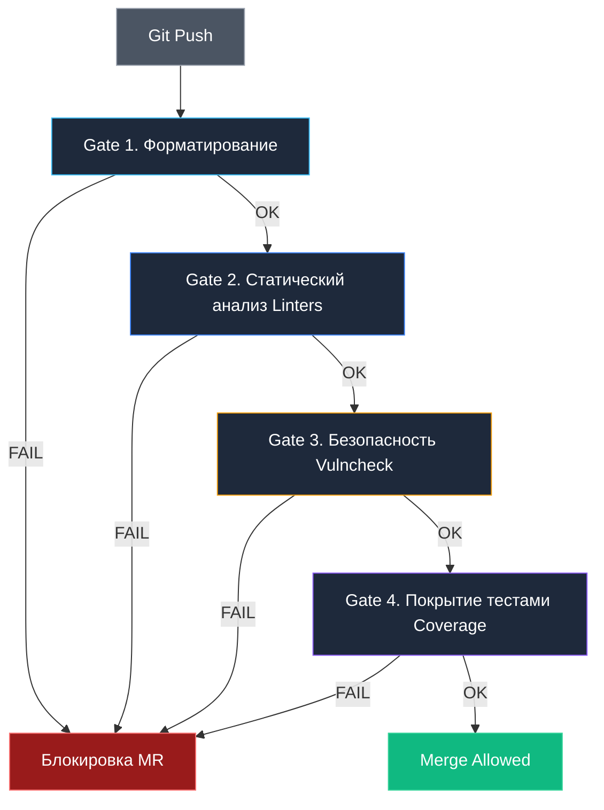

## Ворота качества: Автоматический контроль стандартов кода

Юнит-тесты проверяют функциональную логику: *«Если передать на вход число 42, вернет ли функция строку "OK"?»*. Однако тесты хранят гробовое молчание о внутренней структуре и чистоте самого кода. Чрезмерно ветвистые функции с чудовищной цикломатической сложностью, скрытое дублирование логики, молчаливое игнорирование ошибок или использование устаревших и небезопасных системных вызовов — все это может с легкостью пройти сквозь сито юнит-тестов, но превратить кодовую базу в мину замедленного действия.

**Quality Gates (Ворота качества)** — это последовательный набор формальных инженерных критериев, которым должен удовлетворять любой фрагмент кода, прежде чем получить право на слияние (Merge) в основную ветку или развертывание в кластере. Если исходный код нарушает хотя бы одно критическое правило, автоматический конвейер CI немедленно останавливается, блокируя продвижение дефектных изменений.

---

## Уровни защиты

Подобно многоступенчатой системе шлюзов на гидротехническом сооружении, Quality Gates выстраиваются строго последовательно: от самых быстрых синтаксических проверок к глубокому семантическому анализу графа вызовов и аудиту безопасности.



---

## Gate 1: Форматирование

В сообществе Go споров о стиле оформления кода не существует благодаря созданной еще в Bell Labs традиции жесткого канонического форматирования. Однако человеческая забывчивость неизбежна: разработчик может отредактировать код в простом текстовом редакторе и забыть запустить `gofmt`.

В CI проверка форматирования занимает доли секунды и оформляется через сравнение диффов:

```bash
# Проверка: если gofmt изменил файлы, выводим их список и падаем
if [ -n "$(gofmt -l .)" ]; then
  echo "Following files are not formatted:"
  gofmt -d .
  exit 1
fi
```

Команда `gofmt -l .` выводит список файлов, требующих переформатирования. Если список не пуст, утилита `gofmt -d .` печатает в лог CI точный diff расхождений и завершает шаг с ненулевым кодом выхода, пресекая небрежность в самом зародыше.

---

## Gate 2: Статический анализ (Linting)

На втором рубеже в дело вступает комбайн статического анализа `golangci-lint`. Однако запускать полный глубокий анализ на сотни тысяч строк монорепозитория при каждом коммите в Pull Request — нерациональная трата времени.

### Инкрементальный линтинг
Для ускорения обратной связи в ветках разработки и изоляции замечаний от старого легаси-кода используется флаг `--new-from-rev`. Он указывает анализатору инспектировать только те строки AST, которые были непосредственно затронуты изменениями относительно целевой ветки (например, `main`):

```bash
# Анализировать только изменения в текущем Pull Request
golangci-lint run --new-from-rev=HEAD~1
```

> [!warning] Ловушка / Gotcha
> Инкрементальный линтинг не гарантирует целостность всего проекта. Его стоит использовать в PR-пайплайнах для быстрой обратной связи. Для ночных сборок (Nightly builds) или перед релизом обязательно запускайте полный линтинг всего проекта (`golangci-lint run ./...`).
> 
> Изменение сигнатуры функции в PR может не вызвать ошибок в измененном файле, но сломать сторонний пакет, который линтер не проверил из-за фильтрации диффа.

---

## Gate 3: Безопасность (Security Scanning)

Современная разработка опирается на десятки сторонних библиотек. На третьем рубеже качество оценивается сквозь призму информационной безопасности.

### 1. `govulncheck` — интеллектуальный поиск известных уязвимостей
Официальный инструмент от команды Go Team опирается на базу данных Go Vulnerability Database (CVE). 

Его ключевое архитектурное преимущество перед примитивными сканерами манифестов — **анализ графа вызовов (Call Graph Analysis)**. Инструмент не просто проверяет версию модуля в `go.mod`, но и выясняет, вызывает ли ваше приложение ту конкретную функцию пакета, в которой обнаружена уязвимость:

```bash
# Установка и запуск
go install golang.org/x/vuln/cmd/govulncheck@latest
govulncheck ./...
```

Если уязвимый метод действительно вызывается вашим кодом, `govulncheck` падает с подробной трассировкой пути вызова, блокируя продвижение опасной сборки.

### 2. `gosec` — поиск небезопасных паттернов
Анализатор `gosec` специализируется на выявлении классических ошибок разработчиков:
* Использование криптографически слабых алгоритмов хеширования (MD5, SHA1) для паролей.
* Небезопасная сборка SQL-запросов через строковую конкатенацию (уязвимость к SQL-инъекциям).
* Хардкод секретов, токенов и приватных ключей в константах Go.
* Небезопасное использование пакета `unsafe`.

---

## Gate 4: Покрытие тестами (Coverage Thresholds)

Сгенерированный на этапе тестирования файл отчета `coverage.out` содержит сырые числовые данные о том, какие базовые блоки исполнялись тестами. Четвертый барьер проверяет процент покрытия кода: если метрика падает ниже утвержденного порога, ворота захлопываются.

В лаконичном shell-сценарии это проверяется комбинацией стандартных Unix-утилит:

```bash
# Проверка общего покрытия (порог 80%)
go tool cover -func=coverage.out | grep total | awk '{if ($3+0 < 80.0) exit 1}'
```

> [!tip] Собеседование
> **Вопрос:** Стоит ли стремиться к 100% покрытию кода тестами?
> **Ответ:** Нет. 100% покрытие часто означает, что разработчики пишут бесполезные тесты просто ради метрики, либо тратят время на тестирование геттеров/сеттеров.
> Здоровый подход:
> 1. Установить минимальный барьер (например, 60-70%).
> 2. Блокировать MR, если покрытие **снижается** (diff coverage).
> 3. Требовать 100% покрытия только для критических бизнес-модулей и алгоритмов.
> 
> Здесь действует закон Гудхарта: «Когда показатель становится целью, он перестает быть хорошим показателем». Тестировать нужно граничные случаи и инварианты, а не строчки ради галочки.

---

## Интеграция с SonarQube

В корпоративных инфраструктурах консолидацию всех метрик качества доверяют платформе **SonarQube**. Она агрегирует данные статического анализа, дублирования кода, цикломатической сложности и покрытия тестами в единую наглядную панель с вердиктом Quality Gate.

Типовой шаг в GitHub Actions:

```yaml
# Пример шага в CI
- name: SonarQube Scan
  uses: sonarsource/sonarqube-scan-action@master
  env:
    SONAR_TOKEN: ${{ secrets.SONAR_TOKEN }}
```

Если расчетные метрики нарушают корпоративный регламент (например, появилось новое дублирование кода или покрытие измененных строк ниже 80%), SonarQube возвращает статус "Failed", а пайплайн блокирует слияние изменений.

---

## Итог

1. **Quality Gates** — это автоматические защитные рубежи, исключающие субъективность при код-ревью.
2. Соблюдайте четкую последовательность: быстрое форматирование (`gofmt`), статический анализ (`golangci-lint`), аудит уязвимостей (`govulncheck`), пороги покрытия (`coverage`).
3. Применяйте инкрементальный анализ (`--new-from-rev`) для быстрого цикла Pull Request, но проводите полный ночной аудит всей кодовой базы.
4. `govulncheck` обязателен в каждом Go-проекте для предотвращения проникновения известных CVE в продакшен.

Когда код отформатирован, протестирован и успешно преодолел все ворота качества, наступает кульминационный момент инженерного процесса — подготовка к релизу.

В следующей статье мы исследуем построение релизного конвейера и семантическое версионирование: [[31. Release pipeline и versioning]].