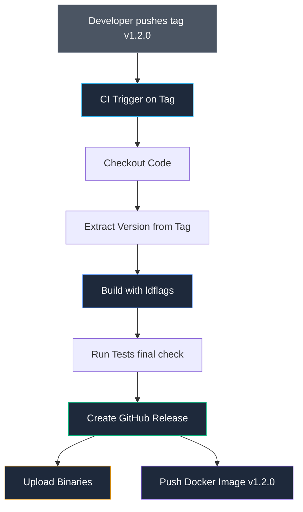

## Релизный конвейер: От коммита к дистрибутиву

Поставка программного обеспечения пользователю — это кульминационный момент труда инженера. Однако если процесс написания кода может быть творческим поиском, то выпуск релиза обязан быть строгой, детерминированной и безукоризненно точной наукой. В былые времена, когда мы в Bell Labs записывали релизы Unix на магнитные ленты или штамповали дискеты, права на ошибку не существовало: отозвать физический носитель из университетов было невозможно. В современном мире микросервисов и открытых пакетов правила ничуть не мягче: ручная сборка бинарника на личном ноутбуке с последующей загрузкой по SSH — абсолютное табу.

Релизный процесс обязан быть **на 100% воспроизводимым**, **аудируемым** и **полностью автоматизированным**.

---

## SemVer: Контракт с пользователем

В лекции [[13. Versioning. SemVer и совместимость]] мы подробно разобрали семантическое версионирование. В релизном конвейере следование этим канонам становится жестким техническим обязательством перед пользователями:

* **MAJOR (v2.0.0)**: Нарушена обратная совместимость, изменены открытые сигнатуры API или протоколы.
* **MINOR (v1.1.0)**: Добавлен новый функционал без нарушения обратной совместимости.
* **PATCH (v1.0.1)**: Исправлены дефекты и уязвимости с полным сохранением поведения.

В экосистеме Go версия программы не должна прописываться вручную в константах кода. Она вычисляется из метаданных системы контроля версий и внедряется прямо в машинный код компоновщиком через флаг `-ldflags`. При этом единственным источником истины (Single Source of Truth) выступает подписанный **Git Tag**.



---

## GoReleaser: Индустриальный стандарт автоматизации релизов

Вместо того чтобы изобретать хрупкие bash-сценарии для сборки под различные архитектуры, архивации и публикации артефактов, сообщество Go опирается на инструмент **GoReleaser**. Это де-факто признанный стандарт подготовки релизов.

GoReleaser берет на себя всю рутинную механику:
1. Выполняет параллельную кросс-компиляцию под целевые ОС и процессорные архитектуры (Cross-compilation).
2. Упаковывает скомпилированные бинарники в архивы (`tar.gz`, `zip`).
3. Вычисляет криптографические контрольные суммы (SHA256) для верификации целостности.
4. Генерирует формулы Homebrew (для установки на macOS через `brew`).
5. Публикует оформленный релиз на GitHub или GitLab с прикрепленными бинарниками.
6. Собирает многоплатформенные Docker-образы и отправляет их в реестр.

Пример конфигурационного файла `.goreleaser.yml`:

```yaml
# Настройка сборки
builds:
  - env:
      - CGO_ENABLED=0
    goos:
      - linux
      - windows
      - darwin
    goarch:
      - amd64
      - arm64
    ldflags:
      - -s -w -X main.version={{.Version}} -X main.commit={{.Commit}} -X main.date={{.Date}}

# Настройка Docker
dockers:
  - image_templates:
      - "myuser/myapp:{{.Version}}"
      - "myuser/myapp:latest"
    dockerfile: Dockerfile

# Настройка релиза на GitHub
release:
  github:
    owner: myuser
    name: myapp
```

> [!info] Под капотом
> GoReleaser использует возможности Go по кросс-компиляции. Он запускает `go build` с разными переменными окружения `GOOS` и `GOARCH` параллельно. Это позволяет собрать 10-20 бинарников за секунды на одной Linux-машине, не нуждаясь в маках или винде.
> 
> Поскольку компилятор Go содержит собственные генераторы машинного кода для всех поддерживаемых архитектур (x86-64, ARM64, RISC-V), для сборки не требуется эмулятор QEMU или сторонние C-кросс-компиляторы (при условии `CGO_ENABLED=0`).

---

## Стратегия тегирования Docker-образов

При сборке контейнерных образов в релизном пайплайне важно следовать строгой дисциплине именования тегов. Никогда не полагайтесь исключительно на тег `latest` в продакшене.

Надежный релизный пайплайн публикует три типа тегов:

1. **Immutable Tag (v1.2.0):** Полная версия SemVer. Этот тег намертво привязан к конкретному коммиту и никогда не должен перезаписываться. Это гарантия воспроизводимости развертывания.
2. **Rolling Tag (v1.2):** Плавающий минорный тег. Он перезаписывается при выпуске патчей (например, `v1.2.1` заменит `v1.2`). Удобен для автоматического подтягивания исправлений безопасности на тестовых стендах, но несет риски для продакшена.
3. **Latest:** Ссылка на самый свежий стабильный релиз. Используется исключительно для локального ознакомления, демонстрационных сред или разработческих сборок.

Пример пайплайна в GitLab CI для тегирования:

```yaml
rules:
  - if: $CI_COMMIT_TAG # Запускать только при создании тега
script:
  - docker build -t $CI_REGISTRY_IMAGE:$CI_COMMIT_TAG .
  - docker tag $CI_REGISTRY_IMAGE:$CI_COMMIT_TAG $CI_REGISTRY_IMAGE:latest
  - docker push --all-tags $CI_REGISTRY_IMAGE
```

---

## Автоматизация Changelog

Пользователям и коллегам необходимо точно понимать, какие изменения вошли в очередную версию сервиса. Ручное составление истории изменений перед релизом неизбежно приводит к пропускам и неточностям.

Современные подходы к автоматизации журнала изменений:
1. **Conventional Commits:** Если команда следует соглашению об именовании коммитов (например, `feat: add user login` или `fix: memory leak`), утилиты вроде `standard-version` или `semantic-release` автоматически генерируют файл `CHANGELOG.md` и обновляют манифест `go.mod`.
2. **Git Log:** Базовое извлечение списка изменений через диапазон тегов в Git:
   ```bash
   git log v1.0.0..v1.1.0 --oneline
   ```

Утилита GoReleaser имеет встроенный генератор журнала изменений, который умеет группировать коммиты по смысловым категориям (Features, Bug Fixes) и отфильтровывать служебные правки.

---

## Защита веток и тегов

В промышленных репозиториях критически важно активировать функцию **Protected Tags** на уровне настроек GitHub или GitLab:
* Разрешите создание и пуш тегов, начинающихся с префикса `v*`, только инженерам с ролью `Maintainer` или `Admin` (либо исключительно служебному сервисному аккаунту CI/CD).
* Это предотвратит случайное создание тега вроде `v2.0.0` младшим разработчиком во время локальных экспериментов.

> [!warning] Ловушка / Gotcha
> **Отозвать релиз нельзя.**
> В Go (и Go Modules) publicadoe tag — это навсегда. Если вы опубликовали `v1.0.0`, а потом нашли баг и удалили тег на GitHub, но пересоздали его с другим кодом (например `v1.0.0` -> delete -> new `v1.0.0`), вы сломаете всем кэши. Go Proxy закэшировал первую версию и будет отдавать её.
> 
> Более того, база контрольных сумм `sum.golang.org` (GOSUMDB) построена на криптографическом дереве Меркла (Merkle Tree). При обнаружении несовпадения контрольных сумм для одного и того же тега `v1.0.0` компилятор Go во всем мире откажется скачивать модуль, сигнализируя о попытке подмены кода (Security Tampering).
> 
> Если релиз содержит критическую ошибку, никогда не перезаписывайте тег — немедленно выпускайте корректирующий патч `v1.0.1` или отзывайте версию через директиву `retract` в `go.mod`.

---

## Итог

1. **Релиз** — это автоматизированный процесс, триггером которого является публикация Git Tag.
2. **GoReleaser** устраняет необходимость в самописных скриптах, автоматизируя кросс-компиляцию, контрольные суммы SHA256 и публикацию дистрибутивов.
3. Внедряйте номер версии и метаданные сборки через `-ldflags` прямо из параметров Git-тега.
4. Защищайте публикацию тегов `v*` политиками Protected Tags в системе контроля версий.
5. Соблюдайте закон неизменяемости: однажды опубликованный тег в экосистеме Go Modules остается неизменным навсегда.

Мы завершили построение сквозного конвейера тестирования, линтинга и релизного развертывания сервисов. Однако за легким упоминанием кросс-компиляции в GoReleaser скрывается сложная и изящная инженерная механика компилятора Go: как именно один компилятор способен порождать бинарники под чужие процессоры и операционные системы без использования виртуальных машин?

В следующей статье мы откроем финальный блок модуля и погрузимся в устройство кросс-компиляции: [[32. Кросс компиляция Go]].