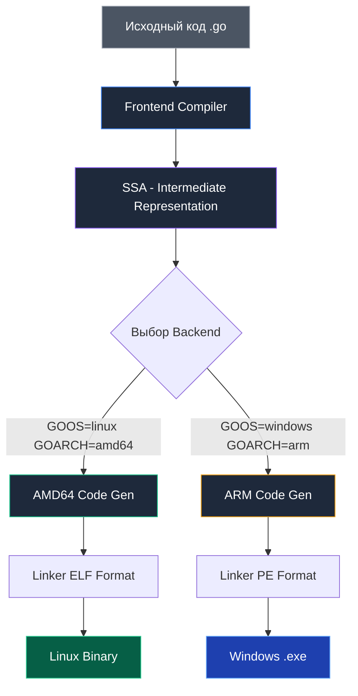

## Магия переносимости: Как устроен кросс-компилятор Go

В середине 1970-х годов в Bell Labs Стив Джонсон (Steve Johnson) и Деннис Ритчи совершили революцию, создав переносимый компилятор C (Portable C Compiler, `pcc`). Они впервые четко отделили машинно-независимый синтаксический анализ от генераторов инструкций конкретного процессора (PDP-11, Interdata 8/32). Спустя сорок лет создатели Go довели эту классическую концепцию до абсолютного инженерного совершенства.

Одной из самых поразительных возможностей языка Go, выгодно отличающей его от C++, Rust или Java, является **нативная, мгновенная кросс-компиляция**. Разработчик может сидеть за ноутбуком MacBook с процессором Apple Silicon (архитектура ARM64) и одной лаконичной командой в терминале собрать монолитный бинарник, который без малейших модификаций запустится на сервере Linux (AMD64) или на старом персональном компьютере под управлением Windows (386).

Для этого не требуется устанавливать многогигабайтные пакеты кросс-компиляторов gcc, системные заголовочные файлы (`sysroot`) целевой платформы или поднимать виртуальные машины. Вся таблица мировых архитектур уже зашита в единый дистрибутив Go.

---

## Как это работает (Under the hood)

Начиная с версии Go 1.5, компилятор Go был полностью переписан с языка C на сам Go (самораскрутка, или bootstrapping). Его архитектура состоит из двух фундаментальных уровней:

1. **Frontend (Фронтенд):** Выполняет лексический разбор, синтаксический анализ исходных файлов `.go`, проверку типов и трансляцию кода в универсальное промежуточное представление — **SSA (Static Single Assignment)**.
2. **Backend (Бэкенд):** Выбирается компилятором на основе целевых переменных окружения **`GOOS`** и **`GOARCH`**. Бэкенд транслирует абстрактные инструкции SSA в конкретный набор машинных команд целевого процессора (x86, ARM, RISC-V), а внутренний компоновщик Go (`cmd/link`) формирует результирующий бинарный контейнер: **ELF** для Linux, **Mach-O** для macOS или **PE** (Portable Executable) для Windows.



> [!info] Под капотом
> В директории `$GOROOT/pkg/tool/<host_os>_<host_arch>/` лежат исполняемые файлы компилятора (`compile`) и линкера (`link`).
> Интересно, что сам компилятор умеет генерировать код для любых платформ, независимо от того, на какой платформе он запущен. "Кросс-компилятор" — это дефолтное состояние Go.
> 
> Внутренний линкер `cmd/link` синтезирует заголовки исполняемых форматов ELF, Mach-O и PE напрямую из структур данных Go, не обращаясь к системным утилитам `ld` операционной системы.

---

## Переменные окружения `GOOS` и `GOARCH`

Управление кросс-компиляцией в Go сведено к двум переменным окружения, задающим целевую операционную систему и микроархитектуру:

* **`GOOS`** (Operating System): `linux`, `windows`, `darwin` (macOS), `freebsd`, `openbsd`, `netbsd`, `solaris`, `aix`, `android`, `ios`.
* **`GOARCH`** (Architecture): `amd64` (x86-64), `arm64` (AArch64), `arm` (32-bit ARM), `386` (32-bit x86), `mips`, `ppc64le`, `riscv64`, `s390x`.

Посмотреть полный перечень сотен официально поддерживаемых пар платформы и архитектуры можно одной командой:

```bash
go tool dist list
# Вывод:
# linux/amd64
# linux/arm64
# windows/amd64
# darwin/arm64
# ...
```

Пример одновременной сборки серверной версии для Linux и клиентской для Windows с одной и той же рабочей станции:

```bash
# Сборка для Linux (стандартный сервер)
GOOS=linux GOARCH=amd64 go build -o bin/app_linux .

# Сборка для Windows (утилита для пользователя)
GOOS=windows GOARCH=amd64 go build -o bin/app_windows.exe .
```

> [!warning] Ловушка / Gotcha
> Обратите внимание: если вы собираете под Windows, вы **обязаны** сами указать расширение `.exe` в флаге `-o`. Go создаст файл без расширения, если вы не укажете, но Windows требует `.exe` для запуска. Go не добавляет его автоматически, чтобы не ломать скрипты в Linux/macOS.

---

## Файловая система: Операционная система в коде

Кросс-компиляция Go работает не только на уровне машинных инструкций микропроцессора, но и на уровне системных абстракций. Пакеты `os` и `syscall` в стандартной библиотеке используют элегантный механизм **File System Stubs** (файловые заглушки).

Когда сборщик видит переменную `GOOS=windows`, он автоматически включает в компиляцию файлы с суффиксом `_windows.go` (например, `syscall_windows.go`), игнорируя файлы с суффиксами `_unix.go` и `_linux.go`.

Это позволяет стандартной библиотеке естественно мимикрировать под любую операционную систему: корректно интерпретировать пути к файлам (`/` против `\`), обрабатывать дескрипторы сокетов, права доступа и системные идентификаторы процессов.

---

## Главная проблема: CGO

Идеальная и безболезненная кросс-компиляция гарантирована до тех пор, пока проект написан на чистом Go. Но стоит подключить механизм **CGO** (вызовы стороннего C-кода через `import "C"`), как идиллия рушится.

Если ваш проект использует `import "C"` или опирается на C-библиотеки (например, драйвер SQLite `go-sqlite3`, биндинги к Git или OpenSSL), компилятору Go требуется внешний C-компилятор (`gcc` или `clang`), умеющий генерировать объектный код под целевую архитектуру:
* На macOS штатный `clang` не умеет компилировать C-код для `linux/arm64` без установленного системного окружения glibc целевой платформы.
* Настройка связок C-кросс-компиляторов превращается в сложнейшую инженерную проблему.

### Практические решения проблемы CGO

1. **Отключение CGO (Рекомендуемый путь):** 
   ```bash
   CGO_ENABLED=0
   ```
   С флагом `CGO_ENABLED=0` Go отсекает зависимость от сторонних C-тулчейнов, порождая абсолютно автономный статический бинарник. Если функционал позволяет (например, переход на чистые Go-драйверы баз данных, такие как `modernc.org/sqlite` вместо CGO-версии), это лучший выбор.
2. **Сборка в эмулируемом контейнере Docker:** 
   Запуск сборочного контейнера с целевой архитектурой (например, `golang:1.22-alpine-arm64`) через механизм QEMU (`docker run --platform linux/arm64`). Это «нативная» сборка внутри эмулируемого виртуального процессора.
3. **Использование кросс-компилятора Zig CC:** 
   Современный компилятор языка Zig включает полноценный C/C++ компилятор, содержащий библиотеки `musl` и `glibc` для всех платформ из коробки. Он интегрируется с Go одной строкой:
   ```bash
   CC="zig cc -target aarch64-linux-musl" CGO_ENABLED=1 GOOS=linux GOARCH=arm64 go build .
   ```

> [!tip] Собеседование
> **Вопрос:** Почему в Go кросс-компиляция простая, а в C++ сложная?
> **Ответ:** В C++ стандартная библиотека и рантайм жестко привязаны к ОС и архитектуре. Вам нужно собирать `libc`, `libstdc++` и системные заголовки для каждой платформы отдельно.
> В Go рантайм (scheduler, GC, map, slice) написан на Go. При кросс-компиляции Go просто перекомпилирует сам свой рантайм под целевую платформу. Это делает его самодостаточным и не зависящим от системных библиотек хоста.

---

## Итог

1. Go предоставляет непревзойденную нативную кросс-компиляцию, управляемую парами переменных `GOOS` и `GOARCH`.
2. Компилятор Go содержит встроенные генераторы SSA-инструкций и линкеры для десятков процессоров и форматов исполняемых файлов (ELF, Mach-O, PE).
3. При компиляции под платформу Windows всегда явно указывайте расширение `.exe` в пути артефакта (`-o`).
4. Флаг **`CGO_ENABLED=0`** — ключевое условие детерминированной, быстрой и переносимой кросс-компиляции.
5. Для проектов с неотключаемым CGO используйте мультиплатформенные образы Docker или компилятор `zig cc`.

Мы изучили теоретические основы и механизмы кросс-компиляции. Теперь рассмотрим, как организовать практическую параллельную сборку бинарников под целый спектр платформ в рамках одного проекта.

В следующей статье мы исследуем матричную сборку под разные платформы: [[33. Сборка под разные платформы]].