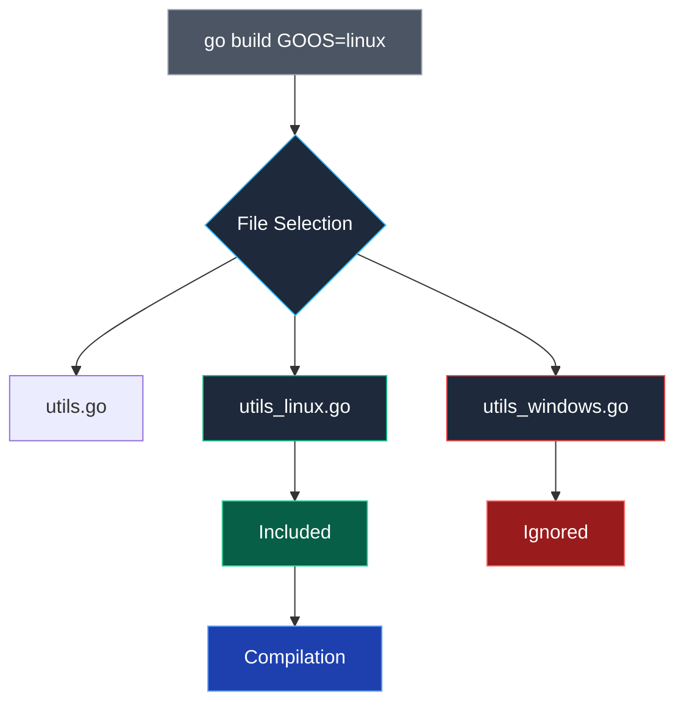

## От теории к практике: Матрица сборки

В предыдущей статье мы исследовали архитектурную механику кросс-компилятора Go. Однако в реальном промышленном цикле разработки перед инженером встает практическая задача: получить из одного репозитория полный спектр бинарных артефактов для всех поддерживаемых платформ. Нам нужен серверный демон под Linux (x86-64 и ARM64), консольная утилита администрирования для инженеров на macOS (Apple Silicon и Intel) и клиентское приложение для пользователей Windows.

Организация параллельной матричной сборки требует продуманной дисциплины именования файлов, четкого управления платформо-зависимым кодом и применения современных инструментов контейнеризации.

---

## Стратегия именования артефактов

Если при пакетной сборке вызвать команду `go build -o app` сначала для Linux, а затем для Windows, результирующие файлы либо перезапишут друг друга, либо приведут к коллизии имен в каталоге артефактов.

Общепринятый индустриальный стандарт требует включать имя программы, семантическую версию, целевую ОС и архитектуру процессора прямо в имя файла.
Формат: `<app>-<version>-<os>-<arch>[.exe]`

Пример классического сборочного bash-сценария:

```bash
VERSION=$(git describe --tags --always)
APP_NAME="myapp"

PLATFORMS=("linux/amd64" "linux/arm64" "darwin/amd64" "darwin/arm64" "windows/amd64")

for PLATFORM in "${PLATFORMS[@]}"; do
    IFS='/' read -r GOOS GOARCH <<< "$PLATFORM"
    
    OUTPUT_NAME="${APP_NAME}-${VERSION}-${GOOS}-${GOARCH}"
    if [ "$GOOS" = "windows" ]; then
        OUTPUT_NAME+=".exe"
    fi
    
    echo "Building for $GOOS/$GOARCH..."
    env GOOS="$GOOS" GOARCH="$GOARCH" go build -ldflags="-s -w" -o "bin/$OUTPUT_NAME" ./cmd/app
done
```

Этот подход часто оформляется в виде целей `Makefile`. Однако в современных производственных пайплайнах всю эту рутину обычно доверяют специализированному декларативному инструменту **GoReleaser** (см. [[31. Release pipeline и versioning]]).

---

## Платформо-зависимый код: Build Tags и суффиксы

Иногда поведение сервиса на разных операционных системах должно различаться фундаментально: например, обработка сигналов завершения `syscall.SIGTERM` в Unix против событий службы Windows Service, или низкоуровневая работа с реестром ОС.

В языке C для таких целей использовались директивы препроцессора `#ifdef`, превращавшие исходный код в нечитаемую «вермишель». Создатели Go предложили два гораздо более чистых и структурированных механизма.

### 1. Неявные суффиксы файлов (Implicit Suffixes)
Компилятор Go автоматически фильтрует файлы исходного кода на этапе построения AST, если их имена оканчиваются на `_<GOOS>.go`, `_<GOARCH>.go` или `_<GOOS>_<GOARCH>.go`:

```text
sound.go          // Общий интерфейс
sound_linux.go    // Реализация через ALSA/PulseAudio (только для linux)
sound_windows.go  // Реализация через WinAPI (только для windows)
sound_darwin.go   // Реализация через CoreAudio (только для darwin)
```

Если задана целевая сборка `GOOS=linux`, файл `sound_windows.go` будет полностью проигнорирован компилятором еще до проверки типов, словно его вовсе не существует в каталоге.

### 2. Явные теги сборки (`//go:build`)
Когда условий включения файла несколько или требуется булева логика (дизъюнкция, конъюнкция, отрицание), применяются директивы **Build Tags** в первой строке файла.

Пример для файла `server_linux_arm.go`:

```go
//go:build linux && arm

package server

// Этот код скомпилируется только если GOOS=linux И GOARCH=arm
```

Пример для файла `log_unix.go`:

```go
//go:build darwin || linux || freebsd

package log

// Этот код скомпилируется для любой UNIX-подобной системы
```



> [!warning] Ловушка / Gotcha
> Не злоупотребляйте платформо-зависимым кодом. Чем больше `#if defined` (аналог в Go), тем сложнее поддерживать код. Старайтесь максимально использовать стандартную библиотеку `os` и `syscall`, которые абстрагируют различия.
> 
> Идеальный архитектурный паттерн — объявить чистый интерфейс Go в общем файле (например, `sound.go`), а конкретные системные реализации разнести по файлам с суффиксами платформ.

---

## Мультиплатформенные Docker-образы: `docker buildx`

Современные облачные кластеры часто строятся на гетерогенном железе: узлы с дешевыми и энергоэффективными процессорами ARM64 (AWS Graviton, Ampere Altra) работают бок о бок с серверами на базе x86-64 (Intel Xeon, AMD EPYC).

Реестры контейнеров (Docker Hub, GitHub Packages, GitLab Registry) поддерживают стандарт OCI **Manifest List** (список манифестов). Это позволяет опубликовать единый публичный тег (например, `myapp:latest`), под капотом которого скрываются разные бинарные образы для архитектур AMD64 и ARM64. Контейнерный движок (containerd или CRI-O) на сервере автоматически запросит именно тот срез, который соответствует микропроцессору хоста.

Для компиляции мультиплатформенных образов применяется плагин `docker buildx`:

```bash
# Создаем и используем билдер
docker buildx create --name mybuilder --use

# Собираем и пушим сразу под 2 архитектуры
docker buildx build \
  --platform linux/amd64,linux/arm64 \
  -t myuser/myapp:latest \
  --push .
```

### Два подхода к мультиплатформенной сборке в Docker

1. **Эмуляция процессора через QEMU:**
   Если агент сборки работает на AMD64, он может исполнять ARM64-контейнеры через системный транслятор инструкций QEMU (`binfmt_misc`). Это универсально, но крайне неэффективно: трансляция машинных инструкций на лету замедляет компиляцию в 10–50 раз.
2. **Нативная кросс-компиляция Go в Dockerfile:**
   Сборочный движок BuildKit передает в `Dockerfile` встроенные аргументы сборки `TARGETOS` и `TARGETARCH`. Мы можем выполнять компилятор Go на нативной скорости процессора хоста, указывая ему целевую архитектуру:

```dockerfile
# Dockerfile для multi-platform
ARG TARGETOS TARGETARCH

RUN GOOS=$TARGETOS GOARCH=$TARGETARCH go build -o /app ./cmd/app
```

В этом сценарии компилятор Go работает на аппаратной скорости хостового процессора, создавая машинный код целевой архитектуры за считанные секунды без малейших накладных расходов на эмуляцию.

> [!tip] Собеседование
> **Вопрос:** В чем разница между сборкой Docker-образа через QEMU и через кросс-компиляцию Go?
> **Ответ:**
> *   **QEMU**: Эмулирует целевой процессор. Всё, что происходит внутри `RUN`, работает через прослойку. Это медленно (в 10-50 раз), но позволяет запускать любой Linux-бинар (не только Go).
> *   **Кросс-компиляция Go**: Использует способность Go компилировать код под другую архитектуру без эмуляции. Это очень быстро. В `Dockerfile` мы просто вызываем `go build`, передавая `GOARCH`. Но это работает только для Go-кода. Если в `Dockerfile` есть `apt install`, он выполнится для архитектуры хоста, что может сломать образ.

---

## Итог
 
 1.  Используйте **матричную сборку** для создания артефактов под все платформы.
 2.  Именуйте файлы по стандарту `app-os-arch`.
 3.  Используйте суффиксы файлов (`_linux.go`) для разделения кода.
 4.  `docker buildx` — стандарт для создания мульти-архитектурных Docker-образов.

Мы научились организовывать матричную кросс-платформенную сборку. Однако этот стройный конвейер безупречно работает лишь до тех пор, пока в процесс сборки не вмешивается код на языке C.

В следующей статье мы исследуем механизм CGO и его фундаментальное влияние на время сборки, линковку и стабильность бинарников: [[34. CGO и его влияние на сборку]].