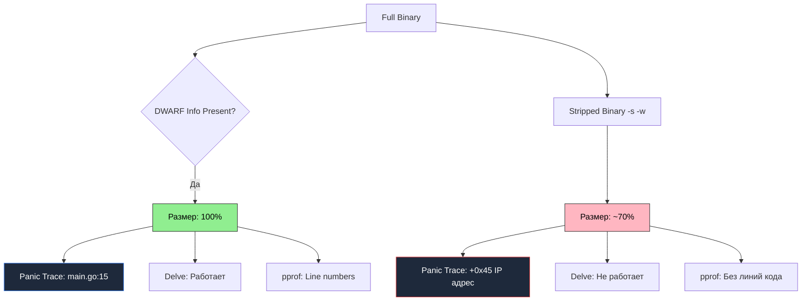

## Невидимый вес: Анатомия отладочной информации и символов

В раннюю эпоху Unix на миникомпьютерах PDP-11 дисковое пространство измерялось считанными мегабайтами. Чтобы сэкономить драгоценные блоки диска, Кен Томпсон создал системную утилиту `strip`, которая безжалостно вырезала таблицу символов из исполняемых файлов a.out. Спустя полвека компилятор Go по умолчанию придерживается диаметрально противоположной философии: он щедро снабжает каждый скомпилированный бинарник исчерпывающей отладочной информацией.

Скомпилированный Go-бинарник содержит не только «сырой» машинный код инструкций процессора, но и богатейший пласт метаданных. Этот невидимый багаж колоссально помогает инженеру при отладке и профилировании, но увеличивает физический размер файла на диске.

Понимание того, как устроены внутренние секции бинарного контейнера и какую цену мы платим за их удаление, — один из ключевых признаков зрелого системного инженера.

---

## DWARF: Карта сокровищ внутри бинарника

В отличие от традиционных компиляторов C или C++, где отладочные символы генерируются только по явному запросу (`-g`), компилятор Go по умолчанию включает полную отладочную информацию в формате **DWARF (Debugging With Attributed Record Formats)**.

Формат DWARF представляет собой структурированную базу данных, аккуратно упакованную в специальные секции исполняемого файла (ELF, Mach-O или PE). Она служит переводчиком между миром машинных инструкций процессора и миром исходного кода программиста.

Секции DWARF хранят три ключевых блока знаний:
1. **Таблица символов (Symbol Table):** Сопоставление числовых виртуальных адресов памяти именам функций, методов и глобальных переменных пакетов.
2. **Линейная информация (Line Number Table):** Прямой мэппинг смещений адресов инструкций в памяти на конкретные номера строк и имена файлов исходного кода (`main.go:42`).
3. **Информация о типах (Type Information):** Структурные описания типов данных: имена полей структур, интерфейсные таблицы, размеры аллокаций и смещения указателей.

> [!info] Под капотом
> Если вы запустите `go build` без флагов, а затем сделаете `go tool objdump -S main`, вы увидите ассемблерный код, перемежающийся строками Go-кода. Это возможно благодаря DWARF-секциям в ELF-файле. Если эту информацию вырезать, останется только "голый" ассемблер.
> 
> Утилита `objdump` обращается к секции `.debug_line`, извлекает адрес счетчика команд (PC) и выводит соответствующую строку оригинального кода на Go над блоком ассемблерных инструкций.

---

## `-ldflags="-s -w"`: Хирургическое удаление метаданных

Если для клиентских CLI-утилит или встраиваемых устройств размер бинарника критичен, компоновщик Go позволяет вырезать эти секции с помощью параметров компоновщика `-ldflags`:

* **`-s`**: Вырезает таблицу символов (symbol table). Бинарник перестает «знать» имена неэкспортируемых функций в секциях символов.
* **`-w`**: Вырезает отладочную информацию DWARF (секции `.debug_*`).

Пример оптимизации:

```bash
# Полный бинарник: ~15 MB
go build -o app_full .

# Облегченный бинарник: ~10 MB
go build -ldflags="-s -w" -o app_stripped .
```

Связка флагов `-s -w` уменьшает физический размер результирующего бинарного файла на 25–35%.



---

## Цена легкости: Обратная сторона медали

Уменьшение размера бинарника на несколько мегабайтов кажется привлекательной победой, особенно при упаковке в контейнеры `scratch`. Однако в реальной эксплуатации за эту экономию приходится платить колоссальную цену.

### 1. Потеря информативности трассировки стека (Stack Traces)
Когда в работающем сервисе происходит аварийная ситуация (`panic`), рантайм Go перехватывает исключение и распечатывает трассировку вызовов горутины:

* **В бинарнике с DWARF-символами:**
  ```text
  panic: something went wrong
  goroutine 1 [running]:
  main.processData(0x0)
          /app/service/processor.go:45 +0x12a
  main.main()
          /app/cmd/main.go:12 +0x3b
  ```
  Дежурный инженер мгновенно видит точный файл `processor.go` и конкретную строку `45`.

* **В бинарнике со срезанными символами (`-s -w`):**
  ```text
  panic: something went wrong
  goroutine 1 [running]:
  main.processData(0x0)
          <autogenerated>:1 +0x12a
  main.main()
          <autogenerated>:1 +0x3b
  ```
  Вместо имен файлов лог заполняется безликими заглушками `<autogenerated>:1` и шестнадцатеричными смещениями инструкций `+0x12a`. Восстановить место падения можно только вручную, дизассемблируя бинарник по сохраненной карте адресов. Среднее время расследования инцидента (MTTR — Mean Time To Resolve) возрастает с пяти минут до нескольких мучительных часов.

### 2. Проблемы с профилированием
Инструменты вроде `pprof` и непрерывные агенты профилирования в продакшене (Parca, Pyroscope) используют DWARF-информацию для аннотации профилей CPU и памяти номерами строк. Без этой информации вы будете видеть только имена функций, но не конкретное место в файле, где происходит аллокация или расход CPU. В стрипнутом бинарнике невозможно понять, какая конкретно строка внутри цикла аллоцирует память.

### 3. Невозможность интерактивной отладки (Delve)
Штатный отладчик Go **Delve (`dlv debug`)** полностью опирается на DWARF-записи для управления точками останова (breakpoints) и чтения локальных переменных. Подключиться к скомпилированному с `-s -w` сервису и поставить breakpoint невозможно.

---

## Инспекция бинарника: `go tool nm` и `objdump`

Даже в бинарниках, собранных с флагами `-s -w`, компилятор сохраняет часть информации о типах: метаданные, необходимые для работы механизмов рефлексии (reflection), интерфейсных таблиц `itab` и сборщика мусора.

Исследовать символы любого бинарного файла Go можно с помощью встроенной утилиты **`go tool nm`**:

```bash
# Список всех символов в бинарнике
go tool nm app_full | grep main
# 10aa40 T main.main
# 10ab20 T main.processData
```

Буква `T` обозначает символ в секции исполняемого кода (Text Section), а шестнадцатеричное число — виртуальный адрес функции в адресном пространстве процесса. Эта утилита незаменима при расследовании того, попала ли конкретная функция в финальную сборку или была отсечена оптимизатором мертвого кода (dead-code elimination).

---

## Best Practice: Что выбирать?

> [!warning] Ловушка / Gotcha
> Энтузиазм новичков часто приводит к тому, что они везде добавляют `-ldflags="-s -w"`.
> **Правило:** В современном мире хранилища дешевы, а время инженеров дорого.
> *   **Dev / Staging**: Никогда не удаляйте символы. Вам нужна полная информация для отладки.
> *   **Production**: Если вы используете `pprof` в проде (что крайне полезно) или хотите адекватные логи паник — **оставьте символы**. Потеря 5-10 мегабайт на диске незначительна по сравнению с неудобством отладки.
> *   **CLI Tools / Client Apps**: Здесь размер имеет значение для скачивания. Удаление символов оправдано.

Если строгие корпоративные политики безопасности требуют удаления отладочной информации из релизных образов для предотвращения реверс-инжиниринга, обязательно сохраняйте полноценный «debug» бинарник той же версии в артефактах сборки CI. Это позволит сопоставить адрес паники с исходным кодом постфактум.

---

## Итог

1. По умолчанию компилятор Go включает полную отладочную информацию в формате **DWARF**.
2. Флаги компоновщика `-ldflags="-s -w"` позволяют уменьшить размер исполняемого файла на 25–35%.
3. Плата за облегчение бинарника — потеря номеров строк в трассировках `panic`, деградация профилей `pprof` и невозможность использования отладчика Delve.
4. В серверных бэкенд-сервисах рекомендуется **сохранять отладочную информацию**, защищая команду от дорогостоящего простоя при разборе аварийных инцидентов.

Мы детально исследовали внутреннюю структуру бинарников и механизмы отладки. Теперь обратимся к автоматизированному контролю производительности кода в непрерывном конвейере сборки.

В следующей статье мы рассмотрим профилирование и контроль регрессий производительности в CI: [[36. Профилирование в CI]].