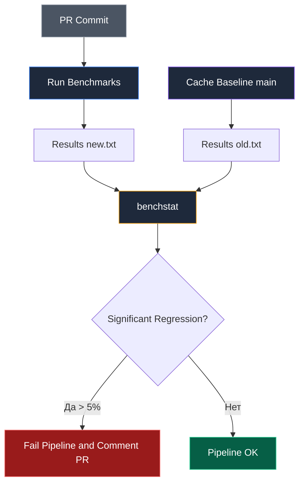

## Профилирование в CI: Охота на регрессии производительности

В нашей классической книге *The Elements of Programming Style* мы с П.Дж. Плогером сформулировали простое правило: *«Не пытайтесь ускорять код мелкими ухищрениями — выбирайте лучший алгоритм»*. Но как убедиться в том, что свежий Pull Request коллеги не замедлил критический алгоритм в два раза и не увеличил потребление оперативной памяти на порядок? 

Большинство инженерных команд привыкли к тому, что конвейер CI проверяет лишь логическую корректность (юнит-тесты) и оформление кода (линтеры). Однако третий фундаментальный критерий — **производительность** — слишком часто оказывается заброшенным вплоть до момента, когда боевые серверы захлебываются под реальной нагрузкой.

Автоматизированное профилирование и бенчмаркинг в CI — это реализация концепции «Shift Left» для производительности: предотвращение деградации отклика и расхода ресурсов еще до того, как код вольется в основную ветку.

---

## Бенчмарки как регулярные тесты: `go test -bench`

В инструментарий языка Go изначально встроен первоклассный фреймворк для микробенчмаркинга. В конвейере CI функции измерения производительности можно и нужно запускать с той же регулярностью, что и функциональные тесты:

```bash
# Запуск бенчмарков
go test -bench=. -benchmem -count=5 ./...
```

Разбор параметров запуска:
* **`-bench=.`**: Указывает запустить все функции, чьи имена начинаются с префикса `Benchmark`.
* **`-benchmem`**: Активирует фиксацию показателей динамической памяти (`B/op` — байт на операцию, `allocs/op` — число аллокаций в куче на операцию). Это **самая стабильная метрика** в облачной среде.
* **`-count=5`**: Принуждает драйвер повторить серию измерений 5 раз подряд, собирая выборку для математической статистики.

### Проблема: Шум виртуализации в CI-раннерах

Виртуальные машины в публичных облаках (GitHub-hosted runners, AWS EC2, GCP) работают на разделяемых гипервизорах. На том же физическом сокете процессора могут параллельно исполняться задачи других виртуальных машин («шумные соседи»). Процессор динамически меняет тактовую частоту (Thermal Throttling, Intel Turbo Boost), переключает контексты, а кэши L1–L3 сбрасываются.

В результате время выполнения одного вызова (`ns/op`) может случайным образом колебаться на 10–25% от прогона к прогону.

> [!warning] Ловушка / Gotcha
> Никогда не пытайтесь сравнивать абсолютное время выполнения (`ns/op`) в CI жестко (например, "если больше 100мс, то fail"). Шум среды убьет ваш пайплайн. Вы будете постоянно перезапускать упавшие билды ("flaky builds").
> 
> Жесткие проверки времени в облаке порождают ложные срабатывания, разрушая доверие команды к конвейеру.

---

## `benchstat`: Статистическая значимость

Для надежного отделения реального ускорения или замедления алгоритма от аппаратного шума команда рантайма Go создала официальную утилиту **`golang.org/x/perf/cmd/benchstat`**. 

Утилита использует непараметрические статистические критерии (в частности, критерий Манна — Уитни) для сопоставления двух выборок измерений. Она вычисляет p-значение (p-value) и сообщает, является ли разница в производительности математически достоверной, либо ее можно списать на случайные колебания.

Эталонный сценарий работы в CI:
1. Загрузить предварительно вычисленные результаты бенчмарков из стабильной ветки `main` (базовый уровень).
2. Выполнить серию бенчмарков для кода текущего Pull Request.
3. Передать оба файла утилите `benchstat`.

```bash
# 1. Сохраняем результаты ветки main (условно)
go test -bench=. -count=10 ./... > old.txt

# 2. Сохраняем результаты текущей ветки
go test -bench=. -count=10 ./... > new.txt

# 3. Сравниваем
benchstat old.txt new.txt
```

Если утилита подтверждает достоверное замедление (p-value < 0.05), превышающее согласованный порог (например, более чем на 5%), пайплайн завершается с ошибкой и оставляет подробный комментарий прямо в карточке Pull Request.



---

## Аллокации памяти: Самый надежный индикатор регрессий

Если физическое время выполнения наносекунд подвержено внешним возмущениям, то метрики работы с памятью — байты на операцию (`B/op`) и число выделений памяти (`allocs/op`) — **абсолютно детерминированы**.

Один и тот же алгоритм Go при фиксированных входных данных всегда выполняет строго одинаковое количество обращений к аллокатору кучи!

> [!info] Под капотом
> Escape Analysis (анализ побега) работает на этапе компиляции. Если компилятор решил, что переменная `x` убежит в кучу, она будет аллоцироваться всегда. Количество аллокаций в бенчмарке — это прямое следствие работы компилятора. Если вы добавили новое поле в структуру, которое используется в "горячем" цикле, и оно увеличило количество аллокаций с 0 до 1 — это серьезная проблема, которую `benchstat` (или даже простое сравнение чисел) обнаружит мгновенно.
> 
> Лишняя аллокация в куче на каждом шаге цикла — это не просто потеря нескольких наносекунд на работу `mallocgc`. Это фрагментация арены памяти, включение барьеров записи сборщика мусора и рост пауз GC в продакшене.

---

## Сохранение профилей `pprof` в артефактах

Когда автоматический бенчмарк фиксирует регрессию, разработчику требуется выяснить ее точную причину. Запустить графический браузерный интерфейс `go tool pprof -http` внутри безголового агента CI невозможно, однако конвейер может автоматически сохранить сырые файлы профилирования как сборочные артефакты:

```bash
go test -cpuprofile=cpu.out -memprofile=mem.out -bench=.
```

В конфигурации GitHub Actions или GitLab CI файлы `cpu.out` и `mem.out` декларируются как артефакты джобы. Инженер скачивает их на свой рабочий компьютер и локально визуализирует узкие места в виде интерактивного графа вызовов (Flame Graph):

```bash
go tool pprof -http=:8080 cpu.out
```

Это трансформирует сухой вердикт «тест замедлился» в наглядный интерактивный тепловой граф с точным указанием ресурсоемких функций.

---

## Непрерывное профилирование (Continuous Profiling)

В продвинутых инженерных организациях контроль производительности дополняется системами непрерывного профилирования (Continuous Profiling), такими как Pyroscope или Grafana Phlare. Агенты eBPF непрерывно снимают профили выполнения сотен микросервисов в продакшене, накапливая временные ряды.

Тем не менее, для 95% задач бэкенда комбинация **микробенчмарков, статистического анализа через `benchstat` и строгого контроля аллокаций памяти** остается непревзойденным золотым стандартом контроля регрессий без усложнения инфраструктуры.

> [!tip] Собеседование
> **Вопрос:** Почему проверки производительности в CI часто называют "flaky" (нестабильными)?
> **Ответ:** Потому что производительность (CPU time) зависит от внешних факторов (нагрузка на гипервизоре, состояние кэша CPU соседних процессов). Чтобы избежать этого, нужно использовать:
> 1. Статистическую обработку (`benchstat`).
> 2. Метрики, не зависящие от времени (Allocs/op).
> 3. Выделенные (dedicated) раннеры для performance-тестов, если важны абсолютные цифры CPU.

---

## Итог

1. **Профилирование в CI** позволяет обнаруживать архитектурные деградации производительности на этапе код-ревью, не допуская их в релиз.
2. Применяйте флаг `-benchmem` для детерминированного контроля аллокаций памяти (`B/op`, `allocs/op`).
3. Никогда не сравнивайте сырое процессорное время в лоб — используйте утилиту `benchstat` для выявления статистически значимых расхождений.
4. Выгружайте профили `cpu.out` и `mem.out` в артефакты конвейера для мгновенного построения Flame Graph на машине инженера.

Мы научились контролировать корректность, стандарты оформления и производительность кода на всех этапах конвейера. Теперь обратимся к тому, как управлять конечными материальными ценностями, которые порождает процесс сборки: скомпилированными бинарниками, отчетами и контейнерами.

В следующей статье мы подробно изучим управление артефактами сборки: [[37. Артефакты сборки]].