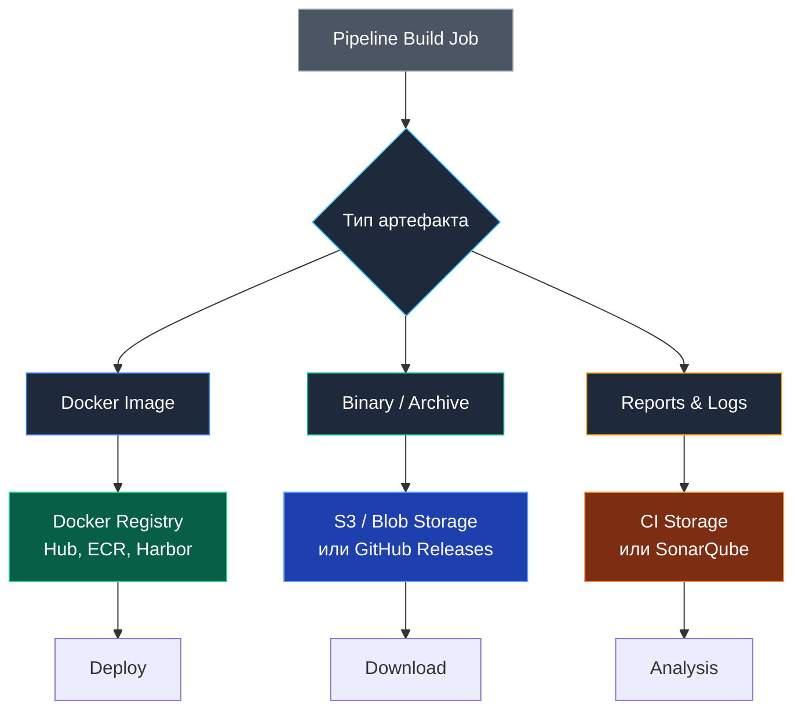

## Материальные ценности конвейера: Управление артефактами

Любой современный конвейер CI/CD подобен автоматизированному производственному цеху. Сырьем для него выступает исходный код программиста, а готовой продукцией — **сборочные артефакты (Artifacts)**. Это детерминированные бинарные файлы, архивы и отчеты, которые синтезируются на различных стадиях конвейера и подлежат строгому учету, долговременному хранению, криптографической подписи и развертыванию.

Четкое понимание жизненного цикла артефактов, гарантия их неизменяемости (immutability) и обеспечение безопасности цепочки поставок (Supply Chain Security) отличают зрелую инженерную организацию от любительских скриптов разряда «собрал и забыл».

---

## Классификация артефактов

В экосистеме Go и облачной инфраструктуре все порождаемые конвейером артефакты делятся на три фундаментальные категории:

1. **Исполняемые сущности (Executable):** Автономные скомпилированные бинарники ELF/PE/Mach-O и контейнерные Docker-образы. Их цель — немедленный или отложенный запуск в целевой среде исполнения.
2. **Дистрибутивные архивы (Archives):** Сжатые пакеты `.tar.gz` и `.zip`, включающие исполняемый файл, манифесты лицензий, документацию и примеры конфигураций. Они предназначены для распространения CLI-утилит конечным пользователям.
3. **Метаданные и отчеты (Reports & Metadata):** Машиночитаемые файлы отчетов о тестировании (`junit.xml`), профили покрытия кода (`coverage.out`), дампы `pprof` (`cpu.out`) и спецификации состава ПО (SBOM). Их назначение — аудит, верификация качества и соответствие стандартам комплаенса.



---

## Docker Image как главный артефакт бэкенда

В облачно-нативной архитектуре контейнерный образ OCI стал неделимой квантовой единицей развертывания. Это не просто изолированный файл, а самодостаточный снимок файловой системы с предварительно сконфигурированным окружением.

### Иммутабельность (Immutability)
Главная инженерная заповедь непрерывной доставки гласит: **один и тот же неизменяемый артефакт обязан последовательно проходить сквозь все этапы тестирования и эксплуатации**:

$$\text{Code} \longrightarrow \text{Dev} \longrightarrow \text{Staging} \longrightarrow \text{Production}$$

* **Фатальная ошибка:** Собрать один образ для тестового стенда Staging, а затем пересобрать проект с флагом `--prod` для боевого кластера. Любое расхождение во времени сборки может привести к разнице в скомпилированном машинном коде.
* **Правильный подход:** Собрать образ ровно один раз, присвоить ему уникальный тег (например, `myapp:v1.0.0-abc123`), всесторонне протестировать его на стейджинге и развернуть в прод именно его, обращаясь по неизменяемому криптографическому дайджесту SHA-256 (`@sha256:...`).

> [!warning] Ловушка / Gotcha
> Не используйте тег `latest` или теги веток (`main`, `develop`) для деплоя. Они изменчивы (mutable). Сегодня `latest` указывает на версию 1.0, а завтра на 2.0. Используйте уникальные теги, основанные на Git Commit SHA или SemVer (например, `v1.2.3` или `1.2.3-abc1234`). Это гарантирует, что вы деплоите именно то, что тестировали.
> 
> Использование плавающих тегов разрушает идемпотентность оркестратора Kubernetes: перезапуск пода может неожиданно подтянуть другую версию контейнера.

---

## Хранение бинарников и архивов

Поскольку Go генерирует монолитные статические файлы, распространение утилит и сервисов не требует сложных пакетных менеджеров.

Для долговременного хранения бинарных дистрибутивов применяются два проверенных решения:

1. **GitHub Releases:** Идеально подходит для открытых библиотек и CLI-инструментов. Утилита GoReleaser умеет в автоматическом режиме загружать сжатые архивы (`.tar.gz`, `.zip`) и файлы с контрольными суммами SHA-256 прямо на страницу релиза GitHub.
2. **S3 / Nexus / Artifactory:** Промышленный стандарт для закрытых корпоративных контуров. Архивы выгружаются в объектные хранилища S3 или менеджеры репозиториев (Sonatype Nexus, JFrog Artifactory), где настраиваются политики жизненного цикла (Lifecycle Policies) для автоматической ротации старых сборок через заданный интервал времени.

---

## Отчеты и промежуточные файлы конвейера

CI-платформы (GitHub Actions, GitLab CI) предоставляют встроенное хранилище для артефактов, создаваемых промежуточными джобами в рамках одного пайплайна.

Эти файлы обладают ограниченным временем жизни (обычно от 7 до 90 дней) и служат для двух целей:
* **Межстадийная передача данных:** Этап компиляции создает бинарник и передает его независимому этапу нагрузочного тестирования.
* **Диагностика разработчиком:** Скачивание подробного файла покрытия `coverage.out`, сырых логов или графических дампов упавших сквозных тестов.

> [!info] Под капотом
> В GitHub Actions артефакты загружаются через действие `actions/upload-artifact`. Это работает через API GitHub, который сохраняет файлы во внутреннее хранилище Azure. При скачивании (`actions/download-artifact`) раннер получает их обратно. Учтите, что это **не** Docker Registry. Хранить там образы нельзя, только файлы.

---

## Безопасность цепочки поставок: SBOM и подпись артефактов

В современных реалиях недостаточно просто скомпилировать бинарник. Организация обязана математически доказать подлинность кода и предоставить исчерпывающую опись его содержимого для защиты от атак на цепочку поставок (Supply Chain Attacks).

### 1. SBOM (Software Bill of Materials)
SBOM — это подробный цифровой паспорт программного обеспечения, стандартизированный в форматах SPDX или CycloneDX. Он содержит полный перечень всех транзитивных зависимостей, их точные версии, лицензии и криптографические контрольные суммы.

Для генерации SBOM в Go-проектах применяется утилита **`syft`** (разработка Anchore):

```bash
# Генерация SBOM для Docker образа
syft myapp:v1.0.0 -o spdx-json > sbom.spdx.json
```

Утилита сканирует бинарник Go, извлекает встроенную метаинформацию о модулях (внедряемую компилятором через `runtime/debug.ReadBuildInfo`) и формирует машинно-читаемый манифест.

### 2. Signing (Подписывание)
Как гарантировать, что контейнер в Kubernetes был собран именно вашим доверенным CI-раннером, а не подменен злоумышленником в публичном реестре?

Инструмент **Cosign** (проект Sigstore) решает эту задачу с помощью асимметричной криптографии:

```bash
# Подпись образа ключом
cosign sign --key cosign.key myregistry/myapp:v1.0.0

# Проверка перед деплоем в Kubernetes
cosign verify --key cosign.pub myregistry/myapp:v1.0.0
```

Контроллер допуска Kubernetes (Admission Controller) перехватывает запросы на создание подов и сверяет цифровую подпись образа с открытым ключом компании `cosign.pub`. Неподписанный образ блокируется на сетевом уровне до запуска.

---

## Итог

1. **Артефакт** — это неизменяемый материальный результат работы сборочного конвейера.
2. Неукоснительно соблюдайте принцип **Build Once, Deploy Anywhere**: никогда не пересобирайте бинарники для разных сред развертывания.
3. Идентифицируйте контейнеры строгими тегами на основе SemVer и Git Commit SHA, избегая изменчивого тега `latest`.
4. Снабжайте каждый промышленный релиз спецификацией **SBOM** (`syft`) и заверяйте его криптографической подписью (**Cosign**).

Все артефакты скомпилированы, упакованы, подписаны и сохранены в надежных хранилищах. Теперь остается замкнуть цикл: автоматизировать публикацию релизных версий и оповещение команды.

В следующей статье мы рассмотрим комплексную автоматизацию релизов: [[38. Автоматизация релизов]].