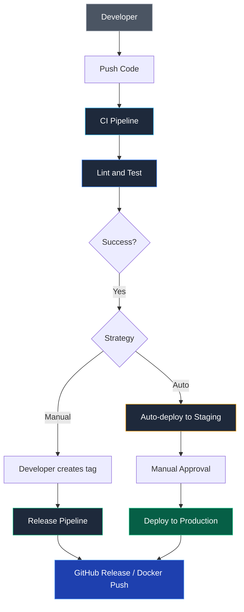

## Автоматизация релизов: Искусство предсказуемости

В вычислительной технике действует непреложный закон: компьютер создан для того, чтобы безупречно повторять одну и ту же монотонную последовательность инструкций миллионы раз подряд, не испытывая усталости и не допуская опечаток. Человек же для монотонной рутины не приспособлен совершенно. В давние времена выпуск новой версии программного продукта в Bell Labs сопровождался напряженными ночными бдениями, ручной проверкой чек-листов и постоянным страхом забыть обновить версию в заголовочном файле.

В современной программной инженерии выпуск релиза обязан стать **скучным, рутинным и совершенно обыденным событием**. Никаких ручных компиляций на ноутбуке тимлида, никаких архиваций мышкой в графическом интерфейсе и никаких забытых версий. Релиз должен запускаться нажатием одной кнопки или публикацией тега, гарантируя абсолютную воспроизводимость каждого шага.

---

## Стратегии триггеров: Когда начинать?

Архитектура релизного конвейера зависит от специфики самого программного продукта. В индустрии устоялись два фундаментальных подхода:

### 1. Явный тег (Manual Trigger)
Классический подход для библиотек языка Go, клиентских SDK и утилит командной строки. Инженер принимает осознанное решение о готовности продукта к публикации, фиксируя релизный тег:

```bash
git tag v1.2.0
git push origin v1.2.0
```

* **Преимущества:** Полный человеческий контроль. Ни одна экспериментальная правка не уйдет в релиз без явного одобрения мейнтейнера.
* **Недостатки:** Зависимость от человеческой дисциплины при ручном оформлении описаний изменений.

### 2. Автоматический (Continuous Delivery)
Стандарт для веб-сервисов, облачных микросервисов и SaaS-платформ. Любое успешное слияние (Merge) протестированного Pull Request в ветку `main` или `master` автоматически инициирует сборку и доставку на тестовые стенды. Версионирование в таком конвейере опирается на хэши коммитов Git SHA или автоинкрементные идентификаторы сборок (`v1.2.0+build.123`).



> [!info] Под капотом
> В GitHub Actions для запуска пайплайна по тегу используется фильтр:
> ```yaml
> on:
>   push:
>     tags:
>       - 'v*.*.*'
> ```
> Это позволяет отделить "обычные" проверки (на каждый коммит) от "релизных" задач (сборка артефактов, обновление Homebrew формулы), которые выполняются редко.
> 
> Благодаря фильтрам триггеров тяжелые сборочные задачи не тратят процессорные минуты раннеров на каждый промежуточный коммит в ветку фичи.

---

## GoReleaser: «Швейцарский нож» релизного цикла

Для утилит и сервисов на языке Go инструмент **GoReleaser** закрывает более 90% задач, которые раньше приходилось костылить через громоздкие bash-скрипты.

Спектр задач, полностью автоматизируемых GoReleaser:
1. **Версионирование:** Извлекает SemVer-версию напрямую из Git-тега.
2. **Параллельная кросс-компиляция:** Собирает бинарники для десятков комбинаций ОС и архитектур.
3. **Формирование дистрибутивов:** Упаковывает бинарники, файлы `README.md` и лицензии `LICENSE` в сжатые архивы.
4. **Автоматический Changelog:** Группирует коммиты и создает журнал изменений.
5. **Публикация релизов:** Создает запись GitHub Release, прикрепляет бинарники и рассчитывает SHA-256 контрольные суммы.
6. **Управление пакетными менеджерами:** Автоматически пушит обновления в формулы Homebrew и Scoop, позволяя пользователям обновлять софт командой `brew upgrade myapp`.

> [!warning] Ловушка / Gotcha
> Если вы используете GoReleaser в CI, убедитесь, что у раннера есть права на запись в репозиторий (`contents: write`). Иначе шаг создания GitHub Release упадет с ошибкой 403 Forbidden.
> 
> По умолчанию современные CI-раннеры GitHub Actions запускаются с правами `contents: read`, следуя принципу наименьших привилегий.

---

## Разделение обязанностей: Build vs Release

В зрелых микросервисных системах критически важно разносить процессы на два независимых конвейера:

* **Build Pipeline (Конвейер сборки на каждый коммит):** Компилирует код, прогоняет юнит-тесты на гонки данных (`-race`), собирает контейнер и тегает его по хэшу коммита (`myapp:abc123`). Результат — протестированный, готовый к развертыванию образ в реестре.
* **Release Pipeline (Конвейер релиза по тегу или событию):** Принципиально **не пересобирает** исходный код! Он берет уже готовый, проверенный на стейджинге образ по его SHA-дайджесту, присваивает ему релизные теги `v1.2.0` и `latest`, обновляет спецификации в GitOps-репозитории Kubernetes и оповещает дежурных инженеров.

Это гарантирует, что в боевой кластер поступает ровно тот скомпилированный машинный код, который успешно прошел полный цикл интеграционного тестирования.

---

## Уведомления и обратная связь

Автоматизация релиза не считается завершенной в момент загрузки файла на сервер. Команда разработки и служба эксплуатации должны получить мгновенное подтверждение успешной поставки.

Штатная интеграция конвейера с корпоративными мессенджерами (Slack, Telegram, Mattermost) или Email должна генерировать структурированное уведомление:
* Имя сервиса и номер версии релиза.
* Прямая ссылка на журнал изменений (Changelog).
* Ссылки на опубликованные артефакты и реестры образов.
* Статус завершения пайплайна (Success или Failure с ссылкой на лог ошибки).

---

## Итог

1. Автоматизация релизов исключает человеческий фактор, делая поставку софта скучным и безопасным процессом.
2. Выбирайте стратегию триггера в зависимости от характера системы: явные Git-теги для библиотек и CLI, автоматический CD для бэкенд-сервисов.
3. Применяйте **GoReleaser** для открытых утилит Go, делегируя ему сборку дистрибутивов, формулы Homebrew и публикацию.
4. Строго разделяйте этапы **Build** (компиляция и тесты) и **Release** (промоушен готового неизменяемого артефакта).
5. Настраивайте права доступа `contents: write` в CI для успешной публикации релизных артефактов.

Мы автоматизировали запуск и сборку релизных версий. Однако пользователям сервиса и разработчикам критически важно знать, что именно изменилось в коде между версиями.

В следующей статье мы изучим методы генерации логов изменений и семантический выпуск версий: [[39. Changelog и semantic release]].