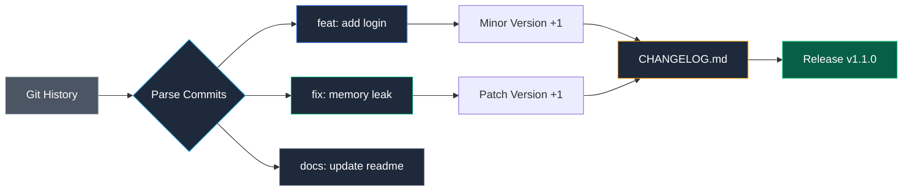

## Связь с пользователем: Changelog и semantic release

Программная инженерия — это в первую очередь искусство коммуникации. Написание исходного кода — это диалог программиста с компилятором, а составление журнала изменений (Changelog) — это уважительный диалог инженера с живыми людьми: коллегами по цеху, системными администраторами и пользователями ваших API.

Загадочные формулировки вроде *«различные исправления ошибок»* или *«исправлены баги»* в релизных заметках — признак неуважения к чужому времени. Осмысленная запись вида `feat(auth): add user authentication via OAuth2` сразу сообщает инженеру эксплуатации, что появилось нового, а запись `fix(pool): resolve race condition in connection handler` убеждает в стабильности системы.

Чтобы формировать четкие, структурированные и содержательные журналы изменений в автоматическом режиме, в репозитории должна царить строгая дисциплина истории коммитов.

---

## Conventional Commits: Фундамент автоматизации релизов

Вся современная индустрия семантического выпуска версий опирается на стандарт **Conventional Commits**. Это формальная грамматика сообщений коммитов, понятная как человеку, так и синтаксическим парсерам сборочных конвейеров.

Формат: `<type>(<scope>): <description>`.

Ключевые семантические типы изменений и их отражение в SemVer:

* **`feat`**: Добавление новой функциональности (сигнализирует о поднятии **MINOR** версии в SemVer, например, `1.1.0`).
* **`fix`**: Исправление дефекта или бага (сигнализирует о поднятии **PATCH** версии, например, `1.0.1`).
* **`docs`**: Правки в документации и комментариях (не меняют логику приложения).
* **`chore`, `refactor`, `style`**: Внутренний рефакторинг архитектуры, обновление зависимостей или форматирование без изменения открытого API (обычно скрываются из пользовательского журнала изменений или группируются в секцию "Maintenance").
* **`BREAKING CHANGE`**: Особая директива в футере коммита или восклицательный знак сразу после типа (`feat!: drop support for legacy v1 API`) — указывает на нарушение обратной совместимости и принудительно увеличивает **MAJOR** версию (`2.0.0`).



> [!warning] Ловушка / Gotcha
> Автоматизация работает только при жесткой дисциплине в команде. Если разработчик пишет коммит "fix stuff" вместо "fix: resolve race condition in handler", ваш Changelog будет бесполезен. Используйте **Commit Linting** (инструменты вроде `commitlint`) в pre-commit хуках или CI, чтобы принудительно требовать правильный формат.
> 
> Настройка линтера коммитов блокирует фиксацию некорректных сообщений на уровне локального Git-клиента, приучая команду к аккуратной инженерной культуре.

---

## Semantic Release: Полная автоматизация жизненного цикла

Концепция **Semantic Release** доводит идею непрерывной доставки до логического финала. Специальный агент полностью берет на себя принятие решений о выпуске новой версии:

1. Анализирует историю Git-коммитов с момента публикации последнего релизного тега.
2. Математически вычисляет следующую версию по правилам SemVer (если обнаружен хотя бы один `feat`, инкрементируется минорная версия; если обнаружен `BREAKING CHANGE`, инкрементируется мажорная).
3. Автоматически компилирует структурированный файл `CHANGELOG.md`.
4. Создает подписанный Git Tag в репозитории.
5. Публикует релиз и артефакты на GitHub или GitLab.

Хотя классический инструмент `semantic-release` написан на Node.js и популярен в JavaScript-сообществе, тащить тяжеловесную среду Node.js и гигабайты `node_modules` в чистый Go-проект ради пары строчек версионирования — нарушение принципа минимализма и архитектурного сочувствия (Mechanical Sympathy).

---

## Go-нативный подход: `svu` и GoReleaser

В экосистеме Go существуют превосходные нативные альтернативы, скомпилированные в компактные монолитные бинарники:

### 1. `svu` (Semantic Version Util)
Элегантная CLI-утилита `svu`, написанная на Go, анализирует граф коммитов репозитория и моментально вычисляет следующее значение версии:

```bash
# Текущая версия v1.0.0
git commit -m "feat: add new feature"

# svu вычислит следующую версию
svu next
# Вывод: v1.1.0
```

Утилита легко интегрируется в любые сценарии автоматизации или `Makefile`:

```bash
VERSION=$(svu next)
git tag $VERSION
git push origin $VERSION
```

### 2. Встроенный генератор Changelog в GoReleaser
Утилита GoReleaser содержит собственный модуль генерации журнала изменений, позволяющий отфильтровывать технологический шум и оформлять релизы в едином корпоративном стиле.

Пример секции `changelog` в `.goreleaser.yml`:

```yaml
release:
  footer: |
    ### Thanks to all contributors!

changelog:
  sort: asc
  filters:
    exclude:
      - '^docs:'
      - '^test:'
      - '^chore:'
      - '^style:'
```

Во время выполнения `goreleaser release` инструмент извлечет только значимые коммиты категорий `feat` и `fix`, отсортирует их и сгенерирует безупречно отформатированное описание релиза на странице GitHub Releases.

---

## Куда девать CHANGELOG.md?

Выбор места хранения журнала изменений диктуется назначением проекта:

* **Библиотеки и открытые SDK (Open Source):** Файл `CHANGELOG.md` обязательно фиксируется в корне репозитория и коммитится в Git. Сторонние разработчики часто изучают его локально при решении проблем совместимости версий.
* **Закрытые микросервисы бэкенда:** Поддержание тяжелого файла `CHANGELOG.md` в кодовой базе часто избыточно. Достаточно динамической генерации страницы релиза в интерфейсе GitLab/GitHub, а также автоматической отправки сжатого списка изменений в корпоративные каналы Slack или базу знаний (Confluence) в момент деплоя.

---

## Итог

1. **Conventional Commits** — формальный машинно-читаемый протокол общения разработчиков с автоматизированными инструментами релизов.
2. Правильный префикс коммита однозначно определяет дельту семантической версии: `feat` $\rightarrow$ Minor, `fix` $\rightarrow$ Patch, `BREAKING CHANGE` $\rightarrow$ Major.
3. Избегайте сторонних тяжеловесных сред: для проектов на Go используйте легковесные нативные утилиты **`svu`** и **GoReleaser**.
4. Внедряйте `commitlint` для защиты истории Git от бессмысленных сообщений и поддержания кристальной ясности релизных журналов.

Мы прошли грандиозный путь: от низкоуровневых флагов компилятора `go build` и устройства драйверов модулей до многоэтапных контейнеров, распределенных пайплайнов CI/CD и полностью автоматизированного семантического выпуска версий.

В следующей, заключительной статье модуля мы объединим все полученные знания в единую стройную систему — эталонный производственный инструментарий: [[40. Итоги раздела. Production ready toolchain]].