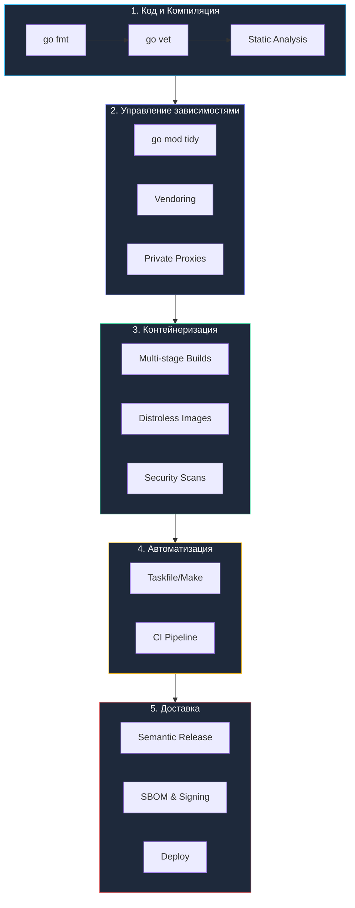

## Production Ready Toolchain: Эволюция процесса и инженерная зрелость

Мы прошли грандиозный путь: от первого робкого запуска `go build` в командной строке до проектирования распределенного, математически строгого и полностью автоматизированного конвейера поставки программного обеспечения. Этот модуль был посвящен не просто набору утилит командной строки. Он был посвящен фундаментальной **инженерной дисциплине**.

В философии языка Go инструментарий — это не отдельная изолированная профессия (как это исторически сложилось в мире DevOps для других языков), а неотъемлемая часть профессиональной культуры каждого разработчика. Создатели Go сознательно заложили компилятор, менеджер пакетов, тестовый фреймворк и линкер прямо в ядро экосистемы. Один статически скомпилированный бинарный файл формата ELF снимает 90% инфраструктурных проблем, терзающих программистов на Python, Node.js или Java: больше никаких конфликтов в рантайме, виртуальных окружений, несовместимости версий JVM и гигантских деревьев зависимостей.

---

## Пять уровней зрелости: Путь к Production Ready

Подводя итоги раздела, мы можем сформулировать цельную, пятиуровневую модель производственной зрелости инфраструктуры Go-проекта:

### 1. Код и Компиляция (Foundation)
Команда `go build` — лишь вершина айсберга. Под капотом компилятора разворачивается синтаксический анализ, трансляция в абстрактную форму SSA, оптимизации сброса стековых фреймов и формирование бинарных секций.
* **Ключевой навык:** Осознанное применение флагов линкера `-ldflags` для внедрения метаданных сборки и четкое понимание разницы между локальной компиляцией `go build` и установкой бинарников в систему через `go install`.
* **Базовый арсенал:** `go fmt`, `go vet`, `golangci-lint`.

### 2. Управление зависимостями (Dependency Management)
Манифесты Go (`go.mod` и `go.sum`) навсегда избавили индустрию от ада зависимостей (Dependency Hell) благодаря детерминированному алгоритму Minimal Version Selection (MVS) и строгому следованию семантическому версионированию.
* **Ключевой навык:** Понимание того, почему мажорная версия `v2+` требует обязательной смены пути импорта пакета, а также уверенное владение директивами `replace`, `exclude` и переменной `GOPRIVATE` для работы в изолированных корпоративных контурах.
* **Статьи для повторения:** [[12. Модули. go.mod и go.sum]], [[13. Versioning. SemVer и совместимость]].

### 3. Контейнеризация (Containerization)
Монолитная статическая компиляция Go идеально гармонирует с парадигмой легковесных контейнеров.
* **Ключевой навык:** Проектирование многоэтапных `Dockerfile` с использованием кэширования слоев и технологии **Multi-stage builds**. Инженерный выбор между безопасной пустотой `scratch`, сбалансированным `distroless` и утилитным `alpine`.
* **Статьи для повторения:** [[23. Multi stage сборки Docker]], [[24. Минимизация образов. scratch, distroless]].

### 4. Автоматизация (Task Orchestration)
Ручной ввод длинных последовательностей команд в терминале — главный источник фатальных человеческих ошибок. Мы научились описывать инженерные сценарии строго декларативно.
* **Ключевой навык:** Проектирование `Makefile` или современного кроссплатформенного `Taskfile` в качестве единого пульта управления проектом (Single Source of Truth), скрывающего запуск тестов, линтеров и кодогенерации.
* **Статьи для повторения:** [[20. Makefile для Go проектов]], [[21. Taskfile как альтернатива Makefile]].

### 5. Доставка и безопасность (CI/CD & Supply Chain)
Финальный этап трансформации исходных текстов в надежный сетевой сервис: автоматические рубежи качества и исключение человеческого фактора при релизе.
* **Ключевой навык:** Построение декларативных конвейеров на базе GitHub Actions или GitLab CI, разделение стадий Build и Release, генерация спецификаций состава ПО (**SBOM**) и заверение артефактов цифровой подписью (**Cosign**).
* **Статьи для повторения:** [[27. GitHub Actions для Go]], [[38. Автоматизация релизов]].

---

## Мышление Senior-уровня: Управление рисками

> [!tip] Собеседование
> **Вопрос:** Что отличает "Senior" подход к инструментарию от "Junior"?
> **Ответ:** Junior думает: "Как мне запустить это у себя?".
> Senior думает: "Как мне сделать так, чтобы это собиралось, тестировалось и деплоилось автоматически и одинаково у всех, даже когда я буду в отпуске?".
> 
> Senior понимает, что тулинг — это не рутина, а управление рисками (Risk Management). Кэширование слоев экономит деньги компании. `govulncheck` предотвращает взлом. `Multi-stage builds` уменьшают поверхность атак.

Опытный инженер осознает прямую финансовую и эксплуатационную связь между конфигурацией тулчейна и бизнесом:
* Эффективное кэширование слоев в Docker и модулей Go в CI экономит тысячи долларов в счетах за облачные вычисления.
* Аудит графа вызовов утилитой `govulncheck` предотвращает катастрофические утечки данных через уязвимости нулевого дня.
* Срезанные привилегии (`USER nonroot`) и образы `distroless` сводят к нулю вероятность побега из контейнера при компрометации процесса.

---

## Итог

Раздел «Инфраструктура языка, Тулинг и CI/CD» полностью завершен. Теперь в вашем распоряжении находится целостная, глубокая и проверенная система знаний для построения надежного, молниеносного и защищенного производственного цикла разработки на Go.

Мы ответили на фундаментальные вопросы: *«Как компилировать?»*, *«Как упаковывать?»*, *«Как автоматизировать?»* и *«Как безопасно доставлять?»*.

Наш заводской цех безупречно оснащен и готов к работе. Теперь настало время перейти от сборочной оснастки к созданию самого программного обеспечения: проектированию высоконагруженной бизнес-логики, архитектуре микросервисов и созданию производительного сетевого бэкенда в следующем модуле энциклопедии!