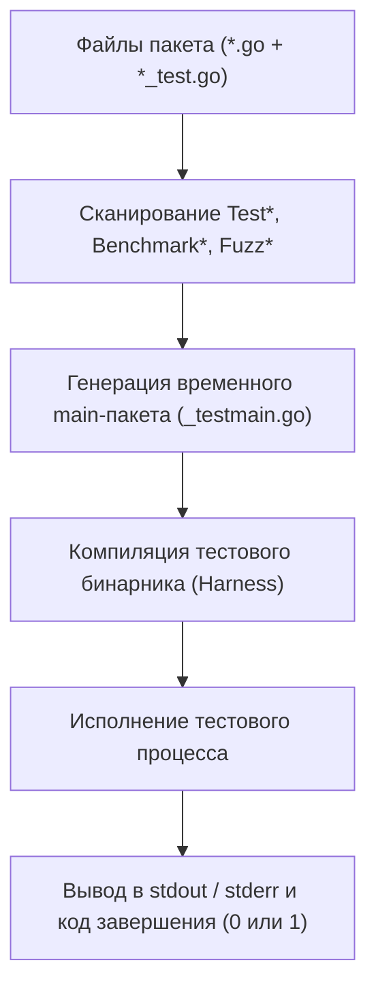

В большинстве языков программирования тестирование — это вотчина внешних библиотек и надстроек: JUnit в Java, PyTest в Python, PHPUnit в PHP. Инженеру приходится выбирать фреймворк, добавлять сторонние зависимости, настраивать кастомный раннер и бесконечно спорить о синтаксисе ассертов.

В Go тестирование с самого первого дня было спроектировано как **неотъемлемая часть языка**. Пакет `testing` встроен в стандартную библиотеку, а команда `go test` — в ядро тулчейна. Это задает строгий единый стандарт для всей мировой экосистемы: любой Go-инженер, открыв чужой репозиторий с открытым исходным кодом или корпоративный сервис, сразу знает, как запустить тесты, бенчмарки и профилирование без чтения мануалов.

---

## Как работает `go test` (Under the hood)

Когда вы запускаете `go test`, тулчейн не просто читает исходники. Он выполняет полноценную мета-сборку:



1.  **Поиск**: Тулчейн находит файлы с суффиксом `_test.go` в указанном пакете. При этом файлы с тестами компилируются только при вызове `go test` и никогда не попадают в итоговый продакшн-бинарник при `go build`.
2.  **Генерация main**: `go test` создает временный пакет `main` (`_testmain.go`), который объединяет код вашего пакета, тестовые функции и сгенерированный тестовый раннер (harness).
3.  **Компиляция и запуск**: Этот временный бинарник компилируется и запускается как отдельный процесс ОС. Он последовательно или параллельно выполняет функции, начинающиеся с префиксов `Test`, `Benchmark` или `Fuzz`.
4.  **Отчет**: Бинарник выводит результаты в stdout и возвращает код возврата 0 (успех) или 1 (провал).

> [!info] Под капотом
> Вы можете увидеть, какой именно код генерирует `go test`, используя флаг `-n` (dry run) или скомпилировав тест-бинарник вручную:
> ```bash
> go test -c -o my.test
> ```
> Это создаст исполняемый файл `my.test`, который можно запустить на другой машине, даже если там нет исходного кода или Go тулчейна. Это широко используется в CI/CD для разделения этапов сборки и запуска тестов (например, сборка на мощном builder-сервере, а запуск — в изолированном контейнере).

---

## Паттерн Table-Driven Tests

Go намеренно не предоставляет сложный DSL для ассертов (вроде `Assert.Equal(expected, actual)` или BDD-подобных `Should().Be()`). Создатели языка рассудили, что обычный Go-код с конструкцией `if` и вызовом `t.Errorf` гораздо проще читать и отлаживать. Чтобы избежать дублирования кода при тестировании разных сценариев, в Go принят идиоматичный паттерн **Table-Driven Tests** (табличные тесты).

```go
package math_test

import "testing"

func Add(a, b int) int {
    return a + b
}

func TestAdd(t *testing.T) {
    tests := []struct {
        name string
        a    int
        b    int
        want int
    }{
        {name: "simple add", a: 2, b: 2, want: 4},
        {name: "negative", a: -1, b: -1, want: -2},
        {name: "zero", a: 0, b: 0, want: 0},
    }

    for _, tt := range tests {
        t.Run(tt.name, func(t *testing.T) {
            got := Add(tt.a, tt.b)
            if got != tt.want {
                t.Errorf("Add(%d, %d) = %d, want %d", tt.a, tt.b, got, tt.want)
            }
        })
    }
}
```

Метод `t.Run` создает подтесты, которые выводятся с иерархическими именами, могут фильтроваться независимо и перезапускаться параллельно.

---

## Ключевые флаги `go test`

`go test` обладает мощным набором флагов, которые дают полный контроль над процессом проверки качества.

### 1. `-v` (Verbose)
Выводит детальную информацию о том, какие именно тесты запускаются и сколько времени они выполняются. В режиме по умолчанию `go test` молчит, если все тесты прошли успешно. С флагом `-v` вы увидите имена passed-тестов, что критично для понимания, где именно завис процесс.

### 2. `-run` (Filter)
Позволяет фильтровать тесты по регулярному выражению. Незаменимо во время разработки, когда нужно сфокусироваться на одной функции:

```bash
# Запустит только TestAdd и его подтесты
go test -run TestAdd

# Запустит только подтест с именем "negative" внутри TestAdd
go test -run TestAdd/negative
```

### 3. `-race` (Race Detector)
Один из главных козырей Go. Включает детектор гонок данных ThreadSanitizer. Программа будет работать медленнее и потреблять больше памяти, но при обнаружении одновременного несинхронизированного доступа к памяти `go test` упадет с подробным отчетом о Race Condition.

```bash
go test -race
```

> [!warning] Ловушка / Gotcha
> Детектор гонок не гарантирует нахождение *всех* гонок. Он детектирует только те, которые произошли во время конкретного выполнения ветки кода. Если ваш код зависит от порядка выполнения горутин (а он недетерминирован), гонка может не проявиться. Поэтому гонки лучше ловить на этапе нагрузочного тестирования или при запуске тестов с `-count=N`, где N > 1 (например, `-count=100` для стресс-проверки конкурентных участков).

### 4. `-cover` (Coverage)
Выводит процент покрытия кода тестами. Для глубокого аудита можно сгенерировать файл профиля покрытия и открыть его интерактивную визуализацию:

```bash
go test -coverprofile=coverage.out
go tool cover -html=coverage.out
```

В браузере зеленым цветом подсветятся выполненные ветви кода, а красным — нетронутые.

### 5. `-count` и Кэширование
Go кэширует успешные результаты тестов! Если вы запустите `go test` дважды, а исходные файлы пакета и его зависимости не менялись, второй запуск будет мгновенным:
```text
ok github.com/user/project 0.001s (cached)
```

Это колоссально ускоряет сборку в CI, но может мешать при отладке нестабильных (flaky) тестов. Флаг `-count=1` принудительно инвалидирует кэш и заставляет тесты отработать заново:

```bash
# Принудительный перезапуск тестов без кэша
go test -count=1
```

> [!tip] Вопрос с собеседования: Как работает кэш `go test`?
> **Вопрос:** При каких условиях `go test` возвращает `(cached)`, и как это связано с герметичностью?
> **Ответ:** Go кэширует результаты тестов пакета на основе контент-адресуемого кэша: хэшируются исходные файлы пакета, все его зависимости, переменные окружения и флаги тестирования. Результат кэшируется **только если все тесты прошли успешно**. Если тест обращается к внешним файлам без использования пакета `os` (например, читает сеть или базу данных), Go не знает о внешнем состоянии и может выдать ложно-зеленый результат из кэша. Поэтому тесты с внешней средой либо инвалидируют флаг `-count=1`, либо используют `testing.Short()`.

---

## Бенчмарки и Фаззинг

`go test` умеет проверять не только логическую корректность, но и производительность, а также устойчивость к невалидным данным.

### Бенчмарки:
Функции, начинающиеся с `Benchmark`, запускаются только при указании флага `-bench`:
```go
func BenchmarkAdd(b *testing.B) {
    for i := 0; i < b.N; i++ {
        Add(1, 2)
    }
}
```
```bash
go test -bench=. -benchmem
```
Флаг `-benchmem` выводит расход памяти в `B/op` (байтов на операцию) и `allocs/op` (число аллокаций в куче на операцию) — ключевые метрики для Mechanical Sympathy в Go.

### Фаззинг (Fuzzing) (доступно с Go 1.18):
Автоматическая мутация входных параметров для выявления граничных случаев, паник и зависаний:

```go
func FuzzAdd(f *testing.F) {
    f.Add(1, 2) // Seed corpus
    f.Fuzz(func(t *testing.T, a, b int) {
        Add(a, b)
    })
}
```
Запуск: `go test -fuzz=FuzzAdd`.

---

## Параллелизм тестов

По умолчанию тесты в одном пакете запускаются строго последовательно. Если у вас есть тяжелые I/O тесты (сетевые клиенты, база данных), используйте метод `t.Parallel()`.

```go
func TestSlowDB(t *testing.T) {
    t.Parallel() // Этот тест будет запущен параллельно с другими Parallel-тестами
    // ... логика
}
```

Параллелизм на уровне пакетов и горутин ограничен системным флагом `-p` (по умолчанию равно значению `GOMAXPROCS`, числу доступных логических ядер CPU).

---

## Итог

1.  **Встроенность**: `go test` — мощнейший инструмент, не требующий сторонних библиотек и работающий одинаково во всех проектах.
2.  **Table-Driven Tests**: Единый идиоматичный паттерн для написания поддерживаемых тестов.
3.  **Race Detector**: Всегда используйте `-race` при локальной разработке и на этапе CI.
4.  **Кэширование**: Помните про кэш тестов и используйте `-count=1`, если нужно перезапустить тест принудительно.
5.  **Инструментарий**: `-cover`, `-bench` и `-fuzz` делают `go test` универсальным швейцарским ножом для обеспечения качества.

Мы проверили работоспособность кода. Однако тесты не спасают от всех проблем. Следующим уровнем защиты является статический анализ кода. В следующей статье мы разберем утилиту, которая ловит ошибки еще до запуска тестов: [[7. go vet. Статический анализ.md]].