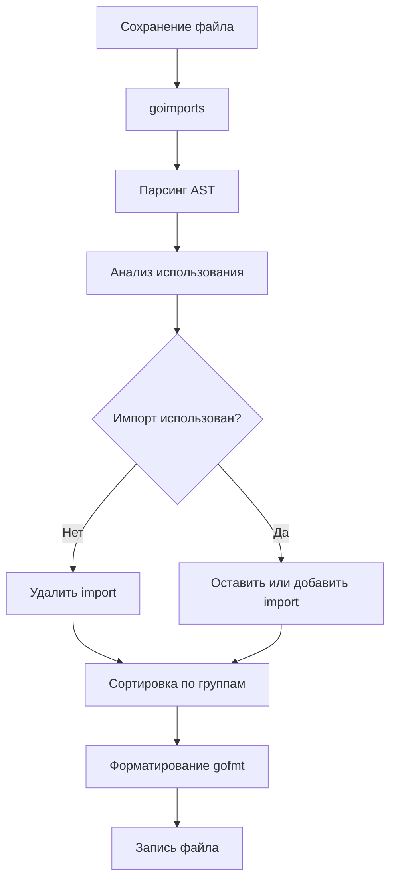

Один из самых больших культурных шоков для разработчиков, переходящих с C#, Java или C++, — это полное и абсолютное отсутствие споров о стиле кода. В большинстве других экосистем десятилетиями полыхают бесконечные "священные войны": ставить ли открывающую фигурную скобку на новой строке (Allman) или на той же (K&R), использовать 2 пробела, 4 пробела или табуляцию, ставить ли пробел после ключевого слова `if`.

В Go этот вопрос закрыт раз и навсегда. Есть `gofmt`, и есть канонический стиль. Всё остальное — синтаксическая ошибка или повод для немедленного автоформатирования.

---

## Философия: Gofmt's style is not my style, it's the style

Роб Пайк однажды сформулировал это с характерным прагматизмом: *"Gofmt's style is no one's favorite, yet gofmt is everyone's favorite"*. Стиль `gofmt` не является чьим-то идеалом, но сам факт его повсеместного и обязательного существования радует всех без исключения.

`go fmt` (и его нижележащий инструмент `gofmt`) форматирует исходный код по единому, жестко зафиксированному стандарту. Это часть концепции Mechanical Sympathy, но применительно не к процессору, а к человеческому восприятию: код должен выглядеть одинаково в любом проекте мира, чтобы мозг инженера не тратил драгоценные когнитивные ресурсы на парсинг чужих эстетических предпочтений, а сразу фокусировался на архитектуре и логике.

---

## Как это работает (Under the hood)

`gofmt` не работает с текстом как с набором сырых строк или регулярных выражений. Он читает исходный код, парсит его в полное **Абстрактное Синтаксическое Дерево (AST)** через пакет `go/parser`, а затем сериализует его обратно в текстовый вид через движок печати `go/printer` и `text/tabwriter`, руководствуясь строгими грамматическими правилами.

Это означает, что `gofmt` не просто подправляет пробелы. Он структурно перестраивает код, выравнивая поля структур, констант и переменных по колонкам с помощью символов табуляции:

```go
// До gofmt (хаос)
struct {
    Name string
    Age int
    IsActive bool
}

// После gofmt (автоматическое выравнивание)
struct {
    Name     string
    Age      int
    IsActive bool
}
```

> [!info] Под капотом
> Алгоритм работает в несколько проходов. Сначала строится AST, затем вычисляются "веса" узлов для размещения на строках, затем происходит "pretty print". Такой подход гарантирует, что код всегда синтаксически валиден (вы не можете случайно потерять скобку или сломать выражение, как это бывает при работе с макросами текстовых редакторов). Кроме того, `gofmt` жестко стандартизирует использование символов табуляции (`\t`) для отступов и пробелов для выравнивания колонок внутри строк.

---

## `go fmt` vs `gofmt`

Разработчики часто путают эти две утилиты:

*   **`gofmt`** — это низкоуровневый системный инструмент форматирования. Он принимает файлы или каталоги и по умолчанию выводит результат форматирования в `stdout` (для перезаписи исходного файла на диске требуется флаг `-w`).
*   **`go fmt`** — это высокоуровневая команда-драйвер Go toolchain. Она оперирует путями пакетов Go (`./...`) и под капотом вызывает `gofmt -l -w` для всех обнаруженных файлов пакета.

Команды повседневного использования:
*   `gofmt -w main.go` — отформатировать и перезаписать конкретный файл.
*   `go fmt ./...` — рекурсивно отформатировать весь проект.

В CI/CD скриптах часто используют проверку без модификации файлов:
```bash
# Проверка, отформатирован ли код (для CI)
gofmt -l .
# Если вывод пуст, всё ок. Если есть список файлов, значит они не отформатированы.
```

---

## goimports: Следующий уровень

Хотя `go fmt` входит в стандартный дистрибутив, в реальной разработке его почти полностью вытеснил инструмент **`goimports`** (разрабатываемый командой Go в репозитории `golang.org/x/tools/cmd/goimports`).

`goimports` делает абсолютно всё то же самое, что и `gofmt`, но решает еще одну важнейшую задачу: **автоматически управляет блоком `import`**.

1.  **Удаление неиспользуемых импортов**: Если вы удалили или закомментировали вызов `fmt.Println`, `goimports` молча удалит строку `import "fmt"`, предотвращая ошибку компиляции "imported and not used".
2.  **Добавление недостающих импортов**: Если вы написали вызов `json.Marshal`, `goimports` автоматически найдет пакет и добавит строку `import "encoding/json"`.

### Логика группировки импортов

`goimports` организует импорты в строгом порядке, разделяя их пустыми строками на три логические группы:
1.  **Standard library**: `fmt`, `os`, `context`.
2.  **Third-party**: `github.com/gin-gonic/gin`, `go.uber.org/zap`.
3.  **Local packages**: `myproject/internal/service` (настраивается флагом `-local`).

```go
package main

import (
    "fmt" // 1. Стандартная библиотека
    "os"

    "github.com/gin-gonic/gin" // 2. Сторонние
    "go.uber.org/zap"

    "myproject/internal/handler" // 3. Локальные
)

// ...
```



> [!warning] Ловушка / Gotcha
> Иногда `goimports` не может однозначно определить нужный пакет. Если в `go.mod` есть пакеты с похожими именами (например, `github.com/user/uuid` и `github.com/satori/uuid`), он может выбрать неправильный или выдать ошибку. В этом случае нужно явно указать алиас импорта вручную.

---

## Интеграция с IDE и CI

Главная польза от автоматического форматирования достигается тогда, когда разработчик вообще перестает о нем думать.

1.  **IDE**: Настройте "Format on Save" в VSCode или GoLand, указав `goimports` в качестве дефолтного форматтера. Это мгновенно выравнивает код и правит импорты при каждом нажатии `Ctrl+S` / `Cmd+S`.
2.  **CI**: Добавьте обязательный шаг в пайплайн, проверяющий `gofmt -l`. Это не позволит неаккуратному разработчику залить неформатированный код в общий репозиторий.

```bash
# Пример проверки в Makefile
lint:
	@if [ -n "$$(gofmt -l .)" ]; then \
		echo "Code is not formatted. Run 'gofmt -w .'"; \
		exit 1; \
	fi
```

> [!tip] Собеседование
> **Вопрос:** Почему Go так строго относится к форматированию, в отличие от, например, C++?
> **Ответ:** Это уменьшает когнитивную нагрузку и делает код-ревью предельно эффективным. В Google, где зародился Go, ревью кода проводятся огромными масштабами. Если бы каждый форматировал код по-своему, diff-ы были бы забиты изменениями пробелов, что мешает видеть логические правки. Стандартный формат — это оптимизация процесса разработки, а не прихоть.

---

## Итог

1.  **`gofmt`** — стандарт де-факто. Споры о стиле бессмысленны.
2.  Работает через AST, гарантируя валидность кода и умное выравнивание полей структур.
3.  **`goimports`** — must-have инструмент, объединяющий форматирование и управление зависимостями.
4.  Интегрируйте эти инструменты в IDE и CI для автоматического применения.

Код отформатирован, импорты расставлены. Но что если нам нужно сгенерировать код до того, как его увидит компилятор? В следующей статье мы разберем мощный механизм кодогенерации: [[9. go generate. Генерация кода.md]].