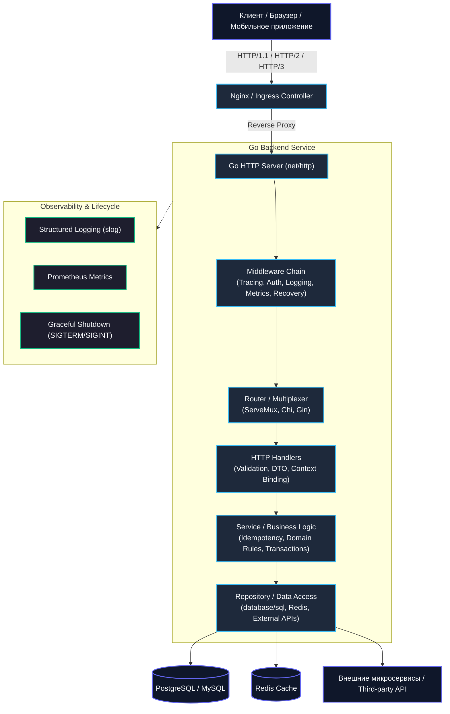

Когда вы осваиваете синтаксис Go, изучаете горутины и каналы, кажется, что весь мир у ваших ног: скомпилировал один бинарник — и он уже слушает порт `8080`. Но в промышленной разработке (production) код, который просто компилируется и отдает «200 OK», составляет лишь небольшую верхушку айсберга.

Настоящий бэкенд — это распределенный организм, работающий в агрессивной среде. Сеть мигает, клиенты рвут соединения на середине передачи файла, базы данных периодически испытывают спайки задержек (tail latencies), операционная система шлет сигналы `SIGTERM` при обновлении пода в Kubernetes, а коллеги читают ваш код в три часа ночи во время разбора инцидента.

Этот раздел — практическая проповедь идиоматичного Go в разработке бэкенд-сервисов. Здесь мы переходим от синтаксиса и теории к реальным паттернам, которые используются в production-системах.

Если в предыдущих разделах мы разбирали устройство Go «под капотом» и стандартную библиотеку, то теперь мы начинаем собирать всё это воедино, чтобы писать настоящие HTTP-сервисы, которые будут работать в продакшене, масштабироваться и радовать коллег читаемым кодом.

---

### Почему именно этот путь?

Go создавался инженерами Bell Labs и Google для решения вполне конкретной боли: разработки гигантских сетевых сервисов многотысячной командой программистов. Его философия — бескомпромиссная простота, предсказуемость исполнения и механическое сочувствие к оборудованию. 

Go — не просто язык с конкурентностью. Это инструмент для создания надежных, производительных и легко поддерживаемых сервисов. Его философия — «меньше кода, меньше багов, больше производительности». Но чтобы реализовать этот потенциал, недостаточно знать синтаксис. Нужно понимать:

- Как правильно организовать структуру проекта
- Как безопасно обрабатывать HTTP-запросы
- Как внедрять зависимости без усложнения архитектуры
- Как писать логи, чтобы находить проблемы
- Как строить отказоустойчивые системы

Каждый из этих пунктов опирается на фундаментальные механизмы операционной системы и рантайма. Когда вы принимаете запрос, ядро Linux через системный вызов `epoll_wait` пробуждает сокет, сетевой поллер Go передает дескриптор в горутину, а аллокатор памяти выделяет буферы в рамках заданных размерных классов. Если вы понимаете эту цепочку, архитектура вашего сервиса перестает быть набором случайных файлов и превращается в выверенный часовой механизм.

> [!info] Под капотом
> Многие практики в Go напрямую связаны с устройством рантайма. Например, `context.Context` — это не просто передача метаданных, а способ управлять жизненным циклом запроса, отслеживать таймауты и корректно завершать горутины. `net/http` сервер использует планировщик Go (G-M-P) и `netpoll`, чтобы эффективно обрабатывать тысячи соединений без создания одного треда на каждое. Когда удаленный клиент обрывает TCP-соединение, ядро сообщает об этом через событие `EPOLLRDHUP` / `EPOLLIN`, `netpoll` уведомляет runtime, контекст запроса отменяется (`ctx.Done()`), и все дочерние операции с базами данных или внешними API обязаны немедленно прекратить работу, освобождая ресурсы процессора.

---

### Что вы получите из этого раздела?

Мы последовательно пройдем все слои современного серверного приложения — от низкоуровневых настроек сокетов и буферов `net/http` до выстраивания транзакционных границ в базах данных и интеграционного тестирования в изолированных Docker-контейнерах:

- **Production-ready сервисы**: вы научитесь создавать HTTP-серверы, которые не падают под нагрузкой и корректно завершаются.
- **Архитектурные паттерны**: Repository, DI, Middleware, Graceful Shutdown — всё это будет разобрано с примерами и объяснением, почему именно так.
- **Обеспечение надежности**: валидация, аутентификация, авторизация, рейт-лимиты, retry/backoff, circuit breaker — всё, что делает сервис живым в реальных условиях.
- **Инструменты для отладки**: логирование, метрики, health-checks, тестирование — без этого невозможно поддерживать здоровье системы.

Каждая концепция сопровождается чистым, идиоматичным кодом, свободным от тяжеловесных фреймворков-монстров. Мы будем опираться на стандартную библиотеку и проверенные минималистичные инструменты сообщества.

---

### Путь от новичка к Senior

Разница между начинающим инженером и зрелым бэкенд-разработчиком заключается не в количестве выученных библиотек, а в понимании последствий каждого принятого решения: почему нельзя игнорировать таймауты чтения заголовков, как не допустить утечки горутин при фоновом кэшировании, и чем опасен наивный `SELECT ... FOR UPDATE` в высоконагруженной системе.

Этот раздел рассчитан на разработчика, который уже знает основы Go, но пока не уверен, как правильно:

- Структурировать HTTP-обработчики
- Валидировать входные данные
- Работать с базами данных
- Организовывать фоновые задачи
- Писать логи и метрики

Мы будем двигаться от простого к сложному, но с акцентом на production-практики. Никаких «hello world» и учебных примеров — сразу реальные кейсы, которые вы встретите на работе.

> [!tip] Собеседование
> Многие вопросы на Senior-уровне касаются именно этих тем: как реализовать graceful shutdown, как обработать ошибки в HTTP-обработчике, как внедрить rate limiting, как построить безопасную аутентификацию. Этот раздел — сборник ответов на эти вопросы. Интервьюер почти никогда не спрашивает про стандартный синтаксис — его интересует, как вы поведете себя, если база данных начнет отвечать за 5 секунд вместо 5 миллисекунд, почему в сервисе возникла утечка дескрипторов файлов и как правильно организовать многослойную обработку ошибок с кодами статусов HTTP.

Впереди вас ждет глубокое погружение в практику. Мы начнем с минимального HTTP-сервера и постепенно добавим всё, что нужно для production-сервиса. К концу раздела вы будете понимать, как строить надежные, масштабируемые и поддерживаемые системы на Go.

Следующая статья: [[2. Архитектура простого HTTP сервиса]]