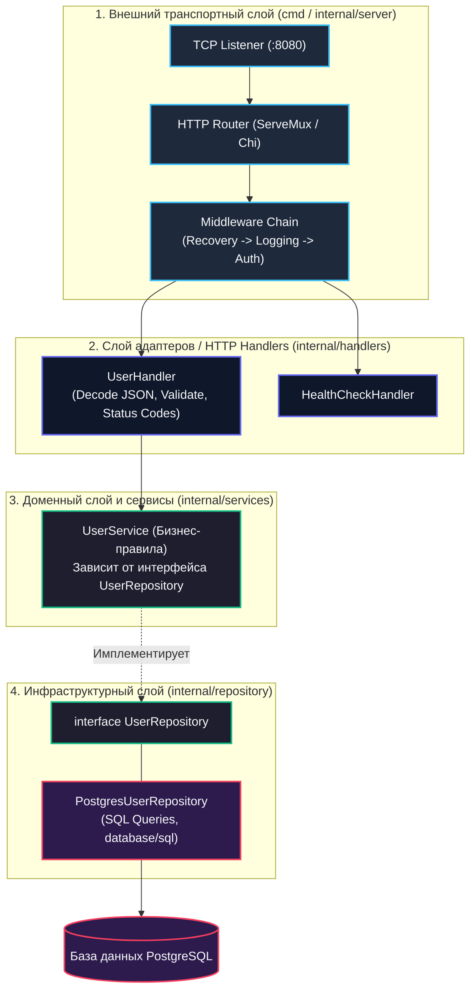

Когда мы говорим о «простом HTTP сервисе», важно понимать, что «простой» не означает «плохо спроектированный». Это основа, на которой строятся все production-сервисы. Давайте разберем, из каких компонентов состоит минимальный, но правильно спроектированный HTTP-сервер на Go.

В мире бэкенд-разработки существует два опасных соблазна. Первый — броситься в омут «микрофреймворков», которые прячут сетевой ввод-вывод за магическими аннотациями и глобальными синглтонами. Второй — нагородить двадцать слоев абстракций ради вымышленной «чистой архитектуры», превратив тривиальное сохранение записи в базе в бесконечное перекладывание DTO из одного пакета в другой. 

Идиоматичный подход Go, завещанный инженерами Bell Labs, заключается в **прозрачности и явном контроле**. Простой сервис на Go собирается из стандартных блоков как надежный швейцарский механизм: каждый винтик на виду, поток управления очевиден, а зависимости передаются явно через аргументы конструкторов.



---

### Основные компоненты сервиса

Простой HTTP-сервис — это не просто `http.ListenAndServe`. Это полноценная архитектура, включающая:

- **HTTP-сервер**: принимает и обрабатывает HTTP-запросы
- **Роутинг**: направляет запросы в нужные обработчики
- **Middleware**: логика, общая для всех запросов (логирование, аутентификация, CORS)
- **Обработчики (handlers)**: конкретная бизнес-логика
- **Конфигурация**: настройки приложения (порт, база данных, внешние API)
- **Зависимости**: подключение к БД, кешу, внешним сервисам
- **Graceful shutdown**: корректное завершение при сигнале ОС

Каждый из этих компонентов решает строго очерченную задачу. Если сервер отвечает за управление TCP-сокетами и сетевыми таймаутами, то обработчик не должен знать ничего о SQL-запросах или формате хранения кэша в Redis.

---

### Минимальная архитектура

Начнем с точки входа. Программа должна запускаться, настраивать зависимости, слушать входящие соединения в фоновой горутине и корректно перехватывать системные сигналы ядра Linux (`SIGINT`, `SIGTERM`), гарантируя, что ни один клиентский запрос не оборвется на полуслове при перезапуске процесса:

```go
// main.go
package main

import (
    "context"
    "log"
    "net/http"
    "os"
    "os/signal"
    "syscall"
    "time"
)

func main() {
    // Создаем HTTP-сервер
    server := &http.Server{
        Addr: ":8080",
        Handler: setupRoutes(), // настраиваем маршруты
    }

    // Запускаем сервер в отдельной горутине
    go func() {
        if err := server.ListenAndServe(); err != nil && err != http.ErrServerClosed {
            log.Fatalf("server failed to start: %v", err)
        }
    }()

    // Ждем сигнал остановки
    quit := make(chan os.Signal, 1)
    signal.Notify(quit, syscall.SIGINT, syscall.SIGTERM)
    <-quit

    log.Println("shutting down server...")

    // Корректно завершаем сервер
    ctx, cancel := context.WithTimeout(context.Background(), 30*time.Second)
    defer cancel()

    if err := server.Shutdown(ctx); err != nil {
        log.Fatalf("server forced to shutdown: %v", err)
    }

    log.Println("server exited")
}

func setupRoutes() http.Handler {
    mux := http.NewServeMux()
    
    mux.HandleFunc("/health", func(w http.ResponseWriter, r *http.Request) {
        w.WriteHeader(http.StatusOK)
        w.Write([]byte("OK"))
    })
    
    return mux
}
```

> [!info] Под капотом
> `http.Server` использует планировщик Go (G-M-P) и `netpoll` для обработки соединений. Когда приходит HTTP-запрос, Go создает горутину, которая обрабатывает его. Это позволяет эффективно обрабатывать тысячи одновременных соединений без создания тредов ОС. Внутри рантайма Go есть структура `conn` (соединение), которая инкапсулирует `net.Conn` и управляет жизненным циклом запроса.
> Метод `server.Shutdown(ctx)` работает в два этапа:
> 1. Немедленно закрывает слушающий TCP-сокет (`net.Listener.Close()`), чтобы ядро Linux перестало принимать новые входящие SYN-пакеты на порт `:8080`.
> 2. Закрывает все простаивающие соединения в пуле Keep-Alive (`conn.Close()`), после чего ожидает завершения выполнения горутин для активных запросов. Если запросы не успевают завершиться за время таймаута переданного `context.Context`, метод принудительно разрывает сокеты и возвращает ошибку `context.DeadlineExceeded`.

---

### Архитектурные слои

Разделение сервиса на четкие слои предотвращает «спагетти-код», при котором логика валидации HTTP-заголовков переплетается с генерацией SQL-запросов.

#### 1. Внешний слой: HTTP-сервер и маршрутизация

Транспортный слой отвечает за привязку к сетевому порту, управление жизненным циклом сервера и регистрацию маршрутов:

```go
type Server struct {
    httpServer *http.Server
    router     *http.ServeMux
}

func NewServer(port string) *Server {
    router := http.NewServeMux()
    s := &Server{
        router: router,
        httpServer: &http.Server{
            Addr:    ":" + port,
            Handler: router,
        },
    }
    
    s.setupRoutes()
    return s
}

func (s *Server) setupRoutes() {
    s.router.HandleFunc("/api/users", s.handleUsers)
    s.router.HandleFunc("/health", s.healthCheck)
}
```

#### 2. Слой middleware: общая логика для всех запросов

Middleware представляет собой функции-обертки над `http.Handler` или `http.HandlerFunc`. Они перехватывают поток управления до вызова целевого обработчика и после него:

```go
func (s *Server) withLogging(next http.HandlerFunc) http.HandlerFunc {
    return func(w http.ResponseWriter, r *http.Request) {
        start := time.Now()
        
        // Вызываем оригинальный обработчик
        next.ServeHTTP(w, r)
        
        log.Printf("%s %s %v", r.Method, r.URL.Path, time.Since(start))
    }
}

func (s *Server) withRecovery(next http.HandlerFunc) http.HandlerFunc {
    return func(w http.ResponseWriter, r *http.Request) {
        defer func() {
            if err := recover(); err != nil {
                log.Printf("panic recovered: %v", err)
                http.Error(w, "Internal Server Error", http.StatusInternalServerError)
            }
        }()
        next.ServeHTTP(w, r)
    }
}
```

> [!warning] Ловушка / Gotcha
> Middleware должны оборачивать обработчики в правильном порядке. Если вы оборачиваете логирование в recovery, то panic может быть пойман до того, как лог будет записан. Правильный порядок: `withRecovery(withLogging(handleUsers))`.  
> Первым на входе (и последним на выходе) обязан стоять `withRecovery`: если внутри вложенного обработчика или в цепочке логирования случится разыменование нулевого указателя (`nil pointer dereference`), именно внешний слой `recover()` перехватит панику, вернет клиенту аккуратный HTTP 500 и предотвратит аварийный краш всего процесса сервиса.

#### 3. Слой обработчиков: бизнес-логика

Задача обработчика (Handler) — распаковать HTTP-запрос (распарсить URL query params, JSON body, извлечь заголовки), передать проверенные структуры в доменный сервис, принять результат и сериализовать HTTP-ответ с корректным статус-кодом:

```go
type UserService struct {
    db Database
}

func (s *Server) handleUsers(w http.ResponseWriter, r *http.Request) {
    switch r.Method {
    case http.MethodGet:
        s.getUsers(w, r)
    case http.MethodPost:
        s.createUser(w, r)
    default:
        http.Error(w, "Method not allowed", http.StatusMethodNotAllowed)
    }
}

func (s *Server) getUsers(w http.ResponseWriter, r *http.Request) {
    users, err := s.userService.GetAll(r.Context())
    if err != nil {
        http.Error(w, "Failed to get users", http.StatusInternalServerError)
        return
    }
    
    w.Header().Set("Content-Type", "application/json")
    json.NewEncoder(w).Encode(users)
}
```

#### 4. Слой приложения: бизнес-логика и взаимодействие с инфраструктурой

Слой сервиса (Service / UseCase) полностью изолирован от деталей HTTP. Он не знает про `http.ResponseWriter` или `*http.Request`. Он оперирует исключительно типами предметной области и контекстом выполнения:

```go
type UserService struct {
    repo UserRepository
}

func (s *UserService) GetAll(ctx context.Context) ([]User, error) {
    // Валидация
    if err := validateContext(ctx); err != nil {
        return nil, err
    }
    
    // Бизнес-логика
    return s.repo.FindAll(ctx)
}
```

---

### Правильная инициализация зависимостей

В Go принято избегать «магических» контейнеров инверсии управления и глобальных переменных. Инициализация зависимостей происходит явно в функции `main` — так называемом корне композиции (Composition Root):

```go
func main() {
    // Загружаем конфигурацию
    cfg := loadConfig()
    
    // Создаем зависимости
    db, err := connectDB(cfg.DatabaseURL)
    if err != nil {
        log.Fatal(err)
    }
    defer db.Close()
    
    // Создаем сервисы
    userService := &UserService{
        repo: NewUserRepository(db),
    }
    
    // Создаем сервер
    server := NewServer(cfg.Port, userService)
    
    // Запускаем сервер
    if err := server.Start(); err != nil {
        log.Fatal(err)
    }
}
```

> [!tip] Собеседование
> Вопрос: «Как вы организуете зависимости в Go-сервисе?»  
> Ответ: Используем Dependency Injection для передачи зависимостей в конструкторы. Это позволяет легко тестировать код и избегать глобальных переменных. Сервисы инстанцируются в `main`, а не создаются внутри обработчиков.  
> Если репозиторий или почтовый клиент передается через интерфейс в конструктор `NewUserService(repo UserRepository)`, для unit-тестирования сервиса достаточно передать тестовую структуру-стаб (`mockRepo`), не поднимая реальную базу данных и не завися от внешних сетевых соединений.

---

### Иерархия папок (Standard Go Project Layout)

Для организации исходного кода промышленных сервисов сообщество выработало проверенную структуру каталогов:

```
my-service/
├── cmd/
│   └── my-service/
│       └── main.go
├── internal/
│   ├── handlers/
│   ├── services/
│   ├── repository/
│   └── middleware/
├── pkg/
├── configs/
├── deployments/
└── go.mod
```

- `cmd/my-service/main.go`: точка входа, инициализация и запуск приложения
- `internal/handlers`: HTTP-обработчики
- `internal/services`: бизнес-логика
- `internal/repository`: работа с базой данных
- `internal/middleware`: общая логика для HTTP-запросов

Директория `internal/` имеет специальный статус в компиляторе Go: пакеты, расположенные внутри `internal/`, не могут быть импортированы сторонними модулями. Это гарантирует жесткую инкапсуляцию внутренней архитектуры вашего сервиса.

---

### Ключевые принципы архитектуры

При проектировании HTTP-сервисов на Go мы следуем четырем базовым принципам:

1. **Single Responsibility**: каждый компонент отвечает за одну задачу
2. **Dependency Inversion**: зависимости инжектятся, а не создаются внутри
3. **Interface Segregation**: используем интерфейсы для слабой связанности
4. **Clean Architecture**: слои не зависят от внешних слоев

Обратите внимание на то, где объявляется интерфейс: в идиоматичном Go интерфейс объявляется **потребителем** (в слое сервиса), а не реализацией (в слое репозитория):

```go
// Интерфейс для репозитория
type UserRepository interface {
    FindAll(ctx context.Context) ([]User, error)
    FindByID(ctx context.Context, id int64) (*User, error)
    Create(ctx context.Context, user *User) error
}

// Сервис зависит от интерфейса, а не от конкретной реализации
type UserService struct {
    repo UserRepository // интерфейс, а не конкретная структура
}
```

---

### Заключение

Эта архитектура может показаться избыточной для простого сервиса, но она масштабируется и поддерживается легко. Каждый компонент можно тестировать отдельно, заменять реализации и развивать независимо.

> [!note]
> Главное преимущество такой архитектуры — это **тестируемость** и **поддерживаемость**. Когда каждый слой четко отделен, можно легко мокать зависимости и писать unit-тесты.

Следующая статья: [[3. net_http сервер с нуля]]