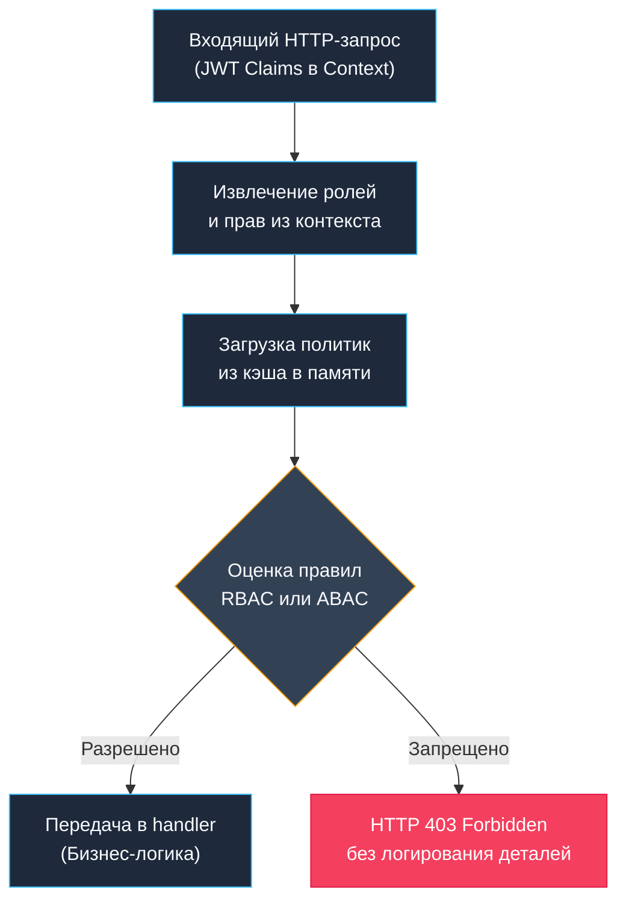

В программировании существует давний спор между неявной магией и прозрачным кодом. В таких фреймворках, как Spring, Laravel или Ruby on Rails, авторизацию традиционно прячут за декораторами и аннотациями вроде `@PreAuthorize`, `@Can` или макросами маршрутизатора. Они перехватывают поток управления незаметно для разработчика, полагаясь на рефлексию, байткод-манипуляции и скрытые глобальные контексты.

Язык Go придерживается совершенно иной школы инженерной мысли, восходящей к традициям Unix и Bell Labs: **явное всегда лучше неявного**. В Go авторизация — это не магия фреймворка, а строго типизированный, проверяемый контракт на уровне middleware или сервисного слоя. Разработчик точно видит, где именно проверяются привилегии, как передаются контекстные данные, может мгновенно протестировать логику изолированным юнит-тестом и с точностью до наносекунды измерить затраты процессора.

RBAC (Role-Based Access Control) моделирует доступ через классическую трехуровневую цепочку: `User → Role → Permission`. Пользователь обладает одной или несколькими ролями, а роли объединяют элементарные атомарные права (чтение, запись, удаление). В зрелых бэкенд-системах чистый RBAC часто расширяется атрибутивным контекстом (ABAC), учитывающим время суток, IP-подсеть или владение конкретным ресурсом.

## 1. Математическая модель и структура данных

В своей фундаментальной основе RBAC опирается на элементарную теорию множеств. Проверка прав доступа — это не что иное, как операция пересечения множеств: `User.Permissions ∩ Resource.RequiredPermissions ≠ ∅`.

В Go для реализации таких множеств применяются три архитектурных шаблона:
- `map[string]struct{}` — быстрое множество строк для поиска за амортизированное время $O(1)$;
- Битовые маски (`uint64`) — предельно компактное представление в скалярном регистре процессора для мгновенных побитовых логических операций;
- Направленные ациклические графы (DAG) — для моделирования иерархического наследования ролей (например, роль `Admin` включает в себя все права `Editor`, которая, в свою очередь, наследует права `Viewer`).



## 2. Под капотом. Оптимизация горячего пути

Проверка прав доступа выполняется на **каждый входящий HTTP-запрос**. Это критический горячий путь (hot path) приложения. Если на каждый вызов эндпоинта выделять память в куче, динамически парсить теги рефлексией или вызывать тяжелые регулярные выражения, процессор начнет тратить больше времени на выяснение прав клиента, чем на саму полезную работу.

Идиоматичный и предельно производительный подход для систем с фиксированным набором прав — использование **битовых масок** (bitmasks).

```go
// Битовые флаги для прав (до 64 прав в uint64)
const (
    PermRead   uint64 = 1 << iota // 1 (0001)
    PermWrite                     // 2 (0010)
    PermDelete                    // 4 (0100)
    PermAdmin                     // 8 (1000)
)

// Проверка за O(1) без аллокаций
func HasPermission(userPerms uint64, required uint64) bool {
    return (userPerms & required) == required
}
```

> [!info] Под капотом
> Битовые операции (`AND`, `OR`, `XOR`) выполняются ровно за 1 такт CPU непосредственно в регистре арифметико-логического устройства (ALU). Они не обращаются к шине оперативной памяти, не порождают промахов кэша (cache miss) и создают ровно ноль аллокаций в куче (`heap allocations = 0`). Число `uint64` целиком помещается в один 64-битный регистр процессора (`RAX`/`RBX` на x86-64 или `X0` на ARM64).
> 
> Сравните это с `map[string]struct{}`: поиск ключа в хеш-таблице требует вычисления хеша строки, прохода по бакетам структуры `hmap`, сравнения байтов ключа и потенциального промаха кэша при разыменовании указателей. При нагрузке в 100 000 RPS разница во времени отклика между битовой маской и map может достигать 50–100 нс на запрос, что в высоконагруженных шлюзах выливается в заметные миллисекунды задержки на перцентилях p99.

## 3. Идиоматичная реализация Middleware

В архитектуре чистого Go авторизация обязана быть строго отделена от аутентификации. Аутентифицирующее middleware (например, проверяющее JWT или сессионный токен) удостоверяет личность и сохраняет идентификатор и права пользователя в `context.Context`. Следующее за ним RBAC middleware проверяет лишь соответствие прав запрашиваемому ресурсу.

```go
package middleware

import (
    "context"
    "net/http"
)

type PermissionKey struct{}

// RequirePerm возвращает middleware, проверяющий наличие прав
func RequirePerm(required uint64) func(http.Handler) http.Handler {
    return func(next http.Handler) http.Handler {
        return http.HandlerFunc(func(w http.ResponseWriter, r *http.Request) {
            // Извлекаем права из контекста (установлены auth middleware)
            perms, ok := r.Context().Value(PermissionKey{}).(uint64)
            if !ok {
                http.Error(w, "unauthorized", http.StatusUnauthorized)
                return
            }

            if (perms & required) != required {
                http.Error(w, "forbidden", http.StatusForbidden)
                return
            }

            next.ServeHTTP(w, r)
        })
    }
}
```

Использование в маршрутизации:
```go
mux.Handle("/api/users", RequirePerm(PermRead)(userHandler))
mux.Handle("/api/users/admin", RequirePerm(PermAdmin)(adminHandler))
```

Такая композиция функций предельно наглядна, не скрывает логику и без труда компонуется стандартным `net/http` или любым роутером (`chi`, `gorilla/mux`).

## 4. Динамические политики и Policy Engines

Битовые маски непревзойденны по скорости, но статичны: они требуют жесткой фиксации прав на этапе компиляции. В сложных enterprise-системах, мультиарендных платформах (SaaS) и системах с развитой административной панелью политики доступа должны изменяться администраторами на лету без перезапуска бинарника.

Для таких задач привлекают специализированные движки политик — в экосистеме Go лидером является библиотека **Casbin**, а в распределенных облачных средах — **Open Policy Agent (OPA)**.

Casbin базируется на метамодели **PERM** (Policy, Effect, Request, Matchers). Конфигурация модели описывается декларативно в текстовом файле или строке, а сами правила динамически загружаются из базы данных:

```go
import "github.com/casbin/casbin/v2"

func casbinMiddleware(e *casbin.Enforcer) func(http.Handler) http.Handler {
    return func(next http.Handler) http.Handler {
        return http.HandlerFunc(func(w http.ResponseWriter, r *http.Request) {
            subj := getUserFromCtx(r)
            obj := r.URL.Path
            act := r.Method

            ok, err := e.Enforce(subj, obj, act)
            if err != nil || !ok {
                http.Error(w, "forbidden", http.StatusForbidden)
                return
            }
            next.ServeHTTP(w, r)
        })
    }
}
```

> [!warning] Ловушка / Gotcha
> **Производительность Enforce**: Метод `e.Enforce()` по умолчанию осуществляет линейный перебор загруженных правил. Если в системе зарегистрированы десятки тысяч правил доступа, линейный поиск на каждом HTTP-запросе парализует горячий путь. В production необходимо задействовать механизмы оптимизации: модуль `rbac_api` с кэшированием результатов в `sync.Map`, предварительную компиляцию матчеров или модель доменов `rbac_domain_model`. Кроме того, рекомендуется отключить автоматическую запись изменений `e.EnableAutoSave(false)` и синхронизировать состояние батчами.
> 
> **Горизонтальная эскалация привилегий (Horizontal Privilege Escalation / IDOR)**: RBAC отвечает только за тип операции: «Может ли пользователь с ролью `Manager` редактировать документы?». Но он не знает, имеет ли менеджер Иванов право редактировать финансовый отчет менеджера Петрова. Проверка владения ресурсом (`resource.owner_id == claims.user_id`) — это **бизнес-логика**, которая обязана жить на уровне сервисного слоя приложения, а не в общем HTTP middleware!

## 5. Race Conditions и атомарное обновление политик

В распределенной системе политики доступа обновляются асинхронно: через сообщения брокера Kafka, события Webhook или периодический опрос базы данных (polling). Если во время входящего трафика перезагрузить правила прямо в работающий экземпляр `*casbin.Enforcer` или перезаписать общую `map`, программа немедленно упадет с ошибкой одновременного чтения и записи (`fatal error: concurrent map read and map write`) либо возникнет состояние гонки (data race).

Идиоматичный паттерн в современном Go (начиная с Go 1.19+) — использование lock-free контейнера **`atomic.Pointer`** и принципа двойной буферизации (Double Buffering):

```go
var policyCache atomic.Pointer[casbin.Enforcer]

func reloadPolicies() {
    newEnforcer, err := casbin.NewEnforcer("model.conf", "new_policies.csv")
    if err != nil {
        log.Printf("policy reload failed: %v", err)
        return
    }
    // Атомарная замена указателя: lock-free, 0 наносекунд ожидания
    policyCache.Store(newEnforcer)
}

// В middleware:
func checkAuth(w http.ResponseWriter, r *http.Request) {
    e := policyCache.Load()
    subj := r.Context().Value("user").(string)
    ok, _ := e.Enforce(subj, r.URL.Path, r.Method)
    // ...
}
```

Читающие горутины продолжают обслуживать запросы на максимальной скорости. При вызове `Store()` указатель переключается за одну машинную инструкцию (`atomic xchg` / `atomic store`). Никаких блокировок `sync.RWMutex`, никакого перевода горутин в состояние ожидания `_Gwaiting` и системных вызовов `futex`.

## 6. Производительность и Mechanical Sympathy

- **Кэш-локальность (Spatial Locality)**: Битовые маски и компактные слайсы прав укладываются в непрерывный блок памяти. Аппаратный предвыборщик процессора (Hardware Prefetcher) заранее подгружает их в L1-кэш данных. Напротив, разветвленная структура `map` разбрасывает бакеты по разным страницам виртуальной памяти, что приводит к промахам буфера трансляции адресов (`dTLB-load-misses`).
- **Escape Analysis**: Скалярные значения `uint64` передаются через регистры процессора и не вызывают выделения памяти в куче. Если же упаковывать права в интерфейсные значения `interface{}` или срезы строк `[]string`, они с высокой вероятностью сбегут в кучу (heap escape), создавая давление на Garbage Collector.
- **Предсказание ветвлений (Branch Prediction)**: Проверка `if (perms & required) == required` чрезвычайно дружелюбна к модулю Branch Target Buffer (BTB) современных процессоров: у легитимных клиентов условие практически всегда истинно, и конвейер процессора исполняет команды на полной скорости без сбросов конвейера (pipeline flushes).
- **Сравнение со сторонними экосистемами**: В Spring Security каждый защищенный вызов проходит сквозь дебри аспектов (AOP), CGLIB-прокси и цепочек фильтров сервлетов. В Go авторизация сводится к прямому вызову функции по указателю. Накладные расходы Casbin в Go измеряются микросекундами, тогда как битовые маски работают за доли наносекунды.

> [!tip] Собеседование
> **Вопрос:** В чем принципиальная разница между RBAC и ABAC? В какой момент монолитная система должна переходить на ABAC?
> **Ответ:** RBAC отвечает на вопрос «Кто ты по должности?» (роль), а ABAC — «При каких условиях выполняется действие?» (атрибуты: IP-адрес клиента, время суток, геолокация, статус документа, владелец записи). RBAC удобен и прост, пока в компании до 20–50 ролей. Как только начинается «взрывной рост ролей» (Role Explosion — когда приходится создавать роли вроде `BillingManagerOnlyWorkingHoursUS`), необходимо внедрять ABAC или гибридную модель.
> 
> **Вопрос:** Почему для множества уникальных прав в Go выгоднее использовать `map[string]struct{}`, а не `map[string]bool`?
> **Ответ:** Пустая структура `struct{}` в Go занимает ровно 0 байт памяти (`unsafe.Sizeof(struct{}{}) == 0`). Тип `bool` формально занимает 1 байт, но из-за правил выравнивания структур (memory alignment) бакеты `hmap` вынуждены резервировать под него дополнительную память. `map[string]struct{}` минимизирует footprint в оперативной памяти и нагрузку на процессорный кэш.

## 7. Сравнение подходов

| Метод | Сложность | Производительность | Динамичность | Идеально для |
|---|---|---|---|---|
| Битовые маски | Низкая | Максимальная (O(1)) | Низкая | Внутренние API, микросервисы, неизменные роли |
| `map`/слайсы | Средняя | Высокая | Средняя | Типичные веб-сервисы с набором строковых прав |
| Casbin/OPA | Высокая | Средняя (кэшируется) | Высокая | Enterprise, multi-tenant SaaS, динамические правила |
| Код в handler | Низкая | Максимальная | Нулевая | Небольшие прототипы, простые CRUD-сервисы |

## Итог

1. В Go авторизация реализуется явно через middleware или сервисный слой, без магических аннотаций.
2. Для статичных прав используйте битовые маски (`uint64`) — это O(1), 0 аллокаций, 100% cache-friendly.
3. Для динамических политик применяйте Casbin, но обязательно кэшируйте энфорсер и обновляйте его через `atomic.Pointer`.
4. Разделяйте аутентификацию (кто ты), авторизацию (что можно) и бизнес-валидацию (твой ли это ресурс).
5. Избегайте `map` для прав в hot-path из-за аллокаций и cache miss.
6. RBAC масштабируется до ~50 ролей; для сложных условий переходите к ABAC или hybrid-моделям.

Следующая статья: [[21. Работа с базой данных]]
