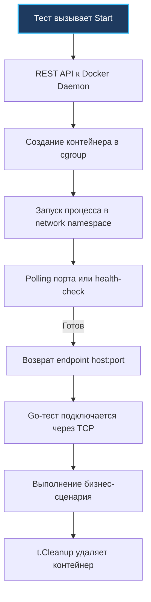

## Философия интеграционных тестов

Юнит-тесты дарят инженеру обманчивое чувство абсолютного контроля. Мы тщательно изолируем функции, подсовываем им элегантные интерфейсные заглушки (моки), любуемся зелеными индикаторами покрытия в 90% и верим, что система готова к бою. Однако юнит-тесты проверяют лишь изолированную логику внутри нашего воображаемого мира — они слепы к суровой реальности сетевых драйверов БД, особенностям сериализаторов, скрытым сетевым таймаутам, уровням изоляции транзакций и нюансам диалектов SQL.

Интеграционные тесты призваны закрыть этот критический пробел, запуская код в среде, максимально приближенной к production. В современном Go это категорически не означает поднятие самодельных моков или легковесных in-memory эмуляторов (вроде SQLite вместо PostgreSQL, поведение которых в транзакциях и блокировках разительно отличается). Надежное интеграционное тестирование — это прямое взаимодействие с реальными сервисами через Docker-контейнеры. Такой подход позволяет обнаружить проблемы на уровне бинарных протоколов, поведения пулов соединений и согласованности данных задолго до первого шага пайплайна деплоя.

Главный инженерный принцип: **интеграционный тест обязан быть абсолютно детерминированным, изолированным и полностью очищаемым после своего завершения**. Любое остаточное состояние (незакрытая транзакция, неудаленная строка в таблице, забытый контейнер) неизбежно ломает параллельное исполнение и превращает CI/CD пайплайн в генератор непредсказуемых flaky-тестов.

### Под капотом. Архитектура testcontainers и сетевой стек

Стандартом де-факто в экосистеме Go стала библиотека `github.com/testcontainers/testcontainers-go`. Библиотека принципиально не эмулирует сервисы: она выступает высокоуровневым программным оркестратором, управляющим жизненным циклом реальных Docker-контейнеров напрямую через Unix-сокет демона (`/var/run/docker.sock`).

Когда в тестовом сценарии вызывается метод `Start()`, разворачивается четкая цепочка событий на стыке рантайма Go и ядра Linux:

1. **REST-запрос к Docker Daemon**: Библиотека отправляет HTTP/REST-запрос `POST /containers/create` через сокет, передавая конфигурацию целевого образа, открываемые порты, переменные окружения и сетевые настройки.
2. **Запуск процесса в cgroup**: Ядро Linux изолирует процесс базы данных в контрольных группах (cgroup), ограничивая доступные PID, оперативную память и кванты CPU. Процесс стартует в изолированных пространствах имен (network namespace, mount namespace, pid namespace), подключаясь к виртуальной сети (обычно bridge).
3. **Polling readiness**: Клиентская библиотека не спешит отдавать управление тесту. Она опрашивает сетевой порт или выполняет специализированную health-check команду (polling readiness) до тех пор, пока целевой сервис внутри контейнера не подтвердит полную готовность принимать пользовательский трафик. Для предотвращения спама в сокет используется экспоненциальный backoff.
4. **Проброс порта в host**: Чтобы избежать конфликтов портов при параллельном запуске нескольких копий одной и той же службы, Docker маппит внутренний порт (например, стандартный 5432) на случайный свободный эфемерный порт хоста (`127.0.0.1:<random>`). Go-тест подключается к этому динамическому порту напрямую, без необходимости модифицировать системный `/etc/hosts` или вмешиваться в DNS.



> [!info] Под капотом
> Сетевая задержка между хостом и контейнером в bridge-режиме включает обязательное прохождение пакета через виртуальную пару интерфейсов (`veth` пару), сетевой мост `docker0`, механизм трансляции адресов NAT и цепочки правил iptables/nftables. Это добавляет порядка 0.1–0.3 мс оверхеда к каждому TCP-пакету. Для интеграционных тестов бизнес-логики это вполне приемлемо, но становится критичным, если вы наивно пытаетесь замерять p99 latency в контейнеризованных тестах на локальной машине. В нагруженных CI-средах создание тысяч одновременных `veth` пар вызывает contention на уровне ядра Linux и способно мгновенно исчерпать системный лимит `ulimit -n` (файловые дескрипторы) на раннере.

### Идиоматичный паттерн: Изоляция, миграции и t.Cleanup

Классический оператор `defer` удобен в прикладном коде, но в модульном тестировании он таит неприятные подводные камни: если тест аварийно завершается через `t.Fatal()` внутри вложенной горутины или хелпера, либо паникует в фазе разбора assertion, цепочка `defer` на верхнем уровне может исполниться несвоевременно или оставить висящие ресурсы при отмене контекста.

Идиоматичный подход в современном Go — использование метода `t.Cleanup()`. Функции, зарегистрированные в `t.Cleanup()`, хранятся рантаймом `testing` в виде стека LIFO и гарантированно исполняются при любых исходах теста — даже при панике, вызове `t.FailNow()`, `t.Fatal()` или прерывании контекста выполнения. Это критически важно для предотвращения появления осиротевших «зомби-контейнеров», съедающих ресурсы в CI-пайплайне.

```go
package integration

import (
    "context"
    "database/sql"
    "fmt"
    "testing"
    "time"

    "github.com/testcontainers/testcontainers-go"
    "github.com/testcontainers/testcontainers-go/wait"
    _ "github.com/jackc/pgx/v5/stdlib"
)

func TestPostgresIntegration(t *testing.T) {
    ctx, cancel := context.WithTimeout(context.Background(), 2*time.Minute)
    defer cancel()

    // Запуск контейнера
    req := testcontainers.ContainerRequest{
        Image:        "postgres:15-alpine",
        ExposedPorts: []string{"5432/tcp"},
        Env:          map[string]string{"POSTGRES_PASSWORD": "test"},
        WaitingFor:   wait.ForLog("database system is ready to accept connections"),
    }

    pgContainer, err := testcontainers.GenericContainer(ctx, testcontainers.GenericContainerRequest{
        ContainerRequest: req,
        Started:          true,
    })
    if err != nil {
        t.Fatalf("failed to start postgres container: %v", err)
    }
    
    // Гарантированная очистка
    t.Cleanup(func() {
        _ = pgContainer.Terminate(context.Background())
    })

    host, err := pgContainer.Host(ctx)
    if err != nil {
        t.Fatalf("failed to get host: %v", err)
    }
    port, err := pgContainer.MappedPort(ctx, "5432")
    if err != nil {
        t.Fatalf("failed to get mapped port: %v", err)
    }

    dsn := fmt.Sprintf("postgres://postgres:test@%s:%s/postgres?sslmode=disable", host, port.Port())
    
    // Подключение и применение миграций
    db, err := sql.Open("pgx", dsn)
    if err != nil {
        t.Fatalf("failed to connect: %v", err)
    }
    defer db.Close()

    if err := applyMigrations(ctx, db); err != nil {
        t.Fatalf("failed to apply migrations: %v", err)
    }

    // Выполнение теста
    testUserRepository(ctx, t, db)
}
```

> [!warning] Ловушка / Gotcha
> **Общее состояние БД**: Если несколько параллельных тестов пишут в одну и ту же базу данных без строгой изоляции, они неизбежно начнут конфликтовать за общие строки и первичные ключи. Надежная стратегия: создавайте уникальные изолированные схемы (`CREATE SCHEMA test_${rand}`) или выделяйте временные базы на каждый тест. В PostgreSQL переключение контекста выполняется мгновенной сменой пространства имен через `SET search_path`, а в MySQL — динамическим созданием временной БД. Никогда не полагайтесь на глобальный `TRUNCATE` таблиц внутри параллельного теста: это работает медленно, не сбрасывает счетчики sequence и провоцирует взаимные блокировки (`deadlock`) на уровне метаданных таблиц.

### Параллелизм и контроль ресурсов

Вызов `t.Parallel()` в интеграционном наборе тестов — мощнейший рычаг сокращения времени сборки в CI. Однако бездумный параллелизм способен мгновенно обрушить хост-машину, запустив десятки прожорливых СУБД одновременно. Параллельные тесты требуют жесткого контроля за пулом контейнеров и активными сетевыми соединениями:

```go
func TestRepositoryParallel(t *testing.T) {
    tests := []struct {
        name  string
        setup func(*testing.T, *sql.DB)
    }{
        {"create user", setupCreateUser},
        {"update status", setupUpdateStatus},
    }

    for _, tt := range tests {
        t.Run(tt.name, func(t *testing.T) {
            t.Parallel()
            // Каждый тест получает свой контейнер или изолированную схему
            runIntegrationTest(t, tt.setup)
        })
    }
}
```

Для радикального снижения накладных расходов на холодный старт контейнеров в CI применяют паттерн **переиспользования на уровне пакета** с использованием `sync.Once` (или в функции `TestMain(m *testing.M)`), либо ограничивают параллелизм через пул семафоров. В этом случае поднимается один контейнер на весь тестовый пакет, а каждый подтест работает в персональной изолированной схеме данных. Но помните: переиспользование контейнера требует идеальной гигиены данных, иначе тесты потеряют детерминизм и станут невоспроизводимыми.

### Механика исполнения и Mechanical Sympathy

С точки зрения архитектуры ЭВМ и операционной системы, интеграционные тесты генерируют колоссальное давление на аппаратные ресурсы:

- **Аллокации и GC**: Загрузка слоев образов из локального кэша демона, десериализация массивных JSON-ответов от Docker API и парсинг бинарных кадров протокола СУБД порождают миллионы временных объектов в куче Go-рантайма. При прогоне сотен интеграционных сценариев это вызывает частые фазы Mark Assist сборщика мусора (GC), драматически увеличивая суммарное время выполнения.
- **Системные вызовы**: Каждая связка `sql.Open` + `db.Ping()` инициирует серию тяжелых сисколлов: `socket()`, `connect()`, установку TCP handshake и криптографическое TLS-рукопожатие (если шифрование включено). В тестах эти шаги повторяются многократно. Грамотная конфигурация пула соединений (`MaxOpenConns: 5`, `ConnMaxLifetime: 1m`) снижает churn сокетов и экономит сотни миллисекунд процессорного времени ядра.
- **Планировщик и `sync.Mutex`**: Внутренние компоненты `testcontainers` защищены мьютексами для потокобезопасного обращения к Docker API через Unix-сокет. При агрессивном параллельном запуске 50+ горутин возникает резкий contention за мьютексы и сокет. Ограничение конкурентности через `testing.M` или использование пула семафоров (`golang.org/x/sync/semaphore`) стабилизирует пропускную способность пайплайна.
- **Файловые дескрипторы**: Каждый поднятый контейнер держит открытыми порядка 10–20 файловых дескрипторов (FD) для stdout/stderr пайпов, сетевых сокетов и системных метрик cgroups. На стандартном CI-раннере с системным ограничением `1024` одновременный запуск десятка тестов мгновенно приводит к ошибке ядра `too many open files`. Превентивная настройка `ulimit -n 4096` (или выше) является строгой необходимостью для стабильного CI.

> [!tip] Собеседование
> **Вопрос:** Почему `defer container.Terminate()` хуже, чем `t.Cleanup()`?
> **Ответ:** Оператор `defer` привязан к лексической области видимости конкретной функции. Если внутри теста происходит вызов `t.Fatal()` во вспомогательной подфункции, или рантайм аварийно паникует при ассерте, отложенные через `defer` вызовы могут не сработать корректно в зависимости от точки аварии и контекста отмены. Метод `t.Cleanup()` регистрирует обработчики непосредственно в управляющей структуре рантайма `testing.T` и гарантированно исполняется при любом сценарии завершения теста (успех, фатальная ошибка, паника, таймаут). Это исключает накопление зависших «зомби-контейнеров» в инфраструктуре CI.
> 
> **Вопрос:** Как ускорить интеграционные тесты в CI без потери надежности?
> **Ответ:** 
> 1. Кэшировать Docker-образы на CI-раннере (layer cache / preload), избегая повторного скачивания из Docker Hub.
> 2. Переиспользовать один инстанс контейнера СУБД на уровне пакета тестов, изолируя сценарии через создание уникальных схем (`CREATE SCHEMA`).
> 3. Отключать синхронную запись журналов транзакций на диск (например, директивы `wal_level = minimal`, `fsync = off`, `synchronous_commit = off` для тестового профиля PostgreSQL в tmpfs/RAM-диске).
> 4. Использовать `pgbouncer` или выверенный `connection pool` для тестовых клиентов, устраняя накладные расходы на постоянный TCP handshake.
> 5. Запускать тяжелые интеграционные сценарии последовательно или с лимитированным пулом воркеров, а легковесные тесты бизнес-логики параллелить на полную мощность через `t.Parallel()`.

### Ловушки production-тестирования

- **Жестко заданные таймауты**: Контейнер на перегруженном виртуальном раннере CI со слабой виртуализацией дисков стартует в 2–5 раз медленнее, чем на мощном MacBook с быстрым NVMe SSD. Конструкция `context.WithTimeout(ctx, 30s)` для инициализации СУБД — гарантированный рецепт случайных падений в ночных сборках. Устанавливайте таймауты с запасом (2-3 минуты) и используйте динамические проверки готовности с экспоненциальным backoff.
- **Тестирование драйверов вместо логики**: Если тест проверяет элементарные вызовы `db.Exec("INSERT...")` и `db.Query("SELECT...")`, он тестирует корректность работы драйвера базы данных, а не ваш бизнес-код. Настоящий интеграционный тест валидирует реальные контракты и пограничные сценарии, описанные в статье [[22. Repository pattern]]: корректность отката транзакций при сбоях, поведение блокировок строк (`FOR UPDATE`), маппинг сложных составных структур и реакцию на специфические ошибки вроде `sql.ErrNoRows`.
- **Игнорирование `GRACEFUL SHUTDOWN`**: При вызове `Terminate()` контейнер сначала получает сигнал `SIGTERM`. Если тестовый раннер принудительно обрывает процесс без ожидания завершения фоновых транзакций, данные могут зависнуть в невалидном состоянии. Всегда дождитесь выполнения условий завершения через `WAITFOR` или используйте принудительное удаление (`force`) строго после завершения всех верификаций.
- **Зависимость от `localhost`**: В корпоративных средах GitHub Actions или GitLab CI Docker-демон часто запускается в режиме rootless или через Docker-in-Docker (`dind`). В таких топологиях метод `Host()` возвращает не привычный `127.0.0.1`, а адрес мостового интерфейса или внутренний IP сервисного контейнера. Никогда не зашивайте IP-адреса в код — всегда извлекайте адрес и порт через методы `testcontainers`.

### Итог

1. Интеграционные тесты проверяют контракты между реальными компонентами распределенной системы, а не изолированную логику. Они незаменимы для верификации сетевых протоколов, драйверов СУБД и транзакционной целостности.
2. Библиотека `testcontainers-go` является де-факто стандартом оркестрации реальных зависимостей в Go. Всегда регистрируйте завершение контейнеров через `t.Cleanup()` для гарантированного освобождения ресурсов.
3. Добивайтесь строгой изоляции состояния: используйте динамические схемы данных (`CREATE SCHEMA test_${rand}` и `SET search_path`) или отдельные базы данных. Категорически избегайте `TRUNCATE` в параллельных тестовых наборах.
4. Контролируйте параллелизм: грамотно сочетайте `t.Parallel()` с пулами семафоров, ограничивайте одновременное число контейнеров и не забывайте расширять лимит файловых дескрипторов `ulimit -n` на CI-раннерах.
5. Оптимизируйте скорость исполнения: прогревайте кэш Docker-образов, переиспользуйте инстансы СУБД между тестами одного пакета и переносите временные каталоги баз данных в память (RAM-диск / tmpfs) с отключенным `fsync`.
6. Фокусируйтесь на критических бизнес-сценариях: тестируйте атомарность транзакций, разрешение гонок, маппинг доменных сущностей и корректность обработки ошибок.

Качественные интеграционные тесты превращают CI/CD пайплайн из источника головной боли и случайных падений в надежный бронированный щит, отсекающий инфраструктурные дефекты задолго до того, как они достигнут серверов пользователей.

Следующая статья: [[36. Load testing]]
