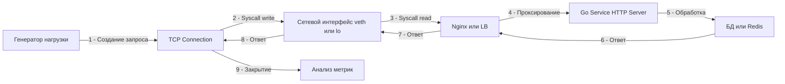

## Философия нагрузочного тестирования

В тишине исследовательских лабораторий Bell Labs инженеры быстро усвоили незыблемое правило: программа, безупречно работающая для одного пользователя, почти наверняка потерпит катастрофу, когда к ней одновременно обратятся тысячи. Нагрузочное тестирование (Load Testing) — это не банальная попытка выяснить, «выдержит ли наш HTTP-сервис 1000 запросов в секунду». Это системный процесс эмпирической валидации архитектурных гипотез, калибровки таймаутов, настройки пулов и глубокого понимания физических пределов масштабирования распределенной системы.

В отличие от профилирования (`pprof`), отвечающего на микроскопический вопрос «почему именно этот изолированный запрос выполняется 50 миллисекунд?», нагрузочное тестирование отвечает на макроскопический вопрос «что произойдет с ядром ОС, рантаймом Go и сетью, когда входящих запросов станет критически много?».

В экосистеме Go, благодаря первоклассному асинхронному рантайму и сетевому поллеру (netpoller), сервисы на удивление редко упираются в чистую вычислительную мощность CPU при обработке сетевого ввода-вывода. Куда чаще узким горлышком становятся системные ограничения ядра Linux (лимиты на файловые дескрипторы), перегрузка внешних зависимостей (СУБД, кэши, брокеры сообщений) или деградация производительности сборщика мусора (GC) из-за безудержных аллокаций в куче под пиковым трафиком. Грамотно спроектированное тестирование воспроизводит реалистичный профиль нагрузки и позволяет обнаружить скрытые точки разлома задолго до того, как они парализуют production.

### 1. Математика и ключевые метрики

Оценка поведения системы под нагрузкой опирается на строгую теорию очередей и математическую статистику. Полагаться на интуицию здесь губительно:

- **RPS (Requests Per Second)**: Количество успешно обработанных HTTP-запросов за одну секунду времени.
- **Throughput (Пропускная способность)**: Суммарный объем полезных данных, передаваемых сетевым стеком за единицу времени (Мбит/с или МБ/с).
- **Latency (Задержка)**: Физическое время от момента отправки первого байта запроса клиентом до полного получения последнего байта ответа.
- **Percentiles (p50, p95, p99)**: Среднее арифметическое время ответа — худшая метрика в инженерной практике. Если 99 пользователей получили ответ за 10 миллисекунд, а один несчастный клиент ждал 10 секунд из-за зависшей блокировки, среднее покажет благополучные ~110 мс. Однако пользовательский опыт 1% аудитории полностью разрушен. В высоконагруженных системах ключевым ориентиром выступает **p99** — пороговое время, быстрее которого сервер ответил на 99% всех поступивших запросов.
- **Закон Литтла (Little's Law)**: Фундаментальное соотношение теории массового обслуживания выражается формулой:
  $$L = \lambda W$$
  где $L$ — среднее количество запросов, одновременно находящихся в системе; $\lambda$ — интенсивность входящего потока запросов; $W$ — среднее время пребывания запроса в системе. Если время обработки ($W$) начинает расти из-за конкуренции за базу данных или блокировки, количество активных горутин ($L$) лавинообразно увеличивается при неизменном входном потоке $\lambda$, пока сервис не исчерпает доступную оперативную память.

### 2. Инструментарий: k6 vs wrk vs Vegeta

Выбор нагрузочного генератора диктуется архитектурной задачей и характером моделируемого трафика:

- **wrk / wrk2**: Написан на языке C, использует системный мультиплексор `epoll` и пул потоков ОС. Инструмент способен генерировать колоссальный трафик с одной хост-машины, минимально нагружая собственный CPU. Идеален для грубого стресс-тестирования аппаратных возможностей и сетевых HTTP-серверов. Минус — минимальная гибкость в бизнес-сценариях (сложно динамически варьировать JSON-полезную нагрузку и сохранять состояние между запросами).
- **k6**: Современный индустриальный стандарт от Grafana Labs. Написан на Go, а сценарии нагрузки описываются на JavaScript. Позволяет эмулировать реалистичные пользовательские пути (user journeys), сохранять токены авторизации, опрашивать различные эндпоинты с разной вероятностью и проверять валидность ответов. Идеально интегрируется в CI/CD пайплайны.
- **Vegeta**: Специализированный инструмент на Go, ориентированный на поддержание строго постоянной частоты атак (Constant Rate). Незаменим для поиска точного предела пропускной способности, не искажая измерения задержками ответов сервера (борьба с проблемой Coordinated Omission).



### 3. Под капотом. Генерация трафика и сетевой стек

Когда инструмент вроде `k6` или `wrk` инициирует шквал запросов, он подчиняется тем же законам операционной системы, что и любой сетевой клиент. На уровне ядра Linux активируются критические механизмы:

- **Файловые дескрипторы**: Каждое открытое TCP-соединение требует выделения одного файлового дескриптора (сокет). Если тестовый сценарий поднимает 10 000 параллельных виртуальных пользователей, системное ограничение `ulimit -n` и на машине-генераторе, и на целевом сервере обязано превышать 10 000 с солидным запасом. Иначе вы получите не объективный замер сервиса, а локальную ошибку ядра `EMFILE (Too many open files)`.
- **Ephemeral Ports**: Для исходящих клиентских соединений ядро выделяет эфемерные порты из диапазона `net.ipv4.ip_local_port_range` (по умолчанию от 32768 до 60999, что дает всего ~28 232 порта). Если тест агрессивно открывает и закрывает тысячи TCP-сессий к одному IP-адресу и порту сервера, пул эфемерных портов мгновенно исчерпывается. Решение — использовать множественные IP-алиасы на генераторе или включать постоянные соединения (`Connection: Keep-Alive`).
- **TCP TIME_WAIT**: Согласно стандарту TCP, при активном закрытии соединения сокет переходит в состояние `TIME_WAIT` на длительность $2 \times \text{MSL}$ (обычно 60 секунд), блокируя повторное использование кортежа адресов `(src_ip, src_port, dst_ip, dst_port)`. В нагрузочных испытаниях сокеты в `TIME_WAIT` быстро забивают память сетевого стека. Поэтому базовое правило тестирования HTTP-сервисов — обязательное переиспользование соединений через заголовок `Connection: Keep-Alive`.

> [!info] Под капотом
> В Linux при высокой нагрузке на один процесс `epoll` эффективен, но при очень частых переключениях контекста между горутинами генератора и обработчика может возникать `lock contention`. Для достижения миллионов RPS часто используют `SO_REUSEPORT` и запускают несколько процессов-генераторов, привязанных к разным ядрам (CPU Affinity), чтобы избежать миграции потоков ОС между ядрами.

### 4. Идиоматичная подготовка сервиса к тесту

Категорически запрещено проводить нагрузочные испытания над бинарником, скомпилированным для локальной отладки: с флагом `-gcflags="-m"`, подробными debug-логами на консоль и активными профилировщиками. Для нагрузочного теста собирайте бинарник строго в режиме `release`:

```bash
# Очистка кэша сборки
go clean -cache

# Компиляция без отладочной информации, с оптимизациями
go build -ldflags="-s -w" -o ./service-bin ./cmd/main.go
```

Флаги `-ldflags="-s -w"` вырезают отладочные символы DWARF и таблицу имен функций, уменьшая размер исполняемого файла и снижая давление на страничный кэш ОС при старте.

Перед испытаниями обязательно сконфигурируйте поведение рантайма Go через переменные окружения `GOGC` и `GOMEMLIMIT`:

```bash
# Уменьшение частоты сборки мусора для повышения пропускной способности (риск роста памяти)
export GOGC=100 
# Или жесткий лимит памяти
export GOMEMLIMIT=512MiB
```

Комбинация мягкого лимита памяти `GOMEMLIMIT` с адаптивным `GOGC` позволяет предотвратить внезапные падения сервиса по OOM-killer в пиках трафика, гарантируя предсказуемое поведение GC.

### 5. Сценарии тестирования

Нагрузочное тестирование не исчерпывается одним запуском. Полноценная верификация включает 4 обязательных профиля:

- **Smoke Test**: Минимальная нагрузка (5–10 RPS в течение 1–2 минут). Цель — убедиться, что окружение собрано верно, сетевые маршруты доступны, база данных отвечает, а базовые конфигурации валидны.
- **Load Test**: Плавный подъем нагрузки до согласованного в SLA целевого уровня (например, от 0 до 1000 RPS за 5 минут с последующим удержанием плато на 10 минут). Проверяется стабильность ключевых перцентилей (например, условие p99 < 200ms).
- **Stress Test**: Экстремальная нагрузка, кратно превышающая штатный максимум (от 2000 до 5000 RPS). Цель — определить точную точку перелома системы (breaking point), исследовать деградацию (появление HTTP 5xx, рост очередей) и проверить, способна ли система корректно восстановиться после спада пика.
- **Soak Test (Endurance)**: Длительный прогон под умеренной нагрузкой (на уровне 60–70% от максимума) на протяжении 12–24 часов. Единственный надежный способ выявить медленные утечки памяти (Memory Leaks), деградацию файловых дескрипторов и фрагментацию кучи, которые совершенно незаметны на коротких пятиминутных тестах.

### 6. Анализ результатов и узкие места в Go

Если графики мониторинга показывают экспоненциальный рост Latency, последовательно проверьте типичные узкие места рантайма Go:

- **CPU Saturation**: Если системная утилита `top` фиксирует 100% утилизацию CPU в пользовательском пространстве (`user`), проверьте алгоритмическую сложность критических путей, избыточное кодирование JSON или раздутые структуры. Большое количество активных горутин также перегружает планировщик.
- **GC Pressure**: Если `top` сигнализирует о всплесках нагрузки в системном пространстве (`sys`) ядра и в логах появляются паузы STW, сервис генерирует избыточный мусор в куче. Запустите детальный анализ профилей памяти через команду `go tool pprof -allocs`, чтобы локализовать места ненужных аллокаций.
- **Mutex Contention**: Если загрузка CPU подозрительно низкая (10–20%), но задержки ответов зашкаливают, горутины массово блокируются на синхронизационных примитивах. Воспользуйтесь профилировщиком блокировок `pprof -block`, чтобы выявить критические секции мьютексов, тормозящие поток запросов.
- **Connection Pool Exhaustion**: Контролируйте метрики пула сетевых соединений к базе данных (`db_connections_in_use`). Если размер пула исчерпан, входящие запросы выстраиваются в блокирующую очередь внутри пакета `database/sql`, вызывая тайм-ауты на верхнем уровне приложения.

> [!warning] Ловушка / Gotcha
> **Тестирование с localhost**: Запуск генератора и сервера на одной машине искажает результаты. Они делят один CPU, одну память и один сетевой стек. Генератор будет «отбирать» ресурсы у сервера. Для достоверных данных запускайте генератор на отдельной машине в том же дата-центре (одной зоне доступности).
> **Эффект разогрева (Warm-up)**: Первый запрос к Go-сервису может быть медленным из-за ленивой инициализации (первый вызов `regexp.Compile`, инициализация монотонного таймера). Всегда давайте сервису 10-30 секунд на разогрев перед началом замеров метрик.

### 7. Интеграция в CI/CD

Нагрузочное тестирование становится по-настоящему ценным, когда оно превращается в непрерывный регрессионный барьер в CI/CD пайплайне. Пример лаконичного сценария для `k6` (`script.js`):

```javascript
import http from 'k6/http';
import { check, sleep } from 'k6';

export const options = {
  stages: [
    { duration: '30s', target: 100 },  // Ramp-up: разгон до 100 виртуальных пользователей
    { duration: '1m', target: 100 },   // Plateau: удержание целевой нагрузки
    { duration: '30s', target: 0 },    // Ramp-down: плавное завершение
  ],
  thresholds: {
    http_req_duration: ['p(95)<200'], // p95 задержки строго ниже 200 мс
    http_req_failed: ['rate<0.01'],   // Частота ошибок строго менее 1%
  },
};

export default function () {
  const res = http.get('http://target-service:8080/api/health');
  check(res, {
    'status is 200': (r) => r.status === 200,
  });
  sleep(1);
}
```

Запуск в CI: `k6 run --out json=results.json script.js`. Если заданные пороги (thresholds) нарушаются, утилита возвращает ненулевой код выхода, и пайплайн падает с красным статусом, блокируя выпуск проблемного релиза.

> [!tip] Собеседование
> **Вопрос:** Как эмулировать медленного клиента в нагрузочном тесте?
> **Ответ:** Обычные инструменты читают ответ максимально быстро. Чтобы проверить поведение сервера при медленных клиентах (атака Slowloris), нужно использовать инструменты, которые читают тело ответа по одному байту с задержкой. Это проверяет, не держит ли сервер горутины открытыми слишком долго. В Go для защиты от этого используются `ReadTimeout` и `WriteTimeout` в `http.Server`.
> 
> **Вопрос:** Что важнее: пропускная способность или задержка?
> **Ответ:** Обычно приоритет — задержка (Latency). Пользователь не заметит, если сервис обрабатывает 1000 RPS или 2000 RPS, но он заметит, если страница грузится 5 секунд вместо 0.5. Оптимизация под p99 важнее, чем гонка за максимальным RPS.

### 8. Итог

1. Нагрузочное тестирование выявляет скрытые архитектурные дефекты, утечки ресурсов и конкуренцию за блокировки, принципиально незаметные на юнит-тестах.
2. Подбирайте инструмент под задачу: используйте `k6` для гибкой эмуляции сложных пользовательских сценариев и `wrk` для предельного стресс-тестирования сетевого ввода-вывода.
3. Всегда опирайтесь на статистические перцентили (p95, p99) и Закон Литтла — среднее время ответа маскирует катастрофические задержки для хвостовых запросов.
4. Никогда не проводите замеры с одного `localhost` — генератор нагрузки и целевой сервис обязаны быть физически разделены для исключения взаимного вытеснения за ресурсы CPU и память.
5. Строго контролируйте лимиты операционной системы (`ulimit -n`, лимиты эфемерных портов) и калибруйте размер пулов базы данных `database/sql`.
6. Встраивайте нагрузочные тесты с четкими порогами (thresholds) в регулярный CI/CD пайплайн для предотвращения деградации производительности.
7. Регулярно запускайте Soak-тестирование для выявления медленных утечек памяти и скрытой фрагментации структур кучи рантайма Go.

Следующая статья: [[37. Dockerization сервиса]]
