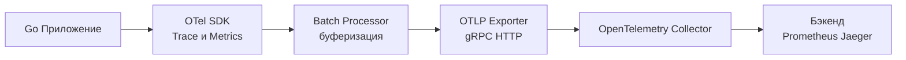

## Философия Observability в Go

В классической разработке времен раннего Unix и Bell Labs отладка была делом камерным и контролируемым: если программа падала, инженер открывал сформированный дамп памяти (`core dump`) в отладчике `adb` или `dbx`, исследовал содержимое регистров процессора и находил ошибочную строку кода. В современных распределенных системах на Go этот уютный мир остался в прошлом.

Когда единый пользовательский запрос пронизывает десятки микросервисов, пролетает через распределенные очереди сообщений, кэши в памяти и шардированные базы данных, классический отладчик бессилен. Вы не можете подключиться интерактивным отладчиком Delve к production-кластеру и поставить точку останова (breakpoint) — остановка рабочего процесса на доли секунды парализует входящий поток трафика и вызовет каскадный сбой всей инфраструктуры.

Вместо этого мы проектируем программные комплексы на основе принципа **Observability (Наблюдаемости)**. Термин, пришедший из математической теории управления Рудольфа Калмана (1960 г.), определяет наблюдаемость как меру того, насколько точно внутреннее состояние физической системы может быть реконструировано исключительно по ее внешним наблюдаемым выходам.

В распределенном бэкенде Observability опирается на «три столпа телеметрии»:
1. **Метрики (Metrics)**: Численные агрегаты за интервалы времени (счетчики, гистограммы, квантили). Они дают панорамную картину и мгновенно отвечают на вопрос: *«Здорова ли система прямо сейчас?»*.
2. **Логи (Logs)**: Дискретные структурированные записи о единичных свершившихся событиях. Они отвечают на вопрос: *«Что именно произошло в конкретный момент времени?»*.
3. **Трейсы (Traces)**: Сквозные деревья причинно-следственных связей выполнения распределенного запроса. Они отвечают на вопросы: *«Как, где, в каком сервисе и почему именно возникла задержка или произошел сбой?»*.

### 1. OpenTelemetry (OTel): Единый стандарт

В недавнем прошлом Go-сообщество страдало от зоопарка несовместимых вендорных решений: одни библиотеки использовали Zipkin, другие требовали Jaeger SDK, третьи опирались на проприетарные агенты Datadog или New Relic. 

Сегодня безусловным индустриальным стандартом под эгидой CNCF является проект **OpenTelemetry (OTel)**. OpenTelemetry четко разделяет API спецификацию телеметрии и ее рантайм-реализацию. Ваш прикладной код генерирует спаны (`Spans`) и регистрирует метрики (`Metrics`), обращаясь к стабильному OTel API, а специализированный `Exporter` берет на себя доставку данных по открытому стандарту OTLP (OpenTelemetry Protocol) во внешние хранилища (Prometheus, Jaeger, ClickHouse, Grafana Tempo, Loki).



> [!info] Под капотом
> Go-реализация OpenTelemetry SDK спроектирована с маниакальным вниманием к производительности основного приложения. Компонент `BatchSpanProcessor` использует ограниченный неблокирующий канал (`chan Span`) в памяти и отдельную фоновую горутину сборщика. Если бизнес-горутины порождают спаны быстрее, чем сетевой экспортер успевает прокачивать их через сетевой сокет, буферный канал переполняется, и OTel SDK начинает автоматически **дроппать** (отбрасывать) избыточные спаны. SDK осознанно жертвует полнотой телеметрии ради того, чтобы никогда не блокировать прикладные горутины и не спровоцировать катастрофический Out Of Memory. Это фундаментальная гарантия: телеметрия никогда не должна становиться причиной падения сервиса.

### 2. Трейсинг (Distributed Tracing) под капотом

Распределенный трейс представляет собой ориентированное ациклическое дерево операций, где каждый отдельный логический шаг называется **спаном** (`Span`). В экосистеме Go единственным идиоматичным транспортом для сквозной передачи контекста выполнения служит стандартный интерфейс `context.Context`.

```go
package main

import (
    "context"
    "go.opentelemetry.io/otel"
    "go.opentelemetry.io/otel/trace"
)

func doWork(ctx context.Context) {
    // 1. Создаем дочерний спан, неразрывно привязывая его к переданному контексту
    ctx, span := otel.Tracer("my-service").Start(ctx, "operation-name")
    // 2. Гарантируем корректное закрытие спана и фиксацию времени его завершения
    defer span.End()

    // 3. Пробрасываем обогащенный контекст дальше по цепочке вызовов (в БД, RPC или HTTP)
    callDatabase(ctx)
}
```

**Механика распространения (Context Propagation)**: 
Когда вызывается метод `otel.Tracer().Start()`, OTel SDK генерирует структуру `Span`, вычисляет `TraceID` (уникальный 128-битный идентификатор всей распределенной цепочки) и `SpanID` (64-битный идентификатор текущего шага), после чего запаковывает указатель на спан в новый дочерний `Context`. 

Когда ваш код совершает сетевой вызов через `http.NewRequestWithContext(ctx, ...)`, установленный сетевой middleware перехватывает контекст, извлекает актуальные `TraceID` и `SpanID`, сериализует их в стандартный заголовок спецификации W3C Trace Context (`traceparent`, например: `00-4bf92f3577b34da6a3ce929d0e0e4736-00f067aa0ba902b7-01`) и отправляет по сети. Принимающий микросервис считывает этот заголовок и продолжает дерево трейса без разрыва контекста.

> [!warning] Ловушка / Gotcha
> **Глубина контекста и аллокации памяти**: Каждый раз, когда в контекст внедряются новые метаданные (через `context.WithValue` или создание спана), рантайм Go аллоцирует новую структуру `valueCtx`, образующую односвязный список указателей на родителей. В глубоко эшелонированных цепочках вызовов микросервисов дерево контекста может насчитывать десятки узлов. Хотя начиная с Go 1.21 рантайм получил внутренние оптимизации `valueCtx` через атомарные операции, бездумное насыщение контекста тяжелыми объектами неизбежно приводит к раздуванию резидентной памяти (RSS) и создает измеримое давление на сборщик мусора (GC), так как структуры контекста сбегают в кучу (heap escape).

### 3. Влияние на производительность (Mechanical Sympathy)

Попытка включить детальный трейсинг «в лоб» со сбором 100% операций способна обрушить пропускную способность высоконагруженного Go-сервиса на 15–25%:

1. **Аллокации в куче**: Создание каждой структуры `Span` сопровождается выделением памяти под временные карты атрибутов, временные метки и структуры контекста. Миллион спанов в секунду — это миллионы аллокаций, нагружающих GC.
2. **Сериализация и кодирование**: Преобразование внутренних структур Go в Protobuf-сообщения формата OTLP требует сотен миллионов процессорных циклов CPU.
3. **Сетевой I/O**: Непрерывная отправка мегабайт телеметрических данных утилизирует сокеты и буферы ядра Linux.

**Инженерное решение: Семплирование (Sampling)**
В промышленном production сбор 100% трейсов экономически бессмысленен и технически разорителен. Применяются две выверенные стратегии:

*   **Head Sampling (Семплирование на входе)**: Решение о сохранении трейса принимается в момент поступления первого запроса на граничном шлюзе (например, сохраняется ровно 1% случайных запросов или фиксированный лимит в 50 запросов в секунду). Это чрезвычайно дешево с точки зрения ресурсов, однако существует риск пропустить редкую аномалию или редкий пятисотый ответ.
*   **Tail Sampling (Семплирование на выходе)**: Решение о записи трейса принимается уже после того, как запрос завершил свое выполнение. Все запросы временно буферизуются в памяти промежуточного коллектора, и сохраняются только те трейсы, где время ответа превысило SLA (p99 > 500 мс) или произошла ошибка HTTP 5xx. Для Go-инфраструктуры этот подход реализуется путем выноса специализированного прокси-агента `otelcol` с активированным плагином `tail_sampling`.

### 4. Интеграция с Метриками и Логами

Ценность Observability раскрывается в полной мере лишь тогда, когда все три компонента связаны общим идентификатором. Читая лог об ошибке, инженер должен в один клик перейти к распределенному трейсу, а наблюдая всплеск на графике метрик, мгновенно отфильтровать проблемные спаны.

Связывание логов со спанами через современный пакет `log/slog`:

```go
package main

import (
    "context"
    "log/slog"
    "go.opentelemetry.io/otel/trace"
)

// logWithTrace обогащает каждую структурированную запись лога идентификаторами OTel
func logWithTrace(ctx context.Context, msg string, args ...any) {
    spanCtx := trace.SpanContextFromContext(ctx)
    if spanCtx.IsValid() {
        args = append(args,
            slog.String("trace_id", spanCtx.TraceID().String()),
            slog.String("span_id", spanCtx.SpanID().String()),
        )
    }
    slog.InfoContext(ctx, msg, args...)
}
```

Благодаря наличию `trace_id` в каждом логе системы централизованного сбора (Grafana Loki, Elasticsearch) связываются с системами трейсинга (Tempo, Jaeger) на уровне веб-интерфейса.

### 5. Собеседование

> [!tip] Собеседование
> **Вопрос:** Как реализовать распределенный трейсинг в Go-приложении без подключения тяжелых внешних библиотек (для понимания фундаментальных основ)?
> **Ответ:** Основа трейсинга строится на базе `context.Context` и сетевых HTTP-заголовков. На входном HTTP-шлюзе мы считываем заголовок `X-Request-ID` (или генерируем новый UUID v4), сохраняем его в `context.Context` через кастомный строковый ключ и передаем во все вложенные сервисные функции. При совершении исходящих сетевых вызовов middleware клиента извлекает этот ID из контекста и проставляет заголовок `X-Request-ID` в исходящий запрос. Все логи приложения обязаны выводить данный ID. Это минималистичный трейсинг. Полноценный OTel отличается от него поддержкой строгой иерархии вложенных спанов, замером точных таймингов выполнения каждого узла и автоматической агрегацией дерева вызовов.
> 
> **Вопрос:** Что произойдет с Go-приложением, если централизованный сервис сбора телеметрии (OTel Collector) внезапно откажет или упадет?
> **Ответ:** Грамотно спроектированный OTel SDK использует фоновый `BatchProcessor` со строго ограниченным кольцевым буфером в оперативной памяти. Если внешний коллектор недоступен, фоновый воркер предпринимает повторные попытки отправки с экспоненциальным backoff. При заполнении буфера новые спаны молча отбрасываются (drop). Сервис не должен зависать, замедлять обработку клиентских запросов или падать в панику. Этот фундаментальный принцип проектирования называется корректной деградацией функциональности (Graceful Degradation или Degradation Gracefully).

### 6. Инструментарий в Go

*   **Metrics**: `github.com/prometheus/client_golang` (стандарт де-факто) или `go.opentelemetry.io/otel/sdk/metric`.
*   **Tracing**: `go.opentelemetry.io/otel/sdk/trace`.
*   **Profiling**: `net/http/pprof` (для CPU/Memory профилей).

### Итог

1. **Observability** — это проектирование системы для диагностики, а не постфактум логирование.
2. Используйте **OpenTelemetry** для унификации данных.
3. Контекст (`ctx`) — это носитель идентификаторов трейса между функциями и сервисами.
4. Всегда используйте `BatchProcessor` и лимиты очереди, чтобы телеметрия не убила приложение при проблемах в сети.
5. Связывайте логи и трейсы через `TraceID`.
6. Применяйте семплирование в Production, чтобы сэкономить ресурсы CPU и памяти.

Следующая статья: [[42. Логирование в production]]
