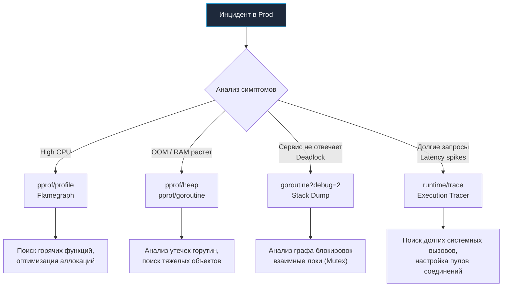

## Хирургия на живом пациенте: Debugging в Production

В тихих лабораториях Bell Labs отладка программ была сродни ремеслу часового мастера: изолированная машина, увеличительное стекло интерактивного отладчика, возможность в любой произвольный момент затормозить выполнение и не спеша исследовать регистры процессора. Но когда ваш компилируемый бинарник на Go выходит в непредсказуемый мир промышленного production, иллюзия полного контроля мгновенно рассеивается.

В боевой среде приложение сталкивается с сетевыми микроштормами, асинхронными всплесками нагрузки, непредсказуемым поведением облачных виртуализаторов, исчерпанием файловых дескрипторов и аппаратной деградацией дисков. Когда в пятницу вечером мониторинг фиксирует 100% утилизацию ядер CPU, запросы клиентов уходят в тайм-аут, а ядро Linux хладнокровно присылает процессу сигнал 9, наивные вызовы `fmt.Println` и пошаговый дебаггер абсолютно бесполезны.

Отладка в production — это высокоточная судебная медицина и хирургия на работающем сердце системы одновременно. Если в материалах статей [[41. Observability основы]] и [[17. Метрики и базовый monitoring]] мы проектировали базовые приборные панели и радары, то здесь мы расчехляем тяжелый инструментарий рантайма Go для препарирования живого, непрерывно исполняющегося машинного кода.

---

## 1. Большая тройка инструментов Go

Рантайм языка Go уникален тем, что проектировался инженерами, знавшими толк в масштабировании боевых систем (Кен Томпсон, Роб Пайк). В саму ткань языка и его стандартную библиотеку встроен инструментарий для низкоуровневой диагностики, доступный непосредственно на «живой» системе практически без деградации ее производительности.

### pprof (Performance Profiler)
Это главный диагностический скальпель бэкенд-инженера. Пакет `net/http/pprof` позволяет снимать детальные анатомические слепки памяти, процессора, аллокаций и блокировок горутин прямо через сетевой HTTP-интерфейс без перезапуска или остановки сервиса.

Идиоматичное подключение через выделенный служебный мультиплексор:
```go
package main

import (
    "log"
    "net/http"
    _ "net/http/pprof" // Регистрирует обработчики /debug/pprof/ в DefaultServeMux
)

func main() {
    // Выносим профилировщик на отдельный закрытый порт
    go func() {
        log.Println(http.ListenAndServe("localhost:6060", nil))
    }()
    
    // ... запуск основного бизнес-сервера ...
}
```

> [!warning] Ловушка / Gotcha
> Никогда и ни при каких обстоятельствах не выставляйте служебный порт с `pprof` в открытую сеть (Интернет)! Он обязан быть заблокирован брандмауэром и доступен строго через приватную сеть управления или через защищенный туннель port-forwarding (например: `kubectl port-forward pod-name 6060:6060`). Открытый доступ к эндпоинтам `pprof` позволяет злоумышленнику в один клик скачать полный дамп оперативной памяти сервиса (`heap dump`), в котором в открытом виде хранятся секретные ключи шифрования, JWT-токены, хэши паролей и персональные данные клиентов.

### execution tracer (runtime/trace)
Если классический профилировщик `pprof` отвечает на статистический вопрос: *«В каких функциях и строках кода мы тратим процессорные такты или аллоцируем память?»*, то трассировщик исполнения (`runtime/trace`) отвечает на динамический вопрос: *«Когда, в каком порядке и почему именно исполнялись конкретные горутины?»*. Трейсер помикросекундно фиксирует переключения контекста в планировщике Go (G-M-P модель), моменты блокировок в сетевом поллере, время ожидания захвата мьютексов и точные паузы Stop-the-World сборщика мусора.

### Delve (dlv) в режиме core dump
Интерактивное подключение к живому рабочему процессу через команду `dlv attach` в боевом окружении — критически опасная практика. При подключении отладчик перехватывает управление над потоками ядра через системный вызов `ptrace`, принудительно останавливая планировщик Go. Клиентские TCP-соединения начинают массово обрываться по таймаутам. 

Промышленный стандарт для глубокой отладки — генерация «посмертных снимков» оперативной памяти (core dumps). При аварии рантайма (или по сигналу через утилиту `gcore`) ядро Linux мгновенно сбрасывает образ адресного пространства процесса на диск. Инженер спокойно скачивает этот файл на свою рабочую станцию и исследует локально через `dlv core ./bin core.dump`, анализируя стек горутин и значения локальных переменных без риска для клиентов.

---

## 2. Анатомия проблем и их расследование

Разберем наиболее распространенные архитектурные патологии и методологию их оперативной локализации.

### Сценарий А: Утечка памяти (Memory Leak)

В среде с автоматическим управлением памятью классическая утечка в стиле языка C (забытый системный вызов `free()`) невозможна. В Go утечка памяти — это **непреднамеренное удержание ссылок** на объекты в куче, из-за которого сборщик мусора считает их «живыми» и не имеет права освободить память.

**Симптом:** График утилизации оперативной памяти (Resident Set Size — RSS) на дашборде мониторинга монотонно ползет вверх характерной «лесенкой», не возвращаясь на базовый уровень после спада сетевого трафика. В финале сервис внезапно уничтожается системным демоном OOM Killer ядра Linux.

**Расследование:**
1. Подключаемся к сервису через туннель и снимаем слепок кучи в интерактивный веб-интерфейс:
   ```bash
   go tool pprof -http=:8080 http://localhost:6060/debug/pprof/heap
   ```
2. Анализируем два взаимодополняющих режима представления данных:
   - `alloc_space` — совокупный объем памяти, выделенный сервисом за все время его работы с момента старта. Незаменим для выявления функций, создающих паразитный churn мусора и нагружающих Garbage Collector.
   - `inuse_space` — физический объем памяти, удерживаемый объектами *непосредственно в текущую секунду*. Крупнейшие прямоугольники на графе вызовов однозначно укажут на структуры, которые застряли в куче и не освобождаются.

> [!tip] Собеседование
> **Вопрос:** Какова самая распространенная первопричина утечек памяти в реальных приложениях на Go?
> **Ответ:** Утечка горутин (Goroutine Leak). Горутина, заблокированная навсегда (например, пытающаяся читать из канала `chan receive` или писать в небуферизованный канал `chan send`, куда никто и никогда больше не обратится, либо зависшая на исходящем HTTP-запросе без установленного таймаута), физически не может быть утилизирована рантаймом. Ее стек (от 2 КБ до нескольких мегабайт) остается в памяти навечно. Но страшнее другое: сборщик мусора обязан считать живыми абсолютно все переменные, лежащие на стеке этой застрявшей горутины, и все объекты в куче, на которые они ссылаются. Десятки тысяч таких зомби-горутин гарантированно съедают гигабайты памяти.

Диагностика утечек горутин выполняется выгрузкой профиля:
```bash
go tool pprof http://localhost:6060/debug/pprof/goroutine
```
Если вы наблюдаете 50 000 горутин, застрявших в функции `net/http.(*persistConn).readLoop`, это неопровержимое свидетельство того, что в прикладном коде не настроен сетевой таймаут `IdleConnTimeout` в `http.Transport`, либо разработчики забыли закрыть тело ответа `Response.Body` после чтения.

### Сценарий Б: Утечка через под-слайсы (Slicing Leak)

Еще один коварный архитектурный дефект связан с механикой работы встроенных слайсов:

```go
var globalCache []byte

func loadData() {
    giantFile := make([]byte, 1024*1024*100) // Выделяем массив на 100 МБ
    // ... читаем данные из хранилища ...
    // Нам требуется сохранить в глобальном кэше только первые 10 байт сигнатуры:
    globalCache = giantFile[:10] 
}
```

**Что происходит под капотом:** В памяти структура слайса описывается тремя машинными словами: указатель на данные (`pointer`), длина (`len`) и емкость (`cap`). В данном коде срез `globalCache` получает `len=10`, однако его базовый указатель `pointer` продолжает указывать на исходный массив памяти (`backing array`) размером 100 МБ. До тех пор, пока переменная `globalCache` доступна в глобальной области видимости, сборщик мусора не имеет права освободить ни единого байта из этого 100-мегабайтного блока.

**Инженерное решение:** Всегда выполняйте глубокое изолированное копирование данных через встроенную функцию `copy()`, явно аллоцируя компактный буфер целевого размера:
```go
globalCache = make([]byte, 10)
copy(globalCache, giantFile[:10])
```

### Сценарий В: 100% CPU Spike

Сервер внезапно выжигает 100% доступных процессорных ядер, перестает обслуживать сетевые сокеты и накапливает многотысячные очереди входящих запросов.

**Расследование:**
Снимаем статистический профиль активности процессора (по умолчанию за интервал в 30 секунд):
```bash
go tool pprof -http=:8080 http://localhost:6060/debug/pprof/profile?seconds=30
```
В открывшемся интерфейсе открываем представление **Flame Graph** (Огненный граф). Ширина горизонтальных блоков строго пропорциональна доле времени CPU, затраченной конкретной функцией и ее дочерними вызовами.

> [!info] Под капотом
> **Как работает CPU pprof?**
> Профилировщик Go принципиально не использует дорогостоящую инструментацию каждой инструкции машинного кода. Вместо этого задействован статистический сэмплинг (Sampling):
> 1. Рантайм Go через системный вызов ядра `setitimer` настраивает генерацию периодического системного сигнала `SIGPROF` с частотой 100 Гц (ровно 100 прерываний в секунду на каждый активный поток ОС).
> 2. При получении процессором сигнала `SIGPROF` поток операционной системы временно прерывается ядром.
> 3. Системный обработчик сигнала в рантайме Go (`runtime.sigtramp`) считывает регистр Program Counter (PC) текущего треда, определяет исполняемую горутину, быстро раскручивает стек вызовов (stack unwinding) и инкрементирует счетчик в буфере сэмплов.
> 4. Тред немедленно продолжает выполнение бизнес-кода.
> 
> По закону больших чисел `pprof` формирует достоверное распределение: если декодирование JSON в функции `json.Unmarshal` встретилось в 80 из 100 сэмплов, значит, этот метод потребляет 80% времени процессора. Накладные расходы такого профилирования в бою составляют всего 1–3%, что делает его абсолютно безопасным для production.

**Типичные виновники аномального потребления CPU:**
1. Неблокирующие циклы ожидания `for { ... }` (spinlocks) без вызова `runtime.Gosched()`, чтения каналов или системных вызовов, выжигающие квант планировщика на ядре.
2. Неэффективная компиляция регулярных выражений: пакет `regexp` работает медленно, если функции `regexp.Compile` вызываются динамически на каждый входящий запрос.
3. Деградация структур `map` при неудачном хэшировании, приводящая к обходу длинных цепочек коллизий со сложностью $O(N)$.
4. Патологический шквал сборки мусора (GC Thrashing) — миллиарды мелких короткоживущих аллокаций приводят к тому, что сканирование кучи в цикле `runtime.gcDrain` отнимает львиную долю тактов процессора.

### Сценарий Г: Зависание сервиса (Deadlock) или деградация Latency

Процессор практически свободен (утилизация 5–10%), память стабильна, но время отклика сервиса (p99) возрастает до десятков секунд или сервис полностью перестает отвечать на HTTP-запросы.

**Расследование:**
При подозрении на тотальную взаимную блокировку горутин выгружаем полный текстовый дамп всех активных горутин рантайма:
```bash
curl "http://localhost:6060/debug/pprof/goroutine?debug=2" > dump.txt
```
Флаг `debug=2` возвращает не агрегированные счетчики, а полный текстовый снимок стеков всех горутин в формате классического panic stacktrace. Ищите горутины, зависшие в системных состояниях `semacquire` (ожидание освобождения `sync.Mutex` или семафора), либо заблокированные на операциях с каналами `chan receive` и `chan send`.

Если же сервис функционирует, но страдает от периодических необъяснимых микрозадержек, на помощь приходит системный трассировщик execution **trace**:
```bash
curl -o trace.out "http://localhost:6060/debug/pprof/trace?seconds=5"
go tool trace trace.out
```
В графическом интерфейсе веб-обозревателя визуализируются:
- **GC pauses:** Точная длительность пауз Stop-the-World. Если сервис регулярно замирает на десятки миллисекунд, сборщик мусора перегружен.
- **Network blocking & Syscalls:** Визуализация горутин, заблокированных на медленных сетевых сокетах СУБД или системных операциях ввода-вывода.
- **Scheduler latency (Задержка планировщика):** Время, которое готовая к выполнению горутина проводит в локальной очереди ожидания `runq`, прежде чем поток операционной системы (M) подхватит ее на исполнение логическим процессором (P). Высокая задержка свидетельствует о нехватке системных потоков или их блокировке в сисколлах.



---

## 3. Разбираемся с Out Of Memory (OOM Killer)

Самый драматичный финал жизни процесса — его мгновенное уничтожение ядром Linux. В логах приложения не остается никаких следов или дампов, процесс просто исчезает по сигналу `SIGKILL` (код возврата 137).

Факт вмешательства подсистемы ядра подтверждается анализом системного кольцевого буфера:
```bash
dmesg -T | grep -i oom
```
В выводе появится характерная запись:
`Out of memory: Killed process 1234 (myapp) total-vm:..., anon-rss:...`

**Почему Go-сервисы ловят OOM Killer:**
1. **Резкие скачкообразные всплески памяти (Spikes):** Сборщик мусора Go опирается на параметр `GOGC` (по умолчанию 100). Это означает, что новый цикл сборки мусора инициируется только тогда, когда объем кучи вырастет на 100% от объема живых данных после предыдущей очистки. Если базовый объем кучи составлял 400 МБ, а в сервис внезапно прилетел запрос с полезной нагрузкой на 300 МБ, куча стремительно раздувается до 800 МБ. Если лимит контейнера в Kubernetes установлен на уровне 700 МБ, ядро Linux уничтожит процесс за миллисекунды до того, как GC успеет запустить сканирование.
2. **Нюансы возврата страниц ядру Linux (`MADV_FREE` vs `MADV_DONTNEED`):** Исторически рантайм Go переключался между системными вызовами управления страницами. Использование вызова `MADV_DONTNEED` немедленно обнуляет страницы и возвращает их ОС, сразу снижая RSS процесса. Вызов `MADV_FREE` лишь помечает страницы как неиспользуемые: ядро сохраняет их за процессом в качестве кэша и отбирает только при возникновении глобального дефицита памяти в ОС. В результате утилиты вроде `top` и метрики контейнеров показывают высокое потребление памяти, что приводило к ложным паникам SRE-инженеров и ранним срабатываниям контроллеров Kubernetes.

**Современное инженерное решение:**
Начиная с версии Go 1.19, в рантайм внедрен механизм мягкого потолка памяти — системная переменная `GOMEMLIMIT`.

Если под в Kubernetes ограничен лимитом в 1Gi, настройте переменную окружения `GOMEMLIMIT=900MiB`. В этом случае при приближении к границе 900 МБ планировщик Go начнет упреждающую, высокоагрессивную очистку мусора (задействуя до 50% вычислительных мощностей CPU для непрерывной сборки), предотвращая выход за пределы квоты cgroups и спасая процесс от фатального выстрела `SIGKILL` со стороны операционной системы.

---

## Итог

1. Отладка боевых систем — это системная дисциплина, опирающаяся на глубокое понимание внутреннего устройства рантайма Go и ядра Linux.
2. Используйте `pprof/profile` для поиска горячих путей в CPU и декомпозиции задержек через визуализацию Flame Graph.
3. Постоянно контролируйте аллокации через `pprof/heap` (`alloc_space` и `inuse_space`): устранение лишних выделений памяти в куче автоматически разгружает процессор от работы сборщика мусора.
4. Отслеживайте утечки горутин через `pprof/goroutine`: незакрытые соединения, отсутствие таймаутов и зависшие каналы — главные причины разрастания памяти.
5. Для расследования сложных блокировок используйте текстовый дамп `goroutine?debug=2`, а для анализа задержек планировщика — execution `trace`.
6. Остерегайтесь длительного сбора профилей `trace` и `mutex/block` на высоконагруженных инстансах — их оверхед значительно выше легковесного CPU-сэмплинга.
7. Всегда защищайте сервисы от OOM Killer с помощью настройки `GOMEMLIMIT` на уровне 85–90% от лимита памяти контейнера.

Освоив искусство препарирования работающего под нагрузкой кода, мы подошли к завершению обзора практики бэкенд-разработки на Go. В финальной лекции мы сведем все воедино: [[44. Итоги раздела. Production backend на Go]].
