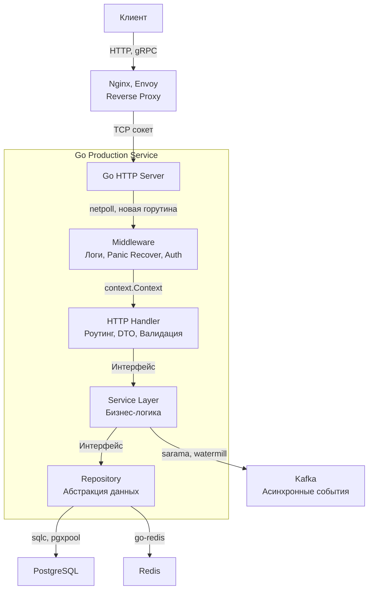

## Манифест Production-Ready Бэкенда на Go

Мы подошли к кульминационной точке нашего фундаментального практического путешествия: от первых шагов и создания базового сервера на чистом `net/http` в статье [[3. net http сервер с нуля]] до глубокой низкоуровневой хирургии живого процесса в условиях нехватки памяти в статье [[43. Debug production проблем]]. Девятый раздел, всецело посвященный архитектуре, инженерии и промышленной практике бэкенд-разработки на языке Go, завершен.

В Bell Labs мы любили повторять: написать программу, которая работает на столе своего создателя при идеальных входных данных — это едва ли десятая часть инженерного труда. Настоящее искусство программирования начинается там, где код сталкивается с враждебной реальностью боевой среды: сетевыми штормами, непредсказуемыми аппаратными задержками дисков, отказами сторонних API и падениями серверов. Остальные 90% ценности senior-инженера — это обеспечение детерминизма, предсказуемости, масштабируемости и глубокой наблюдаемости системы.

В этом манифесте мы сведем воедино ключевые архитектурные принципы, паттерны устойчивости и правила механической симпатии, отделяющие любительские прототипы от надежных распределенных Enterprise-систем мирового уровня.

---

## Архитектура: Явное лучше неявного

Главный философский столп Go, который поначалу шокирует разработчиков, пришедших из мира Java (Spring) или C# (.NET), — **бескомпромиссное отсутствие «магии»**.

В Go нет неявного внедрения зависимостей через сканирование аннотаций в рантайме, нет тяжеловесных ORM с непредсказуемой ленивой загрузкой (lazy loading), порождающих скрытые катастрофы вида $N+1$ запросов к базе данных, и нет скрытых глобальных мутаций, размазанных по десяткам конфигурационных файлов.

В идиоматичном Go вы собираете приложение собственными руками, шаг за шагом, в файле `main.go`. Эта архитектурная точка называется **Composition Root** (корень композиции), концепцию которого мы досконально исследовали в статье [[13. Dependency Injection в Go]]. Инженер явно инициализирует конфигурацию, явно создает типизированный логгер, явно открывает пул сетевых соединений к базе данных, явно передает его в слой доступа к данным (Repository), репозиторий прокидывает в сценарии бизнес-логики (Usecase/Service), а бизнес-логику связывает с транспортным обработчиком (HTTP Handler):

Такая строгая линейная архитектура обеспечивает стопроцентный контроль над жизненным циклом памяти, детерминированное освобождение ресурсов при получении системного сигнала `SIGTERM` ([[10. Graceful shutdown]]) и позволяет мгновенно тестировать любые интерфейсные слои через изолированные изоморфные тесты.

---

## Фундамент надежности (Resilience)

Промышленный сервис никогда не существует в сферическом вакууме. Сеть теряет пакеты, каналы связи страдают от джиттера, реплики СУБД испытывают задержки репликации, а внешние платежные шлюзы внезапно зависают на десятки секунд. Надежный бэкенд проектируется с расчетом на непрерывные локальные отказы.

### 1. Context — король бэкенда
Пакет `context` — это единая кровеносная система рантайма Go. Любой сетевой или дисковый вызов во внешнюю подсистему (SQL-запрос, обращение к кэшу Redis, HTTP-вызов микросервиса) **обязан** быть ограничен явным таймаутом. Вызов сторонней службы без обертки `context.WithTimeout` — это мина замедленного действия: при сбое внешнего сервиса тысячи горутин зависнут в ожидании ответа, исчерпав память и сокеты операционной системы.

### 2. Паттерны отказоустойчивости
Зрелый бэкенд не сдается и не выбрасывает шквал ошибок `500 Internal Server Error` при малейших сетевых флуктуациях. Он реализует активные стратегии выживания:
* **Ограничение входного потока (Shedding):** Если трафик превышает согласованную емкость системы, мы отсекаем избыток на границе с помощью Token Bucket или Leaky Bucket, как мы изучили в [[18. Rate limiting]].
* **Изоляция сбоев (Failure Isolation):** Если зависимый сторонний сервис деградировал, мы прекращаем его бомбардировку и размыкаем цепь с помощью [[30. Circuit breaker]], предотвращая каскадный коллапс собственного кластера.
* **Сглаживание транзиентных сбоев:** При кратковременных морганиях сети мы применяем повторные попытки с экспоненциальным затуханием и случайным джиттером ([[29. Retry и backoff]]).

### 3. Предсказуемое потребление ресурсов
В отличие от интерпретируемых скриптов, где каждый запрос обрабатывается отдельным изолированным процессом ОС, умирающим после отправки ответа, Go-сервер представляет собой долгоживущий монолитный процесс-демон. Любая забытая горутина, незакрытый сетевой дескриптор или бесконечно растущая глобальная карта (`map`) гарантированно приведут к исчерпанию оперативной памяти и неизбежному убийству процесса системным OOM Killer.

> [!info] Под капотом
> Промышленный код на Go обязан создаваться с **Mechanical Sympathy** (механическим сочувствием к аппаратуре и операционной системе). 
> Когда миллион одновременных клиентов удерживает постоянные соединения с вашим сервером, Go не порождает миллион потоков ядра Linux (что привело бы к мгновенному коллапсу планировщика ОС из-за непрерывных переключений контекста). 
> Рантайм Go реализует асинхронный мультиплексор ввода-вывода (механизм `netpoll` на базе системного вызова `epoll` в Linux). 
> Горутина, ожидающая прихода данных из сетевого сокета, аккуратно переводится планировщиком в состояние ожидания `Gwaiting`, полностью освобождая физический поток операционной системы (`M`) и логический процессор (`P`) для полезных вычислений. Как только сетевая карта принимает сетевой пакет, `epoll` будит планировщик, и горутина мгновенно возвращается на исполнение. Эта архитектура позволяет Go-сервису стабильно удерживать сотни тысяч одновременных сетевых соединений при скромном потреблении 1–2 ГБ памяти.

---

## Observability: Слепой хирург не оперирует

Если у вас отсутствуют скоординированные метрики, структурированные логи и распределенные трейсы — вы управляете самолетом с завязанными глазами.

1. **Структурированное логирование:** Мы навсегда оставили позади примитивный вывод через `log.Println` в пользу производительного структурированного логирования (`log/slog` или `zap`), где каждое событие форматируется в машиночитаемый JSON. Это позволяет мгновенно фильтровать аномалии в распределенных хранилищах (Grafana Loki, Elasticsearch) по полям `user_id`, `trace_id` или `endpoint`.
2. **Метрики телеметрии:** В материалах статьи [[17. Метрики и базовый monitoring]] мы внедрили мониторинг на базе Prometheus. Инженер уровня Senior обязан мыслить категориями отраслевых методологий **RED** (Rate, Errors, Duration) и **USE** (Utilization, Saturation, Errors), ориентируясь на 99-й перцентиль (p99) задержки, а не на вводящие в заблуждение средние значения.
3. **Распределенный трейсинг:** При прохождении цепочки микросервисов только сквозной идентификатор `trace_id`, проброшенный через сетевые HTTP-заголовки, позволяет собрать разрозненные события и спаны баз данных в единое причинно-следственное дерево.

> [!warning] Ловушка / Gotcha
> Типичная архитектурная ошибка — попытка использовать логирование в качестве инструмента сбора числовых метрик (например, парсить гигабайты текстовых логов для подсчета пятисотых ошибок). Логи предназначены для точечной микроскопической детализации (*почему произошел сбой*). Метрики служат для макроскопической численной агрегации (*как часто и с какой интенсивностью система сбоит*). В высоконагруженных системах невозможно сохранять подробный лог на каждый успешный запрос `HTTP 200` (это мгновенно исчерпает дисковые массивы и пропускную способность сети), однако вы обязаны инкрементировать числовой счетчик метрик Prometheus в оперативной памяти (RAM) для абсолютно каждого запроса — это стоит доли наносекунды и не требует дискового ввода-вывода.

---

## Собеседование: Чек-лист Senior Go Engineer

Переход от уровня Middle к позициям Senior и Tech Lead лежит не в заучивании редких синтаксических трюков, а в зрелой способности архитектурно предвидеть возможные точки отказа распределенной системы и хладнокровно управлять рисками.

> [!tip] Собеседование
> На архитектурных секциях (System Design) от опытного инженера ожидают уверенного владения следующими фундаментальными концепциями:
> 1. **Идемпотентность транзакций:** Каково поведение сервиса, если клиент из-за сетевого таймаута повторно отправит запрос на списание денежных средств? Архитектурное решение через уникальные ключи идемпотентности и распределенные блокировки мы разобрали в статье [[28. Idempotency]].
> 2. **Бесшовные миграции БД (Zero-Downtime):** Как безопасно изменить структуру боевой таблицы объемом в миллиард строк в работающем кластере без остановки сервиса? (Стратегия многофазных миграций Expand and Contract, поддержка двойной записи и обратная совместимость кода).
> 3. **Корректная деградация (Graceful Degradation):** Как поведет себя API, если распределенный кэш Redis внезапно выйдет из строя? Упадет ли сервис в лавинообразный сбой (Cache Stampede) или переключится на деградированный режим с локальным in-memory кэшем?
> 4. **Асинхронная диспетчеризация:** Если обработка задачи (генерация финансового отчета, конвертация видео) занимает десятки секунд, мы ни в коем случае не держим открытым синхронное HTTP-соединение — мы немедленно отдаем статус `202 Accepted` и передаем задачу в надежный брокер сообщений и фоновые воркеры ([[26. Background jobs]]).

---

## Итог

Разработка серверных приложений на Go — это гимн инженерному прагматизму и ясности. Создатели языка осознанно пожертвовали многими сложными концепциями (в Go нет классического наследования классов, нет перегрузки операторов, а обработка ошибок через явную конструкцию `if err != nil` нарочито прямолинейна и наглядна). Этот аскетизм освобождает ум инженера от борьбы с языковыми абстракциями, заставляя целиком сосредоточиться на структуре данных, сетевых протоколах и бережном контроле системных ресурсов.

Мы завершили освоение практического фундамента бэкенда на Go (сетевой стек, архитектурные слои, базы данных, кэширование, очереди задач, контейнеризация и отладка). Однако ни одна распределенная система не замыкается сама в себе: ей необходимо надежно, быстро и безопасно взаимодействовать с фронтендом, мобильными клиентами и смежными микросервисами по сети.

Поэтому мы подводим черту под Разделом 9 и открываем следующий фундаментальный том нашей энциклопедии — **Раздел 10. Проектирование API и Сетевые протоколы**, где мы препарируем устройство REST, погрузимся в высокоэффективный бинарный мир gRPC и Protocol Buffers, и научимся проектировать нерушимые контракты распределенных систем!
